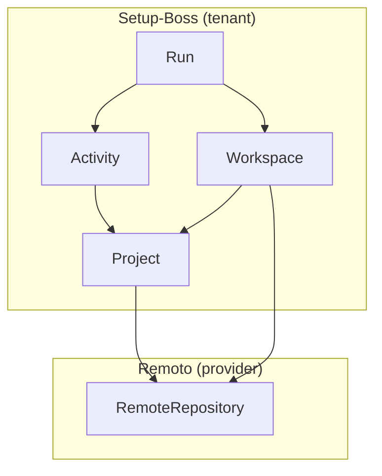
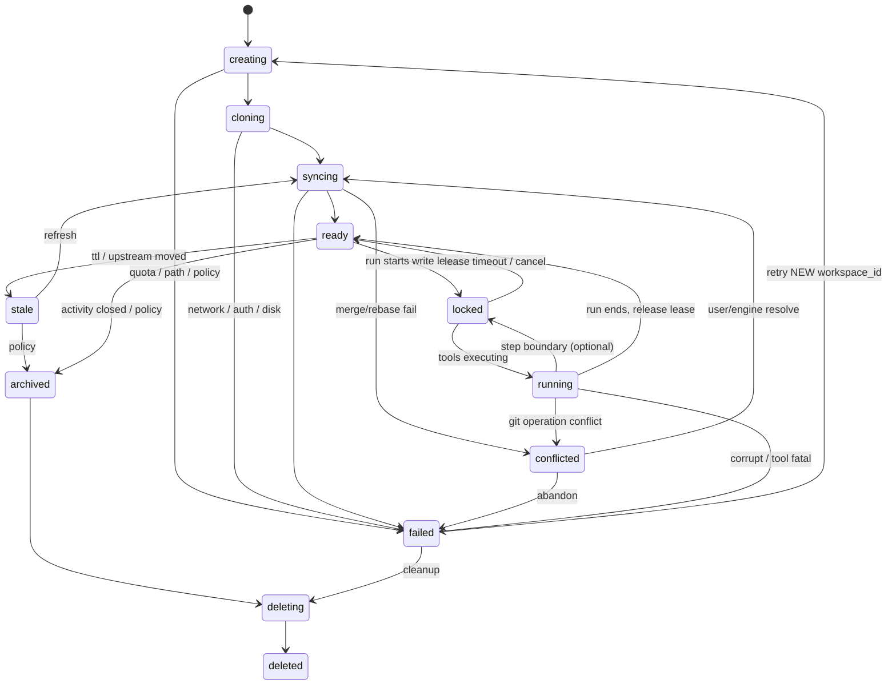

# Discovery técnico: arquitetura de Workspaces gerenciados (Setup-Boss)

**Data:** 2026-05-15  
**Tipo:** discovery — documentação técnica profunda (sem implementação, sem alteração ao runtime actual)  
**Relacionado:** `docs/discovery-web-git-integrations-multitenant.md`, `docs/discovery-git-provider-auth-github-bitbucket.md`

**Princípio:** o **Workspace Git gerenciado** é o núcleo operacional do Setup-Boss cloud/web. O produto deixa de ser “automação sobre uma pasta local” e passa a ser **runtime de engenharia** sobre **repositório remoto + working tree isolada + política de branch + ciclo de vida observável**, sem quebrar o MVP local: o **mesmo modelo conceptual** aplica-se ao daemon (perfil single-tenant / single-user).

---

## Diagrama conceptual — domínio operacional



- **Repository:** verdade remota; não implica disco até haver materialização.  
- **Workspace:** materialização **alocada e governada** (filesystem + `.git` + estado na state machine).  
- **Activity:** intenção de negócio; agrega histórico humano e metadados; **não** é o disco.  
- **Run:** unidade de execução do motor; **produz** alterações **dentro** de um workspace (ou falha antes).

---

# 1. Conceito de Workspace

## 1.1 O que é um Workspace

Um **Workspace** (gerenciado) é um **recurso** do runtime que representa:

1. Uma **árvore de trabalho Git** (working tree + repositório local — completo, worktree ligado a bare, ou variante optimizada).  
2. Um **contexto de isolamento** no filesystem (path dedicado, quotas, políticas).  
3. Uma **associação** a `tenant`, `project`, e tipicamente a uma **Activity** e/ou a um **Run** (conforme o tipo de workspace).  
4. Um estado na **máquina de estados** (§2), visível na API, na timeline e na UI.  
5. Metadados: branch de trabalho (ou conjunto de branches em políticas avançadas), `HEAD` / SHAs rastreados, `git_account_id` usada para operações remotas, timestamps, lease/lock.

**Não** confundir com “projeto no Setup-Boss”: o **Project** é configuração e ligação ao `RemoteRepository`; o **Workspace** é onde o Git e as ferramentas **correm**.

## 1.2 Repository vs Workspace vs Activity vs Run

| Entidade | Pergunta que responde | Persistência típica |
|---------|------------------------|----------------------|
| **Repository** | “De onde vem o código?” (URL, owner/repo, default branch) | Metadados + IDs no provider |
| **Workspace** | “Onde o runtime está a trabalhar **agora**?” | Disco (+ registo na BD / orquestrador) |
| **Activity** | “**Porque** estamos a fazer isto?” (título, dono, estado de produto) | BD de produto |
| **Run** | “**Qual** execução concreta do motor?” (fase: architect, executor, …) | BD + eventos + ligação a `workspace_id` |

Invariante recomendada: **cada `Run` que muta ficheiros** referencia um `workspace_id` **ou** um estado explícito “workspace allocation failed” com causa — nunca um void operacional.

## 1.3 Relação entre branch e workspace

| Modelo | Significado |
|--------|-------------|
| **Branch principal do workspace** | A ref em que o `HEAD` (ou worktree) está posicionado para a maior parte do trabalho; o que a UI mostra como “branch activa”. |
| **Uma branch ≠ um workspace** | Vários workspaces podem checkout da **mesma** branch (perigoso com mutação); por isso a política padrão cloud é **uma branch de escrita por workspace** ou **lock** (§5). |
| **Um workspace pode mudar de branch** | Possível (checkout); deve gerar evento `workspace.branch_changed` e rever lock se a política for por nome de branch. |
| **Activity branch** | Entidade lógica (nome canónico, upstream, `activity_id`); pode sobreviver a vários workspaces ao longo do tempo (efêmero por run). |

## 1.4 Workspace e filesystem

- O workspace **é** um subtree em disco (`WORKSPACE_ROOT`), com `.git` dentro (clone) **ou** worktree com `GIT_DIR` noutro path (bare + worktrees).  
- Todas as ferramentas recebem `WORKSPACE_ROOT` como fronteira; writes fora são proibidos (política + enforcement progressivo).  
- Artefactos de execução (logs agregados, relatórios) podem morar em subpath gitignored ou fora da tree, conforme produto.

## 1.5 Workspace, tenant e usuário

| Dimensão | Regra |
|----------|--------|
| **Tenant** | Isolamento forte: paths, quotas, cofre e políticas incluem `tenant_id`. Dois tenants **nunca** partilham o mesmo workspace nem o mesmo cache mutável sem segregação. |
| **Usuário** | Workspaces são criados **em nome** de um actor (`user_id`); RBAC pode permitir que admins visualizem/operem workspaces alheios **dentro** do tenant (política). |
| **GitAccount** | Operações `fetch`/`push` usam credencial atribuída ao workspace (não “credencial global do daemon” no modelo cloud). |

## 1.6 Tipos de workspace (exemplos esperados)

| Tipo | Descrição | Uso típico |
|------|-----------|------------|
| **Persistente (hot)** | Mantido entre runs da mesma Activity, com `fetch` incremental. | Loops de correction rápidos |
| **Efêmero** | Criado para **um** run (ou um estágio); destroy ao terminar. | Isolamento máximo, cloud por defeito |
| **Review** | Read-only ou semi-imutável; usado para inspeção de diff/PR sem mutar linha de trabalho principal. | Review humano, compare com base |
| **Sandbox** | Rotas de rede e FS restritas; idealmente container (fase posterior). | Execução de agente de risco |
| **Compartilhado** | **Um** workspace com **vários** runs **em série** (fila), não em paralelo de escrita — ou leitores paralelos + um escritor. | Custo/latência |
| **Isolado por Activity** | Um “slot” de trabalho dedicado à activity (pode ser hot ou efêmero por run, mas **namespace** lógico é a activity). | Modelo mental do utilizador |

**Decisão:** “compartilhado” no sentido de **paralelismo de escrita na mesma working tree** **não** é suportado sem merge manual; o compartilhamento correcto é **serialização** ou **branches/workspaces distintos**.

---

# 2. Lifecycle do Workspace — state machine completa

## 2.1 Estados (vocabulário fixo)

| Estado | Significado |
|--------|-------------|
| **creating** | Reserva de recurso: ID, quota, path, lease; sem `git` ainda ou só preparação. |
| **cloning** | `git clone` / cópia a partir de cache / `git worktree add`. |
| **syncing** | `fetch`, `pull`, `merge`, `rebase` — integração com **upstream** ou com base branch. |
| **ready** | Working tree consistente; autorizado a aceitar runs que só leem ou que mutam conforme política. |
| **locked** | Exclusão mútua: outra execução não deve mutar (lease adquirido por um run). |
| **running** | Ferramentas/agentes do Run activos **dentro** do workspace. |
| **conflicted** | `merge`/`rebase` falhou ou working tree em estado que exige intervenção; pushes bloqueados até resolução. |
| **stale** | Base muito desactualizada ou TTL sem uso; próximo passo pode ser `syncing` ou `archived`/`deleting`. |
| **archived** | Conteúdo lógico preservado (metadados, SHAs, bundle opcional); disco pode já estar parcialmente libertado. |
| **deleting** | GC em curso (rimraf, desmontar volume). |
| **deleted** | Terminal; só metadados históricos. |
| **failed** | Terminal irrecuperável sem intervenção operacional ou novo ciclo `creating` (discriminado por `failure_class`). |

## 2.2 Diagrama de transições (principal)



## 2.3 Triggers (quem move o estado)

| Transição | Trigger típico |
|-----------|------------------|
| → `creating` | API “start run”, “ensure workspace for activity”, scheduler |
| → `cloning` | alocação OK; credencial efémera OK |
| → `syncing` | pós-clone; antes de run; cron de frescura; utilizador “sync” |
| → `ready` | checkout OK; working tree limpo ou dirty permitido |
| → `locked` | início de fase mutável; acquisition de lock distribuído / local |
| → `running` | executor confirma arranque de ferramentas |
| → `conflicted` | exit code git; detecção de divergência |
| → `stale` | `last_successful_sync_at` + limite; ou hash upstream ≠ esperado |
| → `archived` | run completado com política de retenção curta no disco |
| → `deleting` / `deleted` | job de GC; confirmar ausência de lease |

## 2.4 Timeouts e leases

| Recurso | Timeout sugerido (orientador) |
|---------|-------------------------------|
| **Lease de lock (run)** | Ligeiramente > p99 duração do run + margem; heartbeat opcional |
| **Estado `cloning`** | Limitado (ex. minutos); falha → `failed` + retry policy |
| **Estado `running` sem heartbeat** | Detecção de “zombie” → `failed` + libertação de lock (§11) |
| **`stale` → `deleting`** | Política por tenant (horas/dias) |

## 2.5 Recovery e retry

| Cenário | Estratégia |
|---------|------------|
| Falha em `cloning` | Retry com *backoff*; após N tentativas `failed` **sem** reutilizar path sujo |
| `conflicted` | Sub-estado na UI (ficheiros em conflito); acção humana ou engine com política limitada |
| Corrupção detectada (`git fsck` / integridade) | `failed` → novo workspace_id; não “curar” silenciosamente |
| Crash do worker | Lease expira; outro worker pode tomar ou marcar `failed` e recriar |

## 2.6 Cleanup

- **Com `deleted` terminal:** remover tree; manter registo com `disk_released_at`.  
- **Com `failed`:** sempre tentar `deleting` para não deixar **orphan paths** (§11).  
- **Artefactos:** uploads para object storage **antes** de `deleted` se forem necessários ao histórico da Activity.

---

# 3. Estratégia Git

## 3.1 Branch por activity, por run, temporária

| Estratégia | Prós | Contras |
|------------|------|---------|
| **Branch por activity** | Uma PR por activity; mental model simples. | Conflitos se base muito activa; vários runs partilham histórico. |
| **Branch por run** | Isolamento forte; revert granular por run. | Poluição de branches remotas; GC de branches necessário. |
| **Branch temporária (local-only)** | Sem push até “promover”; bom para drafts. | Limites do provider/PR flow; complexidade de promoção. |

**Recomendação incremental (cloud):** **branch por activity** como padrão de produto; **sub-branch ou sufixo por run** só quando correction precisa isolar (ex. `activity/x/run-12`).

## 3.2 Naming strategy

- Prefixo tenant/projeto: `sb/{short_activity_id}/{slug}` ou `setup-boss/{uuid}` (evitar PII no nome).  
- Normalização: caracteres seguros; length cap conforme provider.  
- Não reutilizar nome de branch após merge **sem** política (pode gerar confusão de tracking); preferir **novo** ramo para nova activity.

## 3.3 Merge vs rebase

| Política | Quando |
|----------|--------|
| **Merge (merge commit)** | Equipas que preferem histórico fiel de integrações; menor rebasing. |
| **Rebase** | Linearidade; exige coordenação e lock forte durante rebase. |
| **Fast-forward apenas** | Proteção simples: se não FF → `conflicted` / UI. |

**Default recomendado:** merge ou FF na **integração com upstream** controlada pelo engine; rebase **opt-in** por projeto (risco de rewrite).

## 3.4 Pull / update policy

- **Antes de mutação relevante:** `fetch` + comparar `merge-base`; eventos na timeline.  
- **Frequência:** no ínicio de cada run; opcional “mid-run” só para runs longos.  
- **Autopull:** desligado por defeito em runs longos para evitar surpresa; política explícita.

## 3.5 Lock durante execução

- **Lock pessimista** na branch de escrita ou no `workspace_id` durante `running` (mutação).  
- Operações só-leitura (review, diff) podem usar workspace **separada** ou mesmo repo em modo read-only mount.

## 3.6 Concorrência entre execuções

- **Mesma branch, dois escritores:** proibido sem fila; segundo run → `queued` ou **novo branch** (preferível **novo branch** a silenciar conflitos).  
- **Mesmo repo, branches diferentes:** OK; contenção só em **bare mirror** compartilhado (`fetch` serializado por repo-tenant).

## 3.7 Proteção de main/master

- **Nunca** checkout mutável directo em `main` para agentes; `main` só via **read-only mirror** ou **detached read**.  
- Push para `main` **desaconselhado**; preferir PR. Excepção: política enterprise explícita.

## 3.8 Sync com upstream

- **Upstream** = branch base do project (`main`/`develop`).  
- Eventos: `sync.behind`, `sync.ahead`, `sync.diverged`.  
- **Diverged** → estado `conflicted` ou “needs_human” conforme severidade.

## 3.9 Tópicos avançados — análise

| Tópico | Uso no Setup-Boss | Risco / nota |
|--------|-------------------|--------------|
| **Cherry-pick** | Aplicar patch puntual entre branches de runs | Conflitos; audit trail da origem do commit |
| **Stash** | Salvar dirty state antes de sync | Perder rasto se não houver evento; preferir commit WIP em branch |
| **Detached HEAD** | Checkout a SHA para inspeção ou build reprodutível | Não deixar agente mutar sem criar branch |
| **Shallow clone** | Reduzir tempo/tamanho | Limitações (blame antigo, alguns merges); aumentar profundidade sob demanda |
| **Sparse checkout** | Monorepo | Manutenção de paths; CI alinhado; erros se paths omitidos |
| **Monorepo** | Um repo muitos packages | Spart checkout + caches de deps maior; workspaces **por activity** no mesmo repo são OK |

---

# 4. Modelo de Filesystem

## 4.1 Onde vivem os workspaces

| Deployment | Local sugerido |
|------------|----------------|
| **Cloud** | Volume regional ou disco efémero do worker; prefix por `tenant_id` |
| **Daemon local** | `SETUP_BOSS_PROJECTS_DIR` ou equivalente; **mesmo** layout lógico `{tenant}/{workspace_id}` com tenant implícito |

## 4.2 Estrutura de diretórios (exemplo)

```text
{storage_root}/
  {tenant_id}/
    cache/
      bare/{remote_repository_id}.git/     # opcional, read-mostly
      objects/ ...                          # alternates / pack cache (avançado)
    workspaces/
      {workspace_id}/                       # working tree (clone ou worktree)
        .git
        ... project files ...
      {workspace_id}.meta.json              # opcional; ou só BD
```

## 4.3 Isolamento

| Nível | Mecanismo |
|-------|-----------|
| **Por tenant** | Prefixo único; quotas; IAM |
| **Por usuário** | Metadados; opcional subprefix `user/{user_id}/` se política exigir |
| **Por execução** | `workspace_id` único por run efêmero; impede misturar artefactos |

## 4.4 Cache compartilhado

- **Bare mirror por `(tenant_id, remote_repository_id)`** servindo `git worktree add` múltiplos.  
- Lock de curtíssima duração em `git fetch` no bare.  
- Invalidação: TTL + eventos webhook futuros.

## 4.5 Worktree vs clone completo

| Abordagem | Descrição |
|-----------|-----------|
| **Clone completo por workspace** | Simples; mais disco. |
| **Bare + N worktrees** | Menos duplicação de objetos; melhor em escala. |
| **Clone + alternates** | Compartilha object store; cuidado com corrupção partilhada. |

## 4.6 Redução de custo / disco

1. Shallow clone inicial + deepen quando necessário.  
2. Sparse checkout em monorepo.  
3. Bare + worktrees.  
4. Encerrar workspaces efêmeros agressivamente.  
5. GC central de objetos órfãos após TTL.

## 4.7 Comparação de estratégias de materialização

| Estratégia | Prós | Contras |
|------------|------|---------|
| **Clone completo** | Máxima simplicidade e isolamento de fsck | Disco/banda |
| **Bare + worktrees** | Objeto compartilhado; rápido para N workspaces | Complexidade; locks no bare |
| **Overlay FS (upper/lower)** | Velocidade de “fork” conceptual | Suporte infra; debugging dificultado |
| **Snapshots de volume/block (CoW)** | Clones quase instantâneos | Custo de infra; região/azone |
| **Snapshots lógicos (tar/ESA)** | Backup e auditoria | Não substitui git; latência |

**Decisão:** MVP cloud tende a **clone shallow por workspace** ou **bare+1 worktree** quando houver repetibilidade no mesmo repo; **CoW** é **produção madura**.

---

# 5. Concorrência e Locking

## 5.1 Cenários

| Cenário | Política recomendada |
|---------|----------------------|
| **Múltiplas activities no mesmo repo** | Branches distintas; mirror bare serializa fetch. |
| **Múltiplos usuários no mesmo repo** | RBAC no tenant; mesmas regras de branch + lock. |
| **Múltiplas execuções na mesma branch** | **Serializar** escrita ou **rejeitar** segundo run; nunca dois `running` mutando. |

## 5.2 Lock vs queue

| Mecanismo | Descrição |
|-----------|-----------|
| **Lock pessimista** | Lease com TTL + heartbeat; bom para `running`. |
| **Fila** | Runs aguardam; UX clara (“posição na fila”). |
| **Optimistic** | Tentar operação e rollback se `non-fast-forward` | Arriscado para agentes; só com reconciliação forte |

**Default:** **pessimista** na branch de escrita ou no `workspace_id`.

## 5.3 Cancelamento

- Sinal ao worker (graceful); se não terminar → revoke lease.  
- `git` cancelável: subprocess kill com cleanup; estado `failed` ou `ready` se árvore recuperável.

## 5.4 Recovery após crash

1. Detector de lease expirado.  
2. Inspecção opcional read-only (integridade).  
3. Marcar `failed` e recriar **novo** `workspace_id` (preferido a reaproveitar path desconhecido).

---

# 6. Sandbox e Segurança

## 6.1 Execução isolada — evolução

| Fase | Modelo |
|------|--------|
| **MVP** | Subprocess + path confinado + `shell: false` + args validados |
| **Intermediário** | usuário de sistema dedicado, cgroups, no-new-privs |
| **Futuro** | **Container efémero** por workspace ou por run; imagem mínima |

## 6.2 Docker / containers

- Um container (ou job K8s) por **run** ou por **workspace** lifetime.  
- Volume montado só em `WORKSPACE_ROOT`.  
- Rede: egress allowlist (Git HTTPS, APIs aprovadas).

## 6.3 Limites

- CPU/RAM/pids/disco/tempo de parede; **defaults** conservadores no multi-tenant.

## 6.4 Filesystem readonly / parcial

- **Review workspace:** montagem read-only da tree + cópia overlay para comentários (opcional).  
- **Build steps:** RW só em subdirs permitidos.

## 6.5 Execução arbitrária

- Proibir shell livre com input do LLM; allowlist de comandos; paths validados.  
- Dependências instaladas em cache global **read-only** + prefix RW no workspace.

## 6.6 Isolamento entre tenants

- Paths, credenciais, filas e métricas com `tenant_id`; **sem** caches mutáveis partilhados entre tenants.

## 6.7 Limpeza automática

- Jobs de GC; quotas; alertas de crescimento (§7).

## 6.8 Auditoria

- Eventos append-only: criar/destruir workspace, lock, push, pr_created, credential_used (metadata apenas).  
- Sem tokens em logs; sanitizar stderr Git (URLs).

---

# 7. Performance e Escalabilidade

| Conceito | Definição |
|----------|-----------|
| **Hot workspace** | Mantido entre runs; sync incremental. |
| **Warm cache** | Bare/objects regionais quentes; hit rate alto. |
| **Cold** | Primeiro uso: clone completo ou lazy. |
| **Lazy clone** | Shallow + deepen on demand. |
| **Prefetch** | Antecipar mirror bare quando Activity é criada (opcional). |
| **GC** | Git gc agendado em mirrors; não bloquear runs (janelas). |
| **Cleanup policy** | TTL por estado + disco por tenant. |
| **Cache de dependências** | Registry proxy/npm/pip no tenant (futuro); reduz egress. |
| **Monorepo** | sparse-checkout; builds alvo; limites de path. |
| **Repos grandes** | LFS policy; shallow; limites de tamanho; timeout. |
| **Storage growth** | Dashboards por tenant; retenção agressiva de workspaces efêmeros. |

---

# 8. Timeline e UI

## 8.1 Impactos

| Área | Comportamento esperado |
|------|------------------------|
| **Timeline da Activity** | Eventos `workspace.*`, `git.sync`, `git.commit`, `git.push`, `pr.*`; correlacionar runs. |
| **Status visual** | Chip por estado §2.1; substates em `conflicted`. |
| **Clone / sync / branch / commit / push** | Ícones + duração + link para logs sanitizados. |
| **Erros** | Mensagens humanas; “ver detalhes técnicos” com copy segura (sem segredos). |
| **Comparação de branches** | Base vs head; selectors ligados ao repo. |
| **Conflitos** | Lista de paths; CTA “resolver no provider” ou ferramenta interna (fase posterior). |
| **Diff visual** | Side-by-side ou unificado; limites de tamanho. |
| **Snapshots / checkpoints** | Lista de SHAs “conhecidos” por run; restauração como **novo** run (§12 rollback). |

---

# 9. Observabilidade

## 9.1 Métricas (exemplos)

- `workspace_transitions_total{from,to}`  
- `workspace_time_in_state_seconds`  
- `workspace_disk_bytes`, `workspace_clone_duration_seconds`  
- `git_lock_wait_seconds`, `git_push_failures_total`  
- `workspace_orphan_paths_detected` (deve ser ~0)

## 9.2 Logs

- Estruturados; `tenant_id`, `workspace_id`, `run_id`, `activity_id`.  
- **Nunca** URL com credencial.

## 9.3 Tracing

- Span: alocação → clone → sync → run → publish → destroy.  
- Propagação ao client onde suportado.

## 9.4 Eventos e auditoria

- Mesmo vocabulário da timeline + retenção longa em storage imutável (futuro compliance).

## 9.5 Histórico

- **Runs:** já é núcleo do produto; incluir `workspace_id`.  
- **Branches:** tabela `activity_branches` ou eventos com `branch_name`, `created_by_run`.  
- **Consumo:** agregação por tenant para custo.  
- **Health:** probes no orquestrador; “stuck” em `cloning`/`running` > threshold.

---

# 10. Estratégia MVP vs Produção

| Aspecto | MVP (curto prazo) | Preparar (contrato) | Produção / cloud futura |
|---------|-------------------|---------------------|---------------------------|
| **Modelo conceptual** | `Workspace` + states | Eventos estáveis | Igual |
| **Daemon local** | Path único; tenant implícito | API devolve `workspace_id` | Coexiste com perfil local |
| **Single-user** | Lock in-process suficiente | Campos para lease distribuído | Locks reais (Redis/etcd) |
| **Multi-user** | — | RBAC + quotas | Fila + políticas |
| **Materialização** | Clone simples | Flags `workspace_kind` | Bare+worktree / CoW |
| **Sandbox** | Subprocess | Interfaces para “executor backend” | Container / Firecracker |
| **Distributed workers** | — | Idempotência nas transições | Sharding por tenant/repo |

**O MVP local existente não é quebrado** se o contrato for **additive**: hoje a “pasta de projeto” pode mapear internamente para um `Workspace` default com estados simplificados (ex. só `ready`/`running`) até a máquina completa ser exposta.

---

# 11. Riscos

| Risco | Mitigação |
|-------|-----------|
| **Corrupção de workspace** | `failed` + novo id; integridade spot-check; não partilhar object dir sem locking |
| **Race conditions** | Locks pessimistas; filas; idempotência |
| **Branch conflicts** | Detect early; UI honesta; não “auto-merge” agressivo |
| **Disk explosion** | Quotas; TTL; shallow; bare; alertas |
| **Orphan workspaces** | GC com reconciliação BD↔disk; métrica dedicada |
| **Credential leaks** | Cofre; logs sanitizados; sem `GIT_TRACE` em prod |
| **Git locks** | `index.lock` — timeout; cleanup controlado em `failed` |
| **Stuck processes** | Wall time + kill + lease expiry |
| **Zombie executions** | Heartbeat; reconciler que marca `failed` e liberta lock |

---

# 12. Plano incremental (roadmap técnico)

| Fase | Entrega | Notas |
|------|---------|--------|
| **A — Workspace local simples** | Introduzir `workspace_id` lógico sobre pasta actual; eventos mínimos na timeline | Sem mudar UX radicalmente |
| **B — Branches por Activity** | Política de naming; criação automática a partir da base; PR opcional manual | Reduz colisão com `main` |
| **C — Optimização worktree** | Bare mirror por repo (onde fizer sentido); worktrees | Prerequisites locks |
| **D — Sandbox isolation** | Container por run; limites CPU/RAM | Feature flag por tenant |
| **E — Distributed workers** | Filas regionais; lease distribuído; reconciler | Escala horizontal |
| **F — Cloud multi-tenant** | Quotas, custos, auditoria, retention por plano | System Wiser Wiki |

---

## Decisões recomendadas (síntese)

1. **Workspace** é recurso de primeira classe: ID estável durante o seu ciclo; novo run efêmero → novo ID por defeito.  
2. Estados **normativos** §2.1 para UI/API; transições idempotentes com `correlation_id`.  
3. **Branch por activity** como padrão; branch por run como excepção controlada.  
4. **Bare + worktrees** como alvo de escala; **clone shallow** como ponte MVP cloud.  
5. **Locks pessimistas** na escrita; leitura/review em workspace ou mount separado.  
6. **Proteger `main`:** trabalho de agente sempre em branch dedicada.  
7. Não depender de **shared writable** entre runs sem fila explícita.

---

## Critérios de aceite — primeira implementação (pós-discovery)

1. Glossário e state machine §2 aceites pelo time; nomes de estado **iguaes** em API, FE e docs.  
2. Todo `Run` mutável referencia `workspace_id` ou falha estruturada na alocação.  
3. Eventos mínimos emitidos: `workspace.created`, `workspace.ready`, `workspace.running`, `workspace.push`, `workspace.deleted`, `workspace.failed`.  
4. Política de branch e base documentada por `Project`.  
5. Plano de GC/TTL documentado para não criar orphans (métrica prevista).  
6. Revisão de segurança: redacção de logs; vector `git` com `spawn` sem shell.

---

## Referências cruzadas

- Multi-tenant / integrações: `docs/discovery-web-git-integrations-multitenant.md`  
- Auth providers e fluxo actual (clone no daemon): `docs/discovery-git-provider-auth-github-bitbucket.md`

Este documento define o **núcleo operacional** do Setup-Boss cloud/web baseado em Git; a implementação pode ser incremental **sem** negar o MVP local, desde que os **contratos** (`Workspace`, estados, eventos) sejam os mesmos.
