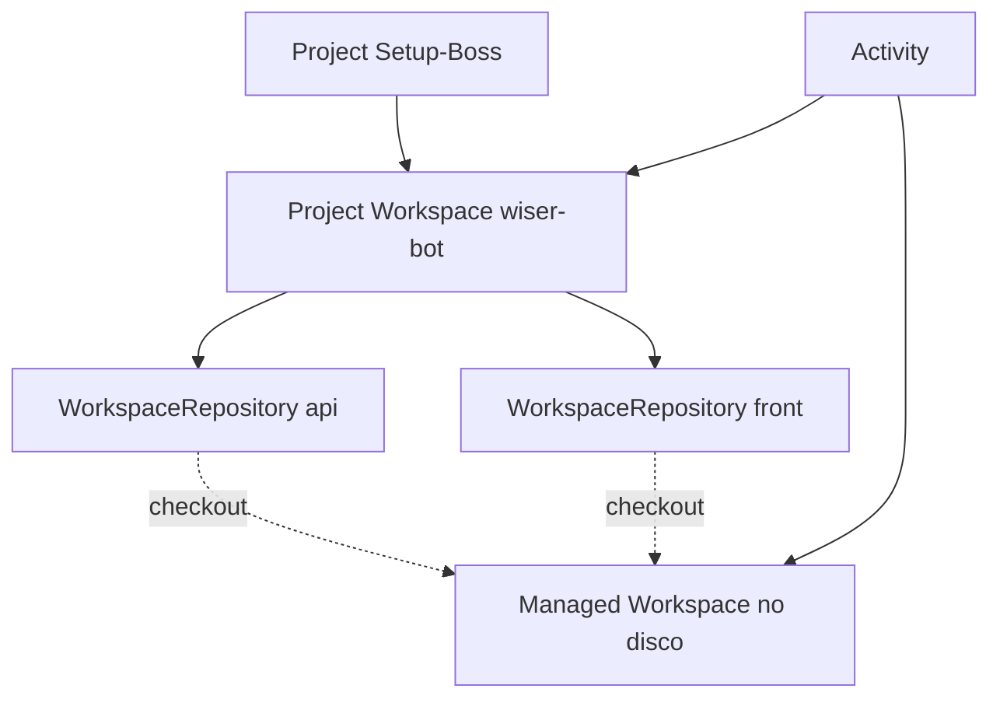
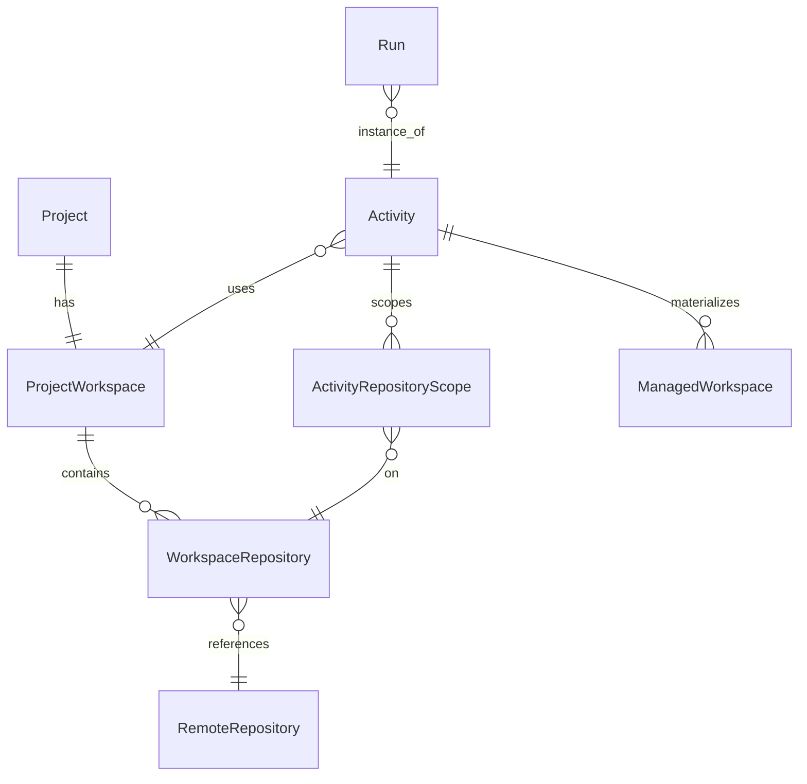

# Discovery técnico: Project Workspaces multi-repositório (Setup-Boss)

**Data:** 2026-05-15  
**Tipo:** discovery — documentação técnica (sem implementação, sem alteração ao runtime actual)  

**Compatível com:**  
- `docs/discovery-web-git-integrations-multitenant.md` — integrações Git, contas, tenant  
- `docs/discovery-managed-workspaces-architecture.md` — **Managed Workspace** (Git no disco, lifecycle, locking)  
- `docs/discovery-runtime-orchestrator-architecture.md` — orchestrator, eventos, workers, timeline  

**Visão:** muitos produtos reais são **N repositórios Git** (front, back, BFF, mobile, infra). O Setup-Boss deve tratá-los como **um único projeto operacional**, análogo a abrir uma *solution* no IDE com várias raízes. A abstração central é o **Project Workspace** (nome oficial recomendado; **Solution Workspace** é sinónimo aceitável para docs/marketing).

---

# 1. Conceito

## 1.1 Vocabulário e diferenças

| Termo | Significado |
|-------|-------------|
| **Git Repository** (remoto) | Identidade lógica no provider: `owner/name`, URLs, default branch; não implica pasta local até clone. |
| **Project** (Setup-Boss) | Entidade de produto/configuração: liga-se a um **Project Workspace**, políticas, equipa, integrações. *Não* confundir só com “um repo”. |
| **Project Workspace** | **Agrupamento lógico** de 1..N repos Git sob um nome estável (ex. `wiser-bot`): define papel, ordenação, branches base, scopes de atividade. |
| **WorkspaceRepository** | **Encaixe** de um repo remoto neste Project Workspace: metadados (role, path_alias, obrigatoriedade), *binding* à `RemoteRepository` / conta Git. |
| **Managed Workspace** | **Materialização operacional em disco** para uma Activity (ou run): árvore de pastas + `.git` por repo, lifecycle `creating`…`deleted` (doc workspaces). Um Project Workspace **tem** vários roots no filesystem **dentro** de um Managed Workspace de activity. |
| **Activity** | Unidade de trabalho (“Refatorar dashboard”): pode declarar **scope** em subconjunto de repos; gera branches/PRs conforme política. |
| **Run** | Execução concreta do motor; pode decompor-se em **unidades por repo** (repo execution units) com estado e retries independentes. |

**Invariante:** um **Managed Workspace** está sempre ancorado a `(tenant, project_workspace_id, activity_id, …)` conforme política de isolamento; *dentro* dele existem **N working trees** (uma por `WorkspaceRepository` activa no scope).

## 1.2 Projeto com 1 repo vs N repos

| Cenário | Modelo |
|---------|--------|
| **1 repo** | Project Workspace com `N=1` (compatível com MVP actual: “projeto = um clone”). |
| **N repos** | Mesmo `Project`; **WorkspaceRepository** por repo; UI e orchestration agregam. |

## 1.3 Nome oficial

- **Project Workspace** (preferido no código/API: `project_workspace` ou `ProjectWorkspace`).  
- **Solution Workspace** — alias opcional na documentação de produto.

## 1.4 Representação na UI

```
Workspace: wiser-bot
├── Atividade: Refatorar dashboard
├── Atividade: Corrigir login
└── Repositórios
    ├── wiser-bot-api   (backend)
    └── wiser-bot-front (frontend)
```

Diagrama conceptual:



---

# 2. Modelo de dados

## 2.1 Entidades propostas

### ProjectWorkspace

| Campo | Tipo | Notas |
|-------|------|--------|
| `id` | UUID | |
| `tenant_id` | UUID | |
| `project_id` | UUID | Project Setup-Boss “pai” |
| `slug` | string | ex. `wiser-bot` |
| `display_name` | string | |
| `description` | string? | |
| `default_git_account_id` | UUID? | fallback quando o binding não especifica |
| `settings` | JSON | políticas globais (branch prefix, sync) |
| `created_at` / `updated_at` | instant | |

### WorkspaceRepository (binding repo ↔ project workspace)

| Campo | Tipo | Notas |
|-------|------|--------|
| `id` | UUID | |
| `project_workspace_id` | UUID | |
| `repo_id` | UUID | → `RemoteRepository` (ou legado URL hash) |
| `remote_url` | string | desnormalizado opcional para leitura |
| `provider` | enum | github / bitbucket / gitlab / … |
| `path_alias` | string | pasta local estável: ex. `wiser-bot-api` |
| `local_path` | string? | relativo ao root do Managed Workspace; default = `path_alias` |
| `role` | enum | `frontend` \| `backend` \| `bff` \| `mobile` \| `infra` \| `docs` \| `other` |
| `order` | int | ordenação na UI e em relatórios |
| `required` | bool | se false, falha parcial permitida |
| `enabled` | bool | soft-disable sem apagar binding |
| `default_branch` | string | branch base do projeto para este repo |
| `active_branch` | string? | branch de trabalho actual (por activity pode sobrepor) |
| `git_account_id` | UUID? | conta para operações; fallback para workspace |
| `metadata` | JSON | labels, links CI, etc. |

### RepositoryRole

Sinónimo estável do campo `role` em `WorkspaceRepository`; pode ser enum partilhado + extensão `custom_label` no futuro.

### RepositoryBinding

Termo genérico: **é a própria linha `WorkspaceRepository`** (ligação lógica). Se no futuro existir *binding* por Activity sem duplicar a linha global, usar `ActivityRepositoryScope` com override.

### ActivityRepositoryScope

| Campo | Tipo | Notas |
|-------|------|--------|
| `activity_id` | UUID | |
| `workspace_repository_id` | UUID | |
| `included` | bool | activity usa este repo ou não |
| `branch_override` | string? | branch de trabalho só nesta activity |
| `required_override` | bool? | |
| `notes` | string? | ex. “só front nesta tarefa” |

### ManagedWorkspace (já no doc workspaces)

| Campo extra sugerido | Notas |
|---------------------|--------|
| `project_workspace_id` | ligação ao agrupamento lógico |
| `layout_version` | ex. `1` — para migrações de estrutura de pastas |
| `repo_checkout_manifest` | JSON: SHA por `workspace_repository_id` após sync |

### Run

| Extensão | Notas |
|----------|--------|
| `repo_units` | Lista de `RunRepositoryUnit` (ver §8) ou projection derivada |

## 2.2 Diagrama ER (simplificado)



---

# 3. UI/UX

## 3.1 Fluxos principais

| Fluxo | Passos |
|-------|--------|
| **Criar Project Workspace multi-repo** | Criar/editar Project → “Definir workspace” → nome/slug → adicionar primeiro repo (conta Git + lista ou URL) → opcionais seguintes |
| **Adicionar repo** | Integração → escolher conta → listar repo → `path_alias`, `role`, `default_branch`, required |
| **Remover repo** | Confirmar; bloquear se activities abertas dependem (ou marcar deprecated) |
| **Ordenar** | Drag-and-drop na lista `WorkspaceRepository` |
| **Papel (role)** | Select por repo |
| **Branch base por repo** | Por linha em repositórios; preview de sync |
| **Nova atividade (todos os repos)** | Default: todos `included=true` no scope |
| **Nova atividade (subset)** | Toggle por repo + explicação (“só API”) |
| **Status por repo** | Chips: sync, branch, último erro, lock |

## 3.2 Sidebar sugerida

```
wiser-bot
  Atividade X
  Atividade Y
  Repositórios
    api
    front
```

- **Repositórios** é secção fixa sob o Project Workspace seleccionado.  
- Cada **Activity** na lista mostra badge “3/3 repos” ou “1/3 repos”.

## 3.3 Tela de detalhes (Repositórios)

- Tabela: path, role, remote, default branch, active branch, último sync, estado Git, conta usada.  
- Acções: sync agora, abrir no provider, logs (sanitizados).

---

# 4. Estratégia de branch multi-repo

## 4.1 Opções

| Estratégia | Descrição | Quando |
|------------|-----------|--------|
| **Nome idêntico em todos os repos do scope** | ex. `setup-boss/refatorar-dashboard-123` em cada repo | **Padrão recomendado** — correlaciona PRs e timeline |
| **Prefixo comum + sufixo por repo** | ex. `…/api`, `…/front` | Monorepos já nomeados conflitantes ou limites de length |
| **Só alguns repos** | Branch criada apenas onde `included` e `mutação prevista` | Opt-out explícito na planificação |

## 4.2 Convenção de naming

- `{prefix}/{activity-slug}-{short_id}` com prefixo por Project Workspace (configurável).  
- Validar caracteres e comprimento por provider.

## 4.3 Repo opcional

- `required=false`: falha de clone/push nessa repo **não** falha a activity inteira se política `partial_success_allowed`; eventos `repo_failed` visíveis.

## 4.4 Repo sem permissão de push

- Detecção cedo (403); marcar repo como **read-only** para a activity; plano só diff local ou PR a partir de fork (futuro).  
- UI: aviso antes de “Executar”.

## 4.5 Sincronização entre repos

- **Independente por repo:** `fetch`/rebase/merge na sua `default_branch`.  
- **Não** exigir que todos estejam no mesmo SHA de “release train” (salvo política enterprise).  
- Evento agregado: `multi_repo_sync_completed` com mapa `repo_id → status`.

## 4.6 Múltiplos PRs/MRs por activity

- Um PR **por repo** alterado; metadado `activity_id` no título ou corpo (template).  
- **PR group** (futuro): link cruzado no provider ou comentário bot.  
- Timeline: lista aninhada “Abrindo PRs → api #12, front #48”.

## 4.7 Exemplo

**Activity:** `refatorar-dashboard`  
**Branches:**

| Repo | Branch |
|------|--------|
| wiser-bot-api | `setup-boss/refatorar-dashboard-123` |
| wiser-bot-front | `setup-boss/refatorar-dashboard-123` |

---

# 5. Filesystem / layout do Managed Workspace

## 5.1 Layout recomendado (por activity)

```text
/workspaces/{tenant}/{projectWorkspaceId}/{activityId}/
  wiser-bot-api/          # clone / worktree deste repo
    .git
    ...
  wiser-bot-front/
    .git
    ...
  .setup-boss/
    workspace.json        # metadados do Managed Workspace
    activity.json         # snapshot de scope, branch names
    repo-map.json         # workspace_repository_id → path, HEAD, estado
```

- **Paths relativos estáveis:** `path_alias` = nome da pasta raiz sob o root da activity (evitar colisões).  
- **Isolamento:** `(tenant, project_workspace_id, activity_id)` define um root; runs da mesma activity reutilizam ou criam novo conforme política “hot vs ephemeral” (doc workspaces).

## 5.2 Avaliação técnica

| Abordagem | Prós | Contras |
|-----------|------|---------|
| **Clone completo por repo** | Simples; MVP natural | Disco × N |
| **Bare cache + worktree por repo** | Partilha de objetos | Lock por bare; mais complexidade |
| **Paths relativos estáveis** | Ferramentas e prompts previsíveis | Renomear alias requer migração controlada |

## 5.3 Cleanup

- GC ao nível do diretório `activityId`; reconciliar com BD para **orphans**.  
- Política TTL alinhada ao doc de Managed Workspaces.

---

# 6. Execução cross-repo

## 6.1 Comportamento esperado

| Etapa | Comportamento |
|-------|---------------|
| **Scan** | Walk em cada root; respeitar `.gitignore` e limites de tamanho |
| **Carregar `.IA` por repo** | `repo_root/.IA/**` conforme existir |
| **Contexto global** | Root `Project Workspace` (ficheiros virtuais ou diretório `shared/` no layout futuro) |
| **Repos afectados** | Classificador: paths citados, imports, contratos OpenAPI, heurísticas + input humano no scope |
| **Plano cross-repo** | Estrutura com steps por `workspace_repository_id` |
| **Patches** | Aplicar por repo; locks por repo ou globais conforme política |
| **Review diff** | Agregar diffs (sumário + links por repo) |
| **Testes** | “Comando por repo” configurável (ex. `npm test`, `go test`); falha isolada por repo |
| **Relatório único** | Um artefacto com secções por repo + estado global |

## 6.2 Dependências entre repos

- **Manifesto declarativo** (futuro): `workspace.dependencies` (ex. api é consumido por front).  
- **Heurísticas:** import maps, package names, OpenAPI clients gerados.  
- **Impacto:** se contrato API muda, marcar front como afectado automaticamente.

## 6.3 Quando rodar back + front

- Política por **tipo de alteração** (BFF, schema, UI only).  
- Pipelines de validação opcionais multi-step no orchestrator.

## 6.4 Detecção de impacto cross-repo

- Busca de símbolos, referências a paths, tags `#repo:api` no intake.  
- *Knowledge service* (doc orchestrator) pode indexar cross-links.

---

# 7. Contexto e conhecimento

## 7.1 Estrutura sugerida

| Nível | Exemplo | Precedência |
|-------|---------|-------------|
| **Global do Project Workspace** | `shared/.IA/global.md` ou blob em BD | Base para todos os repos |
| **Por repo** | `wiser-bot-api/.IA/index.md` | Especializa e sobrepõe detalhes locais |
| **Por activity** | `activity.json` + notas | Específico da tarefa |

## 7.2 Regras de precedência (merge de contexto)

1. Política de **produto** (tenant)  
2. **Project Workspace** global  
3. **Repo** `.IA`  
4. **Activity** (scope + instruções)  
5. **Run** (continuação / correction)

## 7.3 Knowledge

- **Por repo:** embeddings do código + `.IA` desse root.  
- **Partilhado:** coleções etiquetadas com `project_workspace_id`.  
- **Runbook:** documento global “como construir/testar a solution” com secções por role.

---

# 8. Orquestração

## 8.1 Decomposição

- **Activity** → **N repository tasks** (planeamento, sync, patch, push).  
- **Run** → **N RunRepositoryUnits**:

| Campos conceituais | |
|--------------------|--|
| `run_id` | |
| `workspace_repository_id` | |
| `phase` | sync / patch / test / push |
| `status` | pending / running / succeeded / failed / skipped |
| `attempt` | retry |
| `last_error_code` | |

## 8.2 Estado agregado

- `run.status = derived( units )`: ex. **succeeded** só se todas required OK; **partial** se optional falhou.  
- Orchestrator emite `run_repo_unit_completed` por unidade.

## 8.3 Falha parcial, retry, rollback

| Cenário | Política |
|---------|----------|
| Falha em repo required | Activity/run **failed** ou **blocked** para intervenção |
| Falha em optional | Continuar; marcar warnings |
| **Retry por repo** | Re-enfileirar só a unidade falhada |
| **Rollback por repo** | `git reset`/`revert` só naquela working tree |
| **Commit/push/PR por repo** | Idempotência com ledger (doc orchestrator) |

---

# 9. Timeline

## 9.1 Níveis de eventos

| Nível | Exemplos |
|-------|----------|
| **Global** | `activity_started`, `plan_ready`, `all_pushes_completed` |
| **Por repo** | `repo_branch_created`, `repo_patch_applied`, `repo_push_failed` |

## 9.2 Visualização (exemplo na spec)

**Criando branches**

- api: ok  
- front: ok  

**Aplicando patches**

- api: 2 ficheiros  
- front: 5 ficheiros  

**Abrindo PRs**

- api: PR #12  
- front: PR #48  

## 9.3 Agregação e loops

- **Loops cross-repo:** correction pode reexecutar só units falhadas.  
- **Progresso:** barra global + expand por repo.

## 9.4 Implementação (coerência com docs)

- Event store append-only + **projections** por `activity_id` e `run_id`.  
- Payloads: `repo_key` ou `workspace_repository_id` sempre presentes em eventos de repo.

---

# 10. Segurança e permissões

## 10.1 Cenários

| Questão | Resposta |
|---------|----------|
| Utilizador com acesso a front mas não a back? | **Sim, possível:** validar **por repo** com token/credential adequada; scope de activity deve **excluir** repos não autorizados |
| Validar acesso | Pré-vôo: `GET repo` ou operação read-only no provider |
| Múltiplas contas Git no mesmo Project Workspace | `WorkspaceRepository.git_account_id` por linha |
| Evitar alteração não autorizada | Engine **allowlist** de paths sob roots do scope; orchestrator recusa patches fora |
| Auditoria | Eventos com `(tenant, user, project_workspace_id, workspace_repository_id, action)` |

## 10.2 RBAC

- Papéis tenant: quem pode adicionar repos, correr push, aprovar PR group.  
- Princípio **least privilege** nas contas ligadas.

---

# 11. MVP vs produção

| Fase | Conteúdo |
|------|-----------|
| **MVP local / single-user** | `ProjectWorkspace` com N URLs/repos; clone em pastas irmãs; branch comum opcionalmente manual; relatório multi-repo simples |
| **MVP web** | Ligação a `GitAccount` por repo; UI de repositórios; timeline aninhada |
| **Produção multi-tenant** | Quotas disco × N, bare cache, PR templates, dependency graph, políticas de partial success |

### Primeira versão viável (explicitamente)

- Workspace lógico com **1+ URLs Git** (ou bindings).  
- **Branch comum** por nome em todos os repos do scope.  
- **Clone** em pastas irmãs sob root da activity.  
- **Execução** com **allowlist por repo** (só roots incluídos).  
- **Relatório único** agregado.  
- **Sem** PR automático na primeira iteração (manual ou fase seguinte).

---

# 12. Riscos

| Risco | Mitigação |
|-------|-----------|
| Inconsistência entre repos (um merge outro não) | Estado `partial`; UI honesta; “reattempt sync” |
| Branch criada em um repo e falhou noutro | Transacção **lógica**: evento `branch_creation_partial`; compensação (apagar branch vazia) ou prosseguir read-only |
| PR parcial | Destacar repos sem PR; bloquear conclusão da activity se policy exigir |
| Permissões diferentes | Pré-flight por repo; desactivar mutação onde 403 |
| Testes cruzados | Ordem definida no plano; timeouts |
| Contratos API quebrados | Detecção + gate em review |
| Workspace grande | Shallow clone, sparse onde possível, quotas |
| Rollback parcial | Suportar rollback **por repo** + estado global `degraded` |

---

# 13. Plano incremental

| Fase | Entrega |
|------|---------|
| **A** | Modelo conceptual: `ProjectWorkspace`, `WorkspaceRepository`, `ActivityRepositoryScope` nos docs/contratos |
| **B** | UI: criar/editar workspace com múltiplos repos, roles, ordenação |
| **C** | Clone/layout multi-repo no Managed Workspace (MVP local primeiro) |
| **D** | Branch comum por activity + eventos por repo |
| **E** | Scan e contexto `.IA` global + por repo |
| **F** | Execução de patches com unidades por repo |
| **G** | Review/diff/test agregados |
| **H** | Commit/push multi-repo com idempotência |
| **I** | PR/MR multi-repo + metadados de agrupamento |

---

## Decisões recomendadas (síntese)

1. **Project Workspace** como nome canónico do agrupamento lógico **1..N repos**.  
2. **Managed Workspace** continua a ser a **materialização em disco** (não renomear para evitar colisão com doc existente).  
3. **Branch name idêntica** por default em todos os repos do scope da activity.  
4. **RunRepositoryUnit** (ou equivalente) para retries e timeline por repo.  
5. **Allowlist de roots** sempre que o executor aplicar patches.  
6. **Partial success** só com flags explícitas e repos `required=false`.

---

## Critérios de aceite — primeira fase (A / “modelo + contrato”)

1. Glossário e ER **aceites** pelo time; compatível com os três discoveries referenciados.  
2. `Project` no produto referencia **um** `ProjectWorkspace`; repos são **N** `WorkspaceRepository`.  
3. `Activity` pode declarar **scope** explícito (todos ou subset).  
4. Layout de filesystem e ficheiros `.setup-boss/` **documentados** e versionáveis (`layout_version`).  
5. Lista mínima de **eventos** multi-repo definida (`repo_*` prefix ou campo `workspace_repository_id`).  
6. MVP viável descrito sem PR automático obrigatório.

---

## Referências cruzadas

- **Git multi-tenant / contas:** `discovery-web-git-integrations-multitenant.md`  
- **Lifecycle Git no disco:** `discovery-managed-workspaces-architecture.md`  
- **Orchestrator, eventos, workers:** `discovery-runtime-orchestrator-architecture.md`

O **Project Workspace** não substitui o **Managed Workspace**: o primeiro é **lógico e de produto**; o segundo é **operacional**. Ambos são necessários para multi-repositório coerente.
