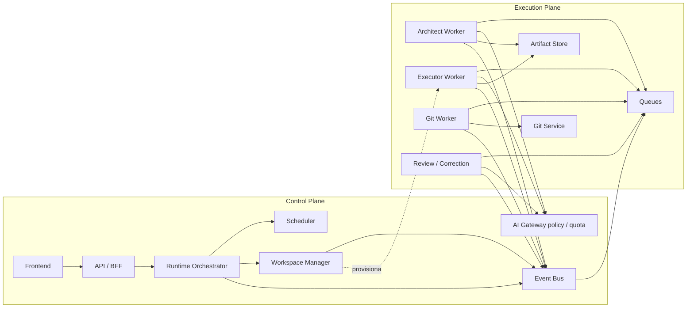
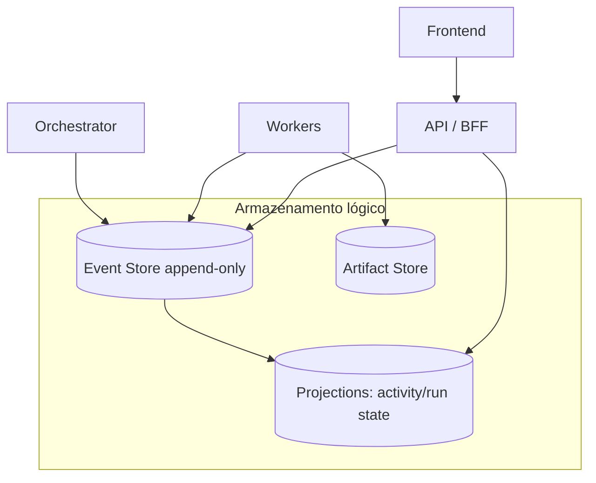
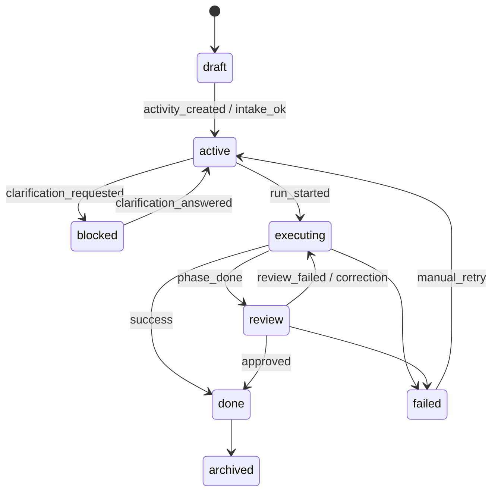
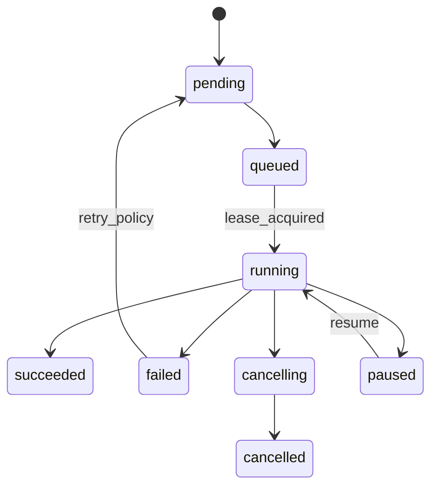
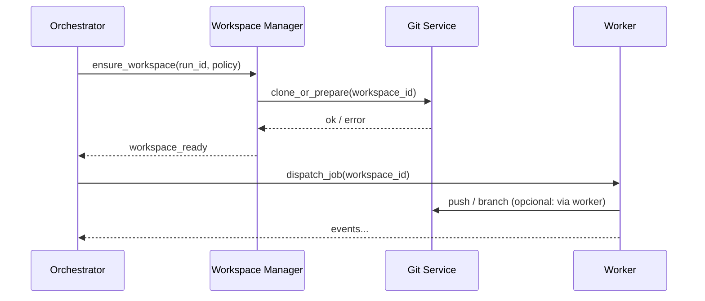

# Discovery técnico: arquitectura do Runtime Orchestrator (Setup-Boss)

**Data:** 2026-05-15  
**Tipo:** discovery — documentação técnica profunda (sem implementação, sem alteração ao runtime actual, sem quebrar MVP local)  

**Compatibilidade conceptual com:**  
- `docs/discovery-web-git-integrations-multitenant.md` (Git multi-tenant, integrações, cofre)  
- `docs/discovery-managed-workspaces-architecture.md` (Repository / Workspace / Activity / Run, lifecycle, locking, Git)  

**Visão:** o Setup-Boss evolui do **daemon monolítico** para uma **plataforma operacional distribuída e cloud-ready**: **workspaces Git gerenciados**, **workers** desacoplados, **execução orientada a eventos**, **multi-tenant**, **timeline** derivada de **eventos** (projection / event sourcing parcial), e **AI runtimes** atrás de um **gateway** com políticas. O MVP local permanece um **perfil de deployment**: *single control plane + worker in-process + event bus em memória ou ficheiro*, com os **mesmos contratos** (`activity`, `run`, `workspace`, `event envelopes`).

---

# 1. Visão geral da arquitectura

## 1.1 Control Plane vs Execution Plane

| Plano | Função | Componentes típicos |
|-------|--------|----------------------|
| **Control Plane** | **Decide o quê, quando e com que política**; mantém estado autoritário ou projections; não executa trabalho pesado nem acede directamente ao workspace em escrita | API/BFF, Runtime Orchestrator, Scheduler, políticas multi-tenant, RBAC, routing de comandos, reconciliação |
| **Execution Plane** | **Executa** trabalho: LLM, ferramentas, Git no disco, indexação; consome filas; reporta progresso via eventos | Workers (architect, executor, git, …), sandboxes, volumes |

**Regra de ouro:** o Orchestrator **ordena** e **reacts a eventos**; **não** substitui o Git Service nem corre o agente dentro do mesmo processo em produção (no MVP pode *colapsar* para simplicidade, mas **sem** acoplar o domínio a isso).

## 1.2 Componentes macro (catálogo)

| Componente | Plano | Papel |
|------------|-------|--------|
| **Frontend** | Ambos (UX) | Timeline visual, controlos, estado agregado; não fonte de verdade. |
| **API / BFF** | Control | Auth/session, validação, *command* append (opt.), queries sobre projections. |
| **Runtime Orchestrator** | Control | Máquinas de estado de Activity/Run; emissão/consumo de intents; orquestra lifecycle de workspace via Workspace Manager; recovery. |
| **Scheduler** | Control | Priorização, fairness por tenant, debounce, janelas de manutenção. |
| **Queue System** | Limite | Filas de *jobs* por tipo worker; DLQ; visibility timeout. |
| **Event Bus** | Control + edge | Bus interno (árvore de evolução: in-process → broker). |
| **Workspace Manager** | Control (coordena) + data plane (provisiona) | Aloca/liberta workspaces; locks; leases; sync/cleanup; ver discovery workspaces. |
| **Git Service** | Execution-adjacent | Clone/fetch/pull/push/branch/PR; tokens via Secrets; operações idempotentes com external refs. |
| **Execution Workers** | Execution | Architect, executor, review, correction, git-specialist, indexing, knowledge. |
| **AI Gateway** | Control + Execution edge | Roteamento LLM, policies, rate limit, custo, tracing de tokens. |
| **Review Runtime** | Execution | Pode ser worker dedicado ou policy pack no executor; separação conceptual clara. |
| **Knowledge Service** | Execution | Ingestão, embeddings, retrieval; **não** no caminho crítico síncrono se possível. |
| **Artifact Store** | Data | Blobs, logs, patches, bundles de replay; local → object storage. |
| **Timeline / Event Store** | Control + Data | Append-only de eventos de domínio; projections para UI/API. |
| **Observability Stack** | Transversal | Traces, métricas, logs correlacionados com `trace_id`, `run_id`. |
| **Secrets / Credentials Service** | Control | Cofre por tenant; injecção efémera; integra com Git multi-tenant. |

## 1.3 Diagrama — planos e fluxo de comandos/eventos

## 1.4 Diagrama — dados e timeline

---

# 2. Runtime Orchestrator

## 2.1 Responsabilidade

O **Runtime Orchestrator** é o **cérebro operacional** do Control Plane:

1. Manter (ou consolidar) o estado das **Activities** e **Runs** conforme políticas do produto.  
2. Traduzir intenções (“aprovar”, “executar”, “cancelar”) em **transições válidas** + enfileiramento de trabalho.  
3. Coordenar com **Workspace Manager** a existência e o estado do **Workspace** (criar, ready, locked, archived… — ver documento de workspaces).  
4. Garantir **at-least-once** *processing* com **idempotência** no consumidor e **dedup** por `command_id` / `event_id`.  
5. Arranjar **recovery**: reconciliação periódica, detecção de *stuck*, re-drive de filas.

## 2.2 O que coordena vs o que NÃO executa

| Coordena | Não executa directamente (em arquitectura alvo) |
|----------|-----------------------------------------------|
| Ordem das fases do Run (intake → clarify → plan → execute → review …) | Chamadas LLM longas |
| Alocação/libertação de workspace (via Manager) | `git push` no filesystem do worker sem passar pelo Git Service (anti-padrão) |
| Emissão de *tasks* para filas | Parsing pesado de monorepo completo sem quota |
| Cancelamento, pause, política de retry | Acesso à credencial em claro |

## 2.3 Lifecycle — Activity (máquina de estados conceptual)

Estados **exemplificativos** (ajustáveis ao produto); o importante é **centralizar** a transição no Orchestrator.

## 2.4 Lifecycle — Run

## 2.5 Coordenação com Workspace (via Workspace Manager)

- **Antes** de `running` mutável: `workspace.ready` (evento) ou falha estruturada.  
- **Durante** mutação: workspace em `locked`/`running` (nomenclatura do doc de workspaces).  
- **Após** sucesso ou falha terminal: política de `archived` / `deleting`; Orchestrator **não** apaga disco — delega no Manager.

## 2.6 Workers — visão do Orchestrator

- Publica **jobs** com `tenant_id`, `run_id`, `workspace_id?`, `job_kind`, `idempotency_key`.  
- Recebe eventos `worker_started`, `worker_heartbeat`, `worker_completed`, `worker_failed`.  
- **Heartbeat + lease**: se expirar, transição para `failed` ou `retry` conforme política.

## 2.7 Retry / recovery

| Camada | Mecanismo |
|--------|-----------|
| Job | Backoff, max attempts, jitter |
| Run | Contador de `attempt` por fase; dead-letter |
| Activity | Estado `failed` com CTA humano |
| Reconciler | Scan periódico de `running` > timeout |

## 2.8 Cancelamento

1. Comando `cancel_run` → Orchestrator marca intenção; emite `run_cancelling`.  
2. Scheduler revoga lease / envia sinal ao worker (implementação).  
3. Workspace Manager liberta lock após teardown seguro.  
4. Evento terminal `run_cancelled`.

## 2.9 Pausa / resume

- **Pause**: útil para **clarification** ou limite de custo; worker completa *step* atual se política exigir checkpoint.  
- **Resume**: re-enfileira com mesmo `run_id` e estado serializado em projection ou artifact snapshot.

## 2.10 Rollback (operacional)

- **Não** é “undo genérico”; é: `rollback.run_to_checkpoint` (novo run filho), `git revert` via Git Service (política), ou **novo workspace** desde SHA (doc workspaces). Orchestrator **regista** a decisão como evento (`rollback_initiated`).

---

# 3. Modelo event-driven

## 3.1 Princípios

- **Evento de domínio** = facto imutável (`occurred_at`, `tenant_id`, `aggregate_type`, `aggregate_id`, `payload`, `metadata`).  
- **Comando** = intenção (pode falhar); idealmente também auditável.  
- **Orchestrator** reage a eventos internos e *externe* (ex.: webhook Git no futuro).

## 3.2 Event bus

| Evolução | Descrição |
|----------|-----------|
| **MVP local** | Bus in-process síncrono ou async com fila na memória + spill opcional a disco |
| **Intermediário** | SQLite/Postgres `outbox` + consumer; ou Redis streams |
| **Cloud** | Kafka / NATS / SQS+SNS / Azure Service Bus — escolha operacional, não conceptual |

## 3.3 Event sourcing parcial vs completo

| Abordagem | Conteúdo |
|-----------|----------|
| **Parcial (recomendado inicial)** | Event store para **timeline + audit + integração**; **snapshot** de estado em projection (Postgres) para queries rápidas |
| **Completo** | Todo estado derivado só por replay; maior pureza, maior custo de engenharia |

## 3.4 Timeline projection

- **Projection builders** subscrevem o stream filtrado por `activity_id` / `run_id`.  
- Materializam: “fase actual”, “último erro”, “lista de loops”, **percentagens** agregadas.  
- **Rebuild:** replay desde `snapshot_version` ou desde offset; idempotente por `event_id`.

## 3.5 Append-only, replay, rebuild

- Log **append-only** com `event_id` ULID/UUID e `causation_id`.  
- **Replay safety:** handlers **devem** ser idempotentes ou usar *effect ledger* (“já emiti PR para este SHA?”).

## 3.6 Catálogo de eventos (exemplos)

| Evento | Agregado típico |
|--------|-----------------|
| `activity_created` | Activity |
| `workspace_ready` | Workspace |
| `spec_generated` | Activity / Run |
| `clarification_requested` | Activity |
| `run_started` | Run |
| `patch_applied` | Run |
| `review_failed` | Run |
| `branch_pushed` | Workspace / Run |
| `pr_opened` | Run |
| `workspace_archived` | Workspace |

## 3.7 Idempotência, ordenação, deduplicação

| Tópico | Directriz |
|--------|-----------|
| **Idempotência** | `Idempotency-Key` em comandos; workers verificam ledger antes de side-effects externos (push, PR) |
| **Ordenação** | Por `activity_id`/`run_id`: serialização **forte** de mutações; paralelismo só em leitura/indexação |
| **Dedup** | `event_id` único; índice único na BD |
| **Retenção** | Hot: N dias em stream quente; cold: object store compactado |
| **Replay safety** | Side-effects externos atrás de “outbox pattern” + reconciliação com provider |

---

# 4. Arquitectura da Timeline

## 4.1 Quatro “timelines” (camadas)

| Camada | Audiência | Conteúdo |
|--------|-----------|-----------|
| **Visual (UI)** | Utilizador | Passos legíveis, erros amigáveis, links PR, ícones de fase |
| **Operacional** | Equipa interna | Estados, retries, fila, lease, workspace_id |
| **Técnica** | Engenharia | Eventos crus (filtrados), *trace_id*, payloads redigidos |
| **Auditoria** | Compliance | Append-only imutável, quem fez o quê, sem segredos |

## 4.2 Como eventos chegam ao frontend

1. **Polling** simplificado no MVP (`GET /activities/:id/timeline?cursor=`).  
2. **SSE** ou **WebSocket** para push de *projection patches* (cloud).  
3. Sempre **derivado** de projections — o cliente não interpreta log cru como fonte primária.

## 4.3 Agregados e loops

- **Loops** (ex.: review → correction) modelados como **sub-grafo** de `run_id` ou `attempt` index.  
- UI: *thread* visual encadeado com `parent_attempt_id`.  
- **Aggregates:** `last_failure_reason`, `retry_count`, `open_incidents`.

## 4.4 Event store, snapshots, streaming

- **Snapshots** de projection: versão + blob JSON ou colunas normalizadas.  
- **Streaming:** partition key `activity_id` para ordenação local; *global* ordering raramente necessário.  
- **WebSocket/SSE:** payload mínimo (`event_type`, `sequence`, `delta`).

---

# 5. Execution Workers

## 5.1 Tipos de workers (papéis)

| Worker | Função |
|--------|--------|
| **Architect** | Decompor, planear, gerar estrutura de execução |
| **Executor** | Aplicar mudanças no workspace, chamar ferramentas |
| **Review** | Avaliar resultado vs spec; gates |
| **Correction** | Fechar lacunas após review falhado |
| **Git** | Operações Git de baixo nível via Git Service (ou embutido no MVP) |
| **Indexing** | AST, grep index, symbol map — assíncrono |
| **Knowledge** | RAG ingest/query — geralmente fora do caminho síncrono |

## 5.2 Pools, filas, isolamento

- **Filas por `job_kind`** para *backpressure* diferente (LLM vs git).  
- **Filas por tenant** (virtual ou físicas) para fairness e noisy neighbor.  
- **Prioridade:** tier pago vs *burst* limitado.  
- **Isolamento:** processo/container; credenciais efémeras; disco por workspace.

## 5.3 Escala horizontal

- Workers **stateless** quanto possível; estado em projections + artifacts.  
- **Lease** no job; visibility timeout = heartbeat esperado.

## 5.4 Timeouts e recovery

| Parâmetro | Função |
|-----------|--------|
| **Soft timeout** | checkpoint + evento |
| **Hard timeout** | kill + `worker_failed` |
| **Heartbeat** | renovação de lease |

## 5.5 Warm vs ephemeral workers

| Modo | Uso |
|------|-----|
| **Warm pool** | Latência baixa para LLM executor |
| **Ephemeral** | Jobs git pesados; escala a zero |

## 5.6 Autoscaling e afinidade

- Métricas: fila pendente p95, idade do job, custo token.  
- **Affinity por workspace:** jobs subsequentes do mesmo `workspace_id` → mesma AZ/volume (quando stateful).

---

# 6. Workspace Manager

## 6.1 Responsabilidades

| Acção | Dono |
|--------|------|
| **Provisionar** | Manager solicita recurso + chama Git Service clone/checkout |
| **Destruir** | Manager agenda GC após política |
| **Lock / lease** | Concorrência branch/repo |
| **Sync policy** | Quando fetch/rebase — eventos `workspace.sync.*` |
| **Cache** | Bare mirror regional (fase madura) |
| **Snapshots** | Metadados + opcional bundle |
| **Reuse** | Hot workspace por Activity — com critérios estritos |

## 6.2 Relação com Orchestrator, Git Service, Workers

> Nota: no desenho maduro, **push** sempre via Git Service para consolidar políticas de lock e tokens.

---

# 7. Git Service

## 7.1 Papel

Serviço **centralizado** (mesmo que biblioteca partilhada no MVP) que:

- Executa **clone / fetch / pull / push / branch / merge / revert** (subconjunto versionado).  
- Encapsula **auth** via Secrets/Credentials.  
- Automatiza **PR/MR** (fase posterior) com idempotência.

## 7.2 Operações síncronas vs assíncronas

| Operação | Modo típico |
|----------|-------------|
| clone grande | async job + eventos |
| fetch incremental | sync curto |
| push | async se rede instável |
| criação PR | async + poll/webhook |

## 7.3 Locks Git e conflitos

- Lock **orquestrado** alinhado ao doc de workspaces (`index.lock`, branch lock).  
- **Conflito** → evento `git.conflict`; Orchestrator move Activity/Run para estado humano ou correction.

## 7.4 Retry policy

- Retry só para erros **transitórios** (5xx provider, timeout); nunca para `non-fast-forward` sem reconciliação.

---

# 8. AI Runtime / AI Gateway

## 8.1 Separação Orchestrator / providers

- Orchestrator **não** conhece API keys de OpenAI/Anthropic/etc.  
- **AI Gateway** central: um pincho para **routing**, **quotas**, **logging**, **caching** onde seguro.

## 8.2 Funcionalidades do Gateway

| Função | Descrição |
|--------|-----------|
| **Routing** | Modelo por tarefa (`architect` vs `executor`) |
| **Policies** | PII strip, tool allowlists upstream |
| **Fallback** | modelo secundário |
| **Custos** | tags `tenant_id`, `run_id` → billing |
| **Rate limit** | token bucket por tenant |
| **Cache** | só para prompts determinísticos *sanitizados* — cuidado com fuga de dados entre tenants |
| **Observabilidade** | tokens in/out, latência, erros por provider |

## 8.3 Relação com fases

- **Architect / executor / review / correction** invocam o gateway com **perfis** diferentes (temperatura, max tokens).  
- **Knowledge** pode usar *embedding* route separado.

---

# 9. Artefactos (Artifact Architecture)

## 9.1 O que são artefactos

Outputs **imutáveis** ou **versionados** por `run_id`: logs agregados, patches, diffs, relatórios, *prompt traces* redigidos, bundles para replay.

## 9.2 Onde vivem

| Fase | Armazenamento |
|------|----------------|
| MVP local | Disco sob `.setup-boss/` ou dir configurado + metadados |
| Cloud | Object storage (S3-compatível) + índice em BD |

## 9.3 Retenção e versionamento

- Retenção por **tenant** e tipo (`log`, `patch`, `report`).  
- **Versionamento:** `artifact_id` + `content_hash`; dedup entre runs se igual.

## 9.4 Replay bundle

- Conjunto mínimo: eventos + SHA do commit + inputs não-secretos + modelo IDs.  
- Objetivo: *deterministic-ish* replay em sandbox interna (nunca prometer bit-a-bit com LLMs).

---

# 10. Observabilidade

## 10.1 Pilares

| Pilar | Exemplos |
|-------|----------|
| **Logs estruturados**               | JSON: `tenant_id`, `run_id`, `workspace_id`, `level` |
| **Tracing distribuído**             | OpenTelemetry **recomendado** (vendor-agnostic) |
| **Métricas**                        | Prometheus-compatible (counter/histogram) |
| **Dashboards**                    | Filas, idade de jobs, falhas Git, custo token/run |
| **Health**                          | `readiness` filas + DB + secrets backend |
| **Execution graph**                 | Export OTel spans nomeados por fase |
| **Token usage**                     | Métricas do AI Gateway |
| **Workspace / Git**                 | Duração clone, push fail, lock wait |

## 10.2 OpenTelemetry / Prometheus / “event tracing”

- **OpenTelemetry** como **padrão** para traces + baggage (`tenant_id` só onde permitido).  
- **Prometheus** (ou compatível) para métricas de *runtime*.  
- **Event tracing:** correlacionar `trace_id` com `event_id` na timeline técnica.

---

# 11. Multi-tenancy

| Aspecto | Directriz |
|---------|-----------|
| **Isolamento tenant** | Namespaces de fila, chaves de cache, partições de storage |
| **Workspace** | Path/ID sempre *scoped* |
| **Secrets** | Cofre com KMS por tenant |
| **Quotas** | Disco, concorrência de runs, tokens |
| **Rate limits** | API + gateway |
| **Fairness** | Scheduler weighted fair queueing |
| **Noisy neighbor** | caps duros + degradação elegante |

---

# 12. Segurança

| Tema | Directriz |
|------|-----------|
| **AuthN / AuthZ** | Wiki SSO + RBAC Setup-Boss |
| **Secrets** | Nunca logar; access auditado |
| **Audit logs** | Stream append-only (subset de eventos) |
| **Sandbox** | Evolução MVP → container |
| **Command isolation** | spawn sem shell; allowlists |
| **Filesystem** | fronteiras workspace |
| **Prompt injection** | Separar *system* / *tool results* / *user*; validators |
| **Tenant isolation** | testes de regressão de fuga |

---

# 13. MVP vs cloud final

| Deployment | Caracterização |
|------------|----------------|
| **Daemon actual** | HTTP local; Git + execução colados; falta separação formal |
| **Orchestrator local** | Mesmo código orchestration; workers in-process |
| **Single-node** | Um broker simulado; filas em memória |
| **Multi-worker** | Vários processos; fila real embed (Redis) |
| **Distributed workers** | Filas regionais; data plane separado |
| **Kubernetes futuro** | Deployments por worker type; HPA |
| **Self-hosted vs SaaS** | Mesmo código; *feature flags* de escala |

### Contratos que devem nascer correctos desde já

- IDs: `tenant_id`, `activity_id`, `run_id`, `workspace_id`, `event_id`  
- Envelope de evento + `correlation_id`  
- Separação **comando** vs **evento**  
- Git e AI atrás de interfaces (mesmo que implementação única)

### O que pode permanecer simples

- Broker in-process  
- Projection em SQLite  
- Git Service = módulo partilhado

### O que **não** acoplar

- LLM vendor ao Orchestrator  
- Estrutura de pastas local ao modelo de domínio  
- UI à ordem física dos eventos no store

---

# 14. Failure recovery

| Falha | Resposta |
|-------|----------|
| **Worker crash** | Lease expira → retry ou DLQ |
| **Daemon restart** | Rehydrate projections + *reconcile runs* `running` |
| **Rede** | Retries exponenciais Git/LLM |
| **Git conflict** | Evento + estado humano |
| **Execução parcial** | Checkpoint + `continuation_token` em artifact |
| **Replay** | Idempotência em efeitos externos |
| **Stuck run** | Reconciler |
| **Zombie run** | Heartbeat missing |
| **Orphan workspace** | GC Manager + *reconciler disk↔BD* |

### Reconciliação, healing, DLQ

- **Loops** periódicos: “jobs sem lease”, “runs running > SLA”.  
- **Healing:** emitir `healing_action` auditado.  
- **DLQ:** inspecção manual + `replay_dlq_job`.

---

# 15. Custos e escala

| Vector | Alavancas |
|--------|-----------|
| **Tokens** | Cache selectiva, modelos menores por fase, summarização |
| **Storage** | TTL artefactos, compactação eventos, shallow git |
| **Workspace** | Ephemeral default, bare+worktree |
| **Workers** | Autoscale por fila; spot para git |
| **Observabilidade** | Sampling de traces, agregações |

### Hot vs cold paths

- **Hot:** start run, primeiro token, status UI  
- **Cold:** indexing, knowledge ingest, relatórios longos

### Lazy provisioning

- Workspace só quando run precisa mutar; PR só em fase definida.

---

# 16. Plano incremental (roadmap)

| Fase | Entrega |
|------|---------|
| **A — Orchestrator local desacoplado** | Módulo orchestration + state machines; mesmo processo daemon |
| **B — Event bus interno** | Outbox ou bus in-process + projections de timeline |
| **C — Worker pools** | Filas lógicas; executor separado opcionalmente |
| **D — Workspace Manager** | Formalizar lifecycle (doc workspaces) no runtime |
| **E — Distributed workers** | Broker + múltiplos consumidores |
| **F — Cloud runtime** | Object storage, multi-tenant quotas, SSE |
| **G — SaaS multi-tenant** | Billing, políticas enterprise, regions |

## Riscos

- Complexidade prematura do broker sem necessidade de escala.  
- Event sourcing completo antes das projections maduras.  
- Workers com acesso directo a secrets.  
- Falta de idempotência em push/PR.  
- Orphan workspaces sem reconciler.

## Decisões recomendadas

1. **Control / Execution** como fronteira mental e organizacional permanente.  
2. **Event-driven** com **projections**; event sourcing **parcial** até prova de necessidade.  
3. **Git Service** e **AI Gateway** como *facades* obrigatórias no desenho alvo.  
4. **Workspace Manager** único dono do lifecycle de disco (alinhado ao doc de workspaces).  
5. **OpenTelemetry** desde cedo nas novas peças (pode no-op no MVP).  
6. **Idempotência** obrigatória em side-effects externos.

## Critérios de aceite — primeiras fases (A–C)

1. **Uma** máquina de Run reconhecida pelo código e pela API (mesmo que local).  
2. **Eventos** mínimos emitidos: `run_started`, `run_completed`, `run_failed`, `workspace_ready`.  
3. **Timeline** lida de projection, não de log ad hoc.  
4. Comandos **idempotentes** para start/cancel do mesmo `run_id`.  
5. Nenhum segredo de LLM/Git no frontend; rastreio com `tenant_id`/`run_id` nos logs estruturados.  
6. Documento de **reconciliação** (pseudo-código) para runs `running` após restart.

---

## Referências cruzadas

- `docs/discovery-web-git-integrations-multitenant.md` — integrações, cofre, BFF, Wiki.  
- `docs/discovery-managed-workspaces-architecture.md` — lifecycle `workspace`, locking, Git, filesystem.  
- `docs/discovery-git-provider-auth-github-bitbucket.md` — estado actual do daemon e rotas Git.

Este discovery **não** substitui os anteriores: **complementa** com o **mapa operacional distribuído** — o Runtime Orchestrator como **control plane** que **coordena** workspaces, workers e eventos sem se tornar o local onde Git ou LLMs **têm** de morar para sempre.
