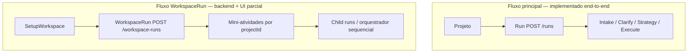

# Discovery — Workspace multi-projeto no frontend (Setup Boss)

**Data:** 2026-05-18  
**Tipo:** discovery only — sem implementação, sem alteração funcional  
**Objetivo:** mapear o estado actual do frontend (e dependências de API/runtime) face ao conceito correcto de **Workspace** como pasta lógica de 1+ projetos, e definir lacunas, impacto e plano incremental.

---

## Conceito correcto (alvo de produto)

Um **Workspace** é uma pasta lógica que agrupa **1 ou mais projetos/repositórios** já registados no Setup Boss. Não tem tipo, não tem projeto principal, não tem prioridade nem tags.

Exemplo:

| Workspace | Projetos |
|-----------|----------|
| Chat Integração | `wiser-bot-front`, `wiser-bot-api`, `setup-boss` |

Uma **única conversa/tarefa** no contexto desse workspace deve considerar **todos** os projetos do grupo (planeamento, execução e versionamento futuros multi-repo).

**Não confundir com:**

| Termo existente no código | Significado |
|---------------------------|-------------|
| `MainWorkspaceView` (`mission-shell-store`) | Vista interna Mission Control: `mission` vs `connections` |
| **Managed Workspace** | Materialização Git em disco (lifecycle, locks) — `docs/discovery-managed-workspaces-architecture.md` |
| **WorkspaceRun** | Entidade de orquestração sequencial (mini-atividades + runs filhos) — fases B–J já implementadas no backend |

Este discovery foca o **agrupamento lógico** (`SetupWorkspace`) e a **experiência Mission Control** para o operar; o **WorkspaceRun** é caminho paralelo que hoje **não** substitui o fluxo `Project → Run` com `TaskComposer`.

---

## 1. Estado actual do frontend

### 1.1 Onde aparece “Workspaces”

| Local | Ficheiro | Comportamento |
|-------|----------|---------------|
| Sidebar | `frontend/components/regions/ProjectActivitySidebar.tsx` | Importa `WorkspaceSidebarSection` **acima** da secção “Projetos” |
| Secção Workspaces | `frontend/components/features/workspace/WorkspaceSidebarSection.tsx` | Cabeçalho “Workspaces”; lista workspaces; expandir mostra **WorkspaceRuns** (não projetos) |
| Painel central alternativo | `frontend/components/regions/AppShell.tsx` | Se `selectedWorkspaceRunId` → `WorkspaceRunViewShell`; senão `RunViewShell` |
| Runtime root | `frontend/components/features/MissionRuntimeRoot.tsx` | SSE workspace (`useWorkspaceRunSse`) quando há `selectedWorkspaceId` |

A hierarquia visual **não** reflecte o alvo (workspace → projetos → atividades). Os projetos continuam numa lista **plana** independente, sem filtro por workspace.

### 1.2 Botão “Novo” e menus

`frontend/components/features/projects/ProjectsNewMenu.tsx`:

| Opção | Estado |
|-------|--------|
| Criar workspace | **Disabled** (placeholder) |
| Repositório Git | **Activo** — abre fluxo real de registo (`AddProjectDialog` / `use-add-project-flow`) |
| Repositório local | Disabled |
| Projeto temporário | Disabled |

Não existe diálogo de criação/edição de workspace no frontend.

### 1.3 API real vs mock vs placeholder

| Área | Estado |
|------|--------|
| Listar workspaces | **API real** — `useWorkspaces` → `GET /workspaces` via `fetchWorkspaces` |
| CRUD workspace no UI | **Inexistente** — sem `postWorkspace` / `patchWorkspace` / `deleteWorkspace` em `workspace-runtime-api.ts` |
| Listar WorkspaceRuns | **API real** — `useWorkspaceRuns` → `GET /workspace-runs?workspaceId=` |
| Detalhe / Git / orquestração WorkspaceRun | **API real** — hooks e mutações em `use-workspace-run-*` |
| Criar WorkspaceRun no UI | **Inexistente** — `POST /workspace-runs` só usado em smokes/scripts |
| Projetos | **API real** — `useProjects` → `GET /projects`; cache offline em `mission-sidebar-cache` |
| Runs por projeto | **API real** — `useRuns` / `projectRunsQueryOptions` |
| `frontend/lib/mocks/projects.ts` | **Morto** — não referenciado noutros ficheiros |

### 1.4 O que precisa ser removido ou simplificado (futuro)

Não remover nesta fase; documentar alinhamento:

- Campo `primaryProjectId` no contrato `SetupWorkspaceDto` e validação backend — **não faz parte do conceito correcto**.
- Campo `description` — opcional hoje; alvo minimalista pode mantê-lo como opcional ou omitir na UI.
- Dupla navegação confusa: lista plana de **todos** os projetos + secção Workspaces só com **WorkspaceRuns** (sem projetos aninhados).
- Vocabulário “WorkspaceRun” vs “atividade” do workspace — hoje são entidades distintas da run `POST /runs`.

---

## 2. Modelo actual de projetos e seleção

### 2.1 Carregamento de projetos

```
GET /projects (runtime-api)
  → useProjects → filterOperationalProjects → ProjectSummaryDto[]
  → cache local (mission-sidebar-cache) se offline
```

Cada projeto: `projectId`, `projectRoot`, `displayName`, metadados de actividade.

### 2.2 Runs / tarefas por projeto

- Índice global `.setup-boss/runs/<runId>.json` com `project_root` / `projectId`.
- Sidebar: `useQueries` com `projectRunsQueryOptions` por projecto expandido ou seleccionado.
- Criação: `useCreateRun` → `createRunFromTask` → **`POST /runs`** com **um** `projectId` obrigatório.

### 2.3 Estado de seleção (`mission-shell-store`)

| Campo | Uso |
|-------|-----|
| `selectedProjectId` | Projeto activo no fluxo principal |
| `selectedRunId` | Run activa (chave canónica resolvida em sidebar/reconcile) |
| `selectedWorkspaceId` | Workspace expandido/seleccionado na secção Workspaces |
| `selectedWorkspaceRunId` | WorkspaceRun no painel central dedicado |
| `expandedProjectIds` | Projetos com lista de atividades visível |
| `expandedWorkspaceIds` | Workspaces expandidos na sidebar |
| `newActivityFlow` | Modo “nova atividade” antes de existir run |

Persistência: `localStorage` (`setup-boss-mission-shell`, version 4).

Reconciliação:

- `use-mission-shell-reconciliation` — project/run vs registry e cache de runs.
- `use-workspace-run-selection-reconciliation` — limpa `selectedWorkspaceRunId` stale.
- `sanitizeMissionShellCrossSelection` — **prioridade Project→Run**: seleccionar run limpa workspace run.

### 2.4 Sidebar de projetos e atividades

`ProjectActivitySidebar.tsx`:

- Renderiza **todos** os projectos operacionais com runs, pins, arquivo, overflow (rename/delete).
- **Não** filtra projectos por `selectedWorkspaceId` nem por membership em workspace.
- Secção Workspaces é **ortogonal** (só WorkspaceRuns).

---

## 3. Modelo necessário de Workspace (alvo)

```text
Workspace {
  id            // workspaceId no backend actual
  name
  projectIds[]  // ids do projects.json
  createdAt
  updatedAt
}
```

**Sem:** tipo, `primaryProjectId`, prioridade, tags.

### 3.1 Gap face ao modelo persistido hoje (Fase A backend)

| Campo actual (`SetupWorkspaceDto`) | Alvo |
|-----------------------------------|------|
| `workspaceId` | `id` (nome API pode manter `workspaceId` por compatibilidade) |
| `name` | `name` |
| `projectIds` | `projectIds` |
| `primaryProjectId` | **Remover do produto** (pode ficar nullable deprecated na API até migração) |
| `description` | Opcional — fora do MVP UX |
| `createdAt` / `updatedAt` | manter |

Validação actual (`core/validate-workspace.js`): exige **≥1 projeto** (`workspace_empty`). Workspace vazio **não** é permitido hoje.

---

## 4. Relação workspace → projetos

### 4.1 Associar projetos existentes

- Backend: `POST /workspaces` ou `PATCH /workspaces/:id` com array `projectIds` completo.
- Não há rotas dedicadas `POST .../projects` / `DELETE .../projects/:id` — o patch de array é suficiente.

### 4.2 Um projeto em vários workspaces?

- **Sim, hoje.** Não existe validação de exclusividade mútua em `workspace-registry.js`.
- Decisão de produto pendente: permitir (como tags) vs. restringir a um workspace.

### 4.3 Workspace padrão

- **Não existe.** Projetos “soltos” aparecem na lista plana de Projetos.
- Runs antigas continuam ligadas ao `projectId` da run, não ao workspace.

### 4.4 Projetos fora de workspace

- Comportamento actual: visíveis na secção Projetos como hoje.
- Alvo UX: secção “Projetos” pode mostrar só órfãos, ou todos com badge — **decisão de Fase 2**.

### 4.5 Workspace vazio

- Backend: rejeitado (`workspace_empty`).
- Alvo minimalista: ou permitir rascunho (alterar validação) ou forçar ≥1 projeto na criação (recomendado para Fase 2 UI).

---

## 5. Relação workspace → tarefa/run

### 5.1 Dois modelos em paralelo (estado actual)



| Aspeto | Project → Run | WorkspaceRun |
|--------|---------------|--------------|
| Criação na UI | `TaskComposer` + `useCreateRun` | **Não** |
| Planeamento multi-repo unificado | Não | `globalSpec` / `globalPlan` (estrutura existe; UI limitada) |
| Execução | Pipeline completo por projeto | Orquestrador + minis (`workspace-run-orchestrator`) |
| Git multi-repo | Por run | `prepare-git` agregado (`WorkspaceGitAggregatedCard`) |
| Painel central | `RunViewShell` + fases operacionais | `WorkspaceRunViewShell` (cards Git + minis) |

### 5.2 Comportamento desejado (alvo de produto)

Com workspace seleccionado, **nova tarefa**:

1. Contexto = todos os `projectIds` do workspace.
2. Runtime/plano consideram múltiplos repositórios.
3. Execução pode actuar em N roots; branch padronizada em todos (futuro).

**Lacuna:** nenhum caminho UI liga “nova conversa no workspace” a `POST /runs` multi-projeto nem unifica com WorkspaceRun sem decisão arquitectural.

### 5.3 Recomendação de integração (para fases futuras)

Escolher **uma** de duas linhas (não implementar neste discovery):

- **A — Evoluir WorkspaceRun** como “a run do workspace” (já tem orquestração e Git agregado); UI de criação passa a `POST /workspace-runs` + composer adaptado.
- **B — Run única multi-projeto** no índice `/runs` com metadado `workspaceId` + `projectIds[]` (mudança maior no runtime actual, onde cada run tem um `project_root`).

O código actual favorece **A** a curto prazo (menos refactor do pipeline single-repo).

---

## 6. UI esperada (proposta minimalista)

### 6.1 Sidebar alvo

```text
Workspaces
  ▼ Chat Integração
      wiser-bot-front
      wiser-bot-api
      setup-boss
      Atividades (runs do workspace / workspace runs)
Projetos (opcional: só sem workspace, ou lista completa colapsada)
```

### 6.2 Criação

1. “Novo workspace” (activar item do `ProjectsNewMenu`).
2. Modal: nome + multi-select de projetos registados.
3. `POST /workspaces` → invalidar `runtimeQueryKeys.workspaces()`.

### 6.3 Edição

- Renomear / add/remove projetos: `PATCH /workspaces/:id`.
- Eliminar workspace: `DELETE /workspaces/:id` (projectos e runs de projeto **intactos**).

### 6.4 Seleção e painel central

- Seleccionar workspace **sem** run: composer “nova tarefa do workspace” (Fase 3).
- Seleccionar atividade: painel unificado (hoje dividido entre `RunViewShell` e `WorkspaceRunViewShell`).

---

## 7. Impacto no fluxo actual

| Componente | Impacto |
|------------|---------|
| **TaskComposer** | Recebe só `projectId`; `useCreateRun` exige um projeto. Precisa modo `workspaceId` + lista de projectos ou delegação a WorkspaceRun. |
| **MissionRuntimeRoot** | Prefetch de runs por `expandedProjectIds`; acrescentar prefetch por workspace ou runs agregadas. |
| **mission-shell-store** | Pode precisar `selectedWorkspaceContext` explícito; hoje workspace e project coexistem sem hierarquia na sidebar. |
| **Seleção project/run** | Regras de sanitize devem evitar estado “workspace seleccionado + run de outro projeto” sem intenção. |
| **Criação de run** | Novo endpoint ou extensão de payload; hoje inviável multi-projeto via `POST /runs`. |
| **API client** | Adicionar mutações workspace; opcionalmente `postWorkspaceRun` para criação. |
| **Painel central** | Unificar ou encadear `RunViewShell` / `WorkspaceRunViewShell`; timeline direita oculta em workspace-run (`AppShell`). |
| **Timeline** | `RightTimelinePanel` só no fluxo project-run; workspace-run não tem timeline operacional equivalente. |
| **VersioningPhasePanel** | Já lê `selectedWorkspaceRunId` e `prepare-git` workspace — padrão a reutilizar para multi-repo. |
| **OperationalPlanDocument / planning** | Assumem um `project_root`; plano multi-projeto é Fase 4. |

---

## 8. Backend/API — inventário

### 8.1 Já implementado (daemon `runtime-api.js`)

| Método | Rota | Notas |
|--------|------|-------|
| GET | `/workspaces` | Lista |
| POST | `/workspaces` | Cria |
| GET | `/workspaces/:workspaceId` | Detalhe |
| PATCH | `/workspaces/:workspaceId` | Actualiza (incl. `projectIds`) |
| DELETE | `/workspaces/:workspaceId` | Remove registo; **não** apaga projectos |
| GET | `/workspace-runs` | Query `workspaceId` |
| POST | `/workspace-runs` | Cria WorkspaceRun |
| GET/PATCH/... | `/workspace-runs/:id/*` | Detalhe, minis, git, start, resume, SSE |

Rotas **não** existentes (da lista sugerida no brief): sub-recursos `POST/DELETE .../projects` — substituíveis por PATCH do array.

### 8.2 Frontend — falta expor

- Funções de escrita em `workspace-runtime-api.ts` (POST/PATCH/DELETE workspaces).
- Hooks `useCreateWorkspace`, `useUpdateWorkspace`, `useDeleteWorkspace` (React Query mutations).
- `POST /workspace-runs` no client para criação guiada.

### 8.3 O que o runtime **não** faz ainda para o conceito “uma conversa, todos os projetos”

- Intake/clarify/strategy **unificados** multi-root no mesmo artefacto de plano.
- `POST /runs` com múltiplos `projectId`.
- Sidebar com projectos aninhados por workspace.

---

## 9. Dados e persistência

| Ficheiro | Conteúdo |
|----------|----------|
| `.setup-boss/workspaces.json` | `schemaVersion: 1`, array `workspaces[]` |
| `.setup-boss/workspace-runs/index.json` | WorkspaceRuns + miniActivities |
| `.setup-boss/projects.json` | Registry de projectos (fonte de verdade dos ids) |
| `.setup-boss/runs/<runId>.json` | Runs single-project (fluxo principal) |

Metadados de run **não** referenciam `workspaceId` hoje no índice global standard.

---

## 10. Compatibilidade

| Cenário | Estratégia |
|---------|------------|
| Runs antigas por projeto | Inalteradas; selecção por `projectId` + `runId` mantém-se |
| Projetos sem workspace | Lista Projetos; nenhuma migração obrigatória |
| Seleção persistida | `selectedWorkspaceId` / `selectedWorkspaceRunId` em localStorage — validar contra GET após Fase 2 |
| WorkspaceRuns existentes | Continuam na secção Workspaces; botão “Run filho” salta para fluxo single-run |
| APIs antigas | `/projects`, `/runs` intactos |

---

## 11. Riscos

| Risco | Severidade | Mitigação |
|-------|------------|-----------|
| Confusão Workspace vs WorkspaceRun vs MainWorkspaceView | Alta | Glossário na UI; renomear labels se necessário (“Grupo de projetos” vs “Corrida orquestrada”) |
| Duplicidade de runs (uma por projeto + uma global) | Alta | Política clara Fase 3: uma entrada de criação por contexto |
| Sidebar poluída (projeto aparece no workspace e em Projetos) | Média | Fase 2: filtrar órfãos ou colapsar duplicados |
| Runtime não pronto para plano/execução multi-projeto real no fluxo `/runs` | Alta | Fases 4–6; usar WorkspaceRun como ponte |
| Branch/versionamento multi-repo incompleto fora do fluxo workspace-run | Média | Já há `prepare-git` workspace; alinhar com VersioningPhasePanel |
| `primaryProjectId` misleading | Baixa | Deprecar no contrato e docs |
| Projeto em N workspaces sem regra | Média | Decidir e validar no backend se necessário |

---

## 12. Plano incremental

### Fase 1 — Modelo e API read/write de workspaces (frontend)

- Client HTTP: POST/PATCH/DELETE `/workspaces`.
- Alinhar tipo TS ao alvo (marcar `primaryProjectId` deprecated).
- Opcional: script/smoke de criação manual; não obrigar mudança de validação `workspace_empty` ainda.

### Fase 2 — Sidebar e criação/edição

- Activar “Criar workspace” no `ProjectsNewMenu`.
- Modal criar/editar; listar projectos do registry no multi-select.
- Sidebar: aninhar projectos sob workspace (leitura de `projectIds`); manter Projetos para órfãos ou toggle “mostrar todos”.
- DELETE workspace com confirmação.

### Fase 3 — Tarefa no contexto do workspace

- Seleccionar workspace → composer nova actividade.
- Criar via `POST /workspace-runs` **ou** extensão acordada de `/runs`.
- Seleccionar workspace limpa/conflictua com run de projeto conforme regras de sanitize.

### Fase 4 — Plano multi-projeto

- Plano/clarificação com scope explícito por `projectId`.
- UI de plano (ex. `OperationalPlanDocument`) com secções por repo.

### Fase 5 — Versionamento / branch multi-repo

- Branch única sugerida aplicada a todos os projectos do workspace (reutilizar `VersioningPhasePanel` + `prepare-git`).

### Fase 6 — Execução sequencial por projeto

- Orquestração visível no painel central (hoje parcial em `WorkspaceMiniActivitiesCard`).
- Unificar timeline/observabilidade onde fizer sentido.

---

## Lacunas resumidas

1. UI de CRUD de workspace inexistente; menu “Criar workspace” desactivado.  
2. Sidebar não mostra projectos dentro do workspace.  
3. `TaskComposer` / `POST /runs` single-project only.  
4. Dois painéis centrais (run vs workspace-run) sem narrativa única de “tarefa do workspace”.  
5. Modelo API inclui `primaryProjectId` e `description` além do minimalista.  
6. Plano operacional e execução multi-repo no fluxo principal ainda não integrados.  
7. `mockProjects` morto — limpeza cosmética futura.

---

## Recomendação — próximo passo

**Fase 1 no frontend:** implementar mutações `POST/PATCH/DELETE /workspaces` no `workspace-runtime-api.ts` + hooks React Query, **sem** alterar ainda a hierarquia da sidebar.

Em paralelo (decisão de 1 página): confirmar se a “tarefa única do workspace” na Fase 3 será **WorkspaceRun** (recomendado pelo código existente) ou evolução de `/runs`.

Validar manualmente com runtime online: criar workspace via API (ou smoke existente `workspace-phaseA-smoke.js`), confirmar que `GET /workspaces` aparece na secção actual da sidebar.

---

## Referências no repositório

| Documento / módulo | Conteúdo |
|--------------------|----------|
| `docs/workspace-model-phaseA.md` | CRUD `workspaces.json` |
| `docs/workspace-mission-control-phaseF.md` | UI WorkspaceRun actual |
| `docs/reports/2026-05-16-workspace-multiproject-discovery.md` | Discovery runtime orquestração |
| `docs/discovery-project-workspaces-multirepo.md` | Visão longo prazo multi-repo |
| `frontend/lib/api/workspace-types.ts` | DTO |
| `scripts/daemon/lib/workspace-registry.js` | Persistência |
| `scripts/daemon/lib/workspace-run-registry.js` | WorkspaceRuns |
