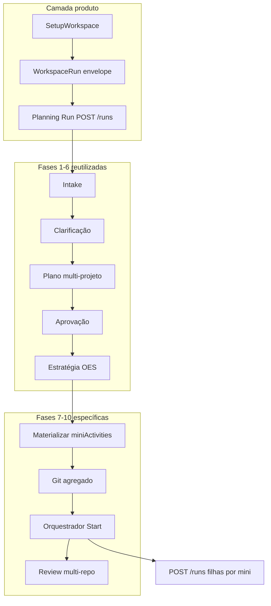

# Discovery — Unificação do fluxo WorkspaceRun com o pipeline completo do Run normal

**Data:** 2026-05-18  
**Tipo:** discovery only — sem implementação, sem alteração de código funcional  
**Objetivo:** definir como o WorkspaceRun passa a ser o fluxo principal multi-projeto reutilizando o pipeline do Run normal, sem runtimes paralelos.

---

## Resumo executivo

Hoje existem **dois caminhos de produto** no Mission Control:

| Caminho | Entrada | Painel central | Execução |
|---------|---------|----------------|----------|
| **Run normal** | `POST /runs` + `projectId` | `RunViewShell` + `OperationalPhaseStack` | Pipeline completo single-repo |
| **WorkspaceRun** | `POST /workspace-runs` | `WorkspaceRunViewShell` (Git + minis + Start) | Orquestrador sequencial multi-repo |

O WorkspaceRun nasceu como **envelope operacional** (fases B–J do backend) antes de existir UX de planeamento unificada. Isso gerou UX incoerente, `workspace_run_no_mini_activities` ao premir Start cedo, e sensação de “sistema paralelo”.

**Correcção parcial já aplicada (2026-05-18, fora do âmbito deste doc como implementação):** criação sem `miniActivities`, `planningRunId` no `globalSpec`, gating UI e delegação do planeamento ao `RunViewShell`. **Lacuna principal em aberto:** materialização automática de `miniActivities` a partir da estratégia/OES multi-projeto.

**Recomendação canónica:** **WorkspaceRun como entidade de produto multi-projeto** que **reutiliza** o pipeline Run existente na fase 1–6; a fase 7+ continua específica (minis, git agregado, orquestração). O Run single-project permanece como **caso especial** (workspace implícito de um projeto) até migração opcional futura.

---

## 1. Pipeline do Run normal (referência)

### 1.1 Fases operacionais (UX)

Ordem canónica (`frontend/lib/runtime/operational/operational-ux-types.ts`):

| # | Fase | Rótulo UI |
|---|------|-----------|
| 1 | `initialization` | Inicialização |
| 2 | `planning` | Montando o plano |
| 3 | `approval` | Aprovação do plano |
| 4 | `versioning` | Versionamento |
| 5 | `execution` | Execução |
| 6 | `review` | Review |
| 7 | `finalization` | Finalização |

**Esteira:** `OperationalPhaseStack` (`frontend/components/features/run-detail/OperationalPhaseStack.tsx`) — um painel por fase, gates em `frontend/lib/runtime/operational/*-operational-state.ts`.

### 1.2 Componentes e stores (frontend)

| Camada | Ficheiros principais |
|--------|----------------------|
| Shell | `AppShell.tsx`, `RunViewShell.tsx` |
| Intake | `TaskComposer`, `use-create-run.ts`, `intake-store.ts` |
| Clarificação / plano | `PlanningPhasePanel`, `ClarificationPanel`, `clarification-store.ts` |
| Aprovação / versioning | `ApprovalPhasePanel`, `VersioningPhasePanel` |
| Execução / review | `ExecutionPhasePanel`, `ReviewPhasePanel`, `orchestration-store.ts` |
| Hub de dados | `useOrchestration` → clarification + strategy + execution bundles |
| Seleção | `mission-shell-store`: `selectedProjectId`, `selectedRunId` |
| Timeline | `RightTimelinePanel`, `stepNavItems`, `semantic-workflow-mapper.ts` |

### 1.3 Backend e APIs

| Etapa | API / runtime |
|-------|----------------|
| Criação | `POST /runs` → `scripts/daemon/lib/run-intake-api.js` |
| Intake | `scripts/runtime/intake/intake-runtime.js` |
| Clarificação | `scripts/runtime/clarification/clarification-runtime.js` |
| Estratégia | `scripts/runtime/strategy-runtime/`, `GET/POST /runs/:id/strategy` |
| Git (single) | `POST /runs/:id/git-branch` |
| Execução | `POST /runs/:id/execute`, `scripts/daemon/lib/run-execute-api.js` |
| Review / finalização | `.../operational-review/*`, `.../operational-finalization/*` |

**DTOs:** `RunSummaryDto`, `ClarificationBundleDto`, `CreateRunPayload` (`projectId` obrigatório) em `frontend/lib/api/runtime-types.ts`, `intake-types.ts`, `clarification-types.ts`.

### 1.4 Gates (`shouldShow*`)

| Gate | Ficheiro | Critério resumido |
|------|----------|-------------------|
| Plano operacional | `planning-operational-plan-state.ts` | Clarificação activa, plano não aprovado |
| Aprovação | `approval-operational-state.ts` | `uxPhase === approval` ou plano pronto |
| Versionamento | `versioning-operational-state.ts` | Plano aprovado; git pendente |
| Execução | `execution-operational-state.ts` | Versionamento completo (`git_branch_ready`) |
| Review / finalização | `review-*`, `finalization-*` | Pós-execução HITL |

### 1.5 Dependência de `projectId`

| Forte | Fraco (só `runId`) |
|-------|---------------------|
| `POST /runs`, registry, `projectRoot` | Bundles clarification/strategy/execution |
| `useRuns`, sidebar por projeto | `deriveOperationalUxContract` |
| Governança IA no intake | `OperationalPhaseStack` (recebe projectId só para mutações) |

**Reutilizável multi-projeto:** quase toda `frontend/lib/runtime/operational/*`, hooks de bundle, stores de bootstrap, fases visuais — desde que exista **uma run de coordenação** com `projectId` registado.

---

## 2. Pipeline do WorkspaceRun (actual)

### 2.1 Entidade e persistência

- **Modelo:** `WorkspaceRunRecord` em `scripts/daemon/lib/workspace-run-registry.js`
- **Índice:** `.setup-boss/workspace-runs/index.json`
- **Campos relevantes:** `workspaceId`, `title`, `globalSpec`, `globalPlan`, `miniActivities[]`, `childRunIds[]`, `git`, `status`

### 2.2 APIs `/workspace-runs`

| Método | Rota | Uso |
|--------|------|-----|
| POST | `/workspace-runs` | Criação (fase planning: sem minis) |
| GET/PATCH | `/workspace-runs/:id` | Detalhe / actualização |
| POST | `.../mini-activities` | CRUD de minis (manual ou futuro OES) |
| POST | `.../prepare-git` | Git agregado multi-repo |
| POST | `.../start`, `.../resume` | Orquestração |
| POST | `.../retry-mini-activity/:id`, `.../skip-mini-activity/:id` | Recovery |

Cliente: `frontend/lib/api/workspace-runtime-api.ts`.

### 2.3 UI actual

| Componente | Papel |
|--------------|-------|
| `WorkspaceSidebarSection` | Lista WorkspaceRuns por workspace |
| `WorkspaceTaskComposer` | Nova tarefa multi-projeto |
| `WorkspaceRunViewShell` | Detalhe: contexto + (se operacional) Git + minis |
| `WorkspaceGitAggregatedCard` | Preparar Git agregado |
| `WorkspaceMiniActivitiesCard` | Start / Resume / lista de minis |
| `WorkspaceContextCard` | Projetos participantes |

**Routing:** `central-shell-view.ts` — `selectedRunId` → `RunViewShell`; só `selectedWorkspaceRunId` → `WorkspaceRunViewShell`.

### 2.4 Orquestração backend

`scripts/daemon/lib/workspace-run-orchestrator.js`:

- `startWorkspaceRun` → exige `miniActivities.length > 0` senão **`workspace_run_no_mini_activities`**
- `assertWorkspaceGitReadyForExecution` antes de avançar
- `advanceWorkspaceRunOrchestration` → `POST /runs` por mini, liga `workspace_run_id` no run index (`core/run-resolver.js`)

**Sync:** `workspace-run-sync.js` — poll de runs filhas, avanço automático (fases H–J).

### 2.5 Fluxo híbrido recente (planeamento)

Documentado em `docs/reports/2026-05-18-workspace-run-planning-pipeline.md`:

1. `POST /workspace-runs` + `globalSpec` (`task`, `projectIds`)
2. `POST /runs` no **primeiro projeto** → `planningRunId` / `planningProjectId` no spec
3. Shell: `selectedWorkspaceRunId` + `selectedRunId` → **RunViewShell** (planeamento)
4. Quando `miniActivities.length > 0` → `activateWorkspaceRunSelection` limpa `selectedRunId` → **WorkspaceRunViewShell** operacional

### 2.6 Onde diverge do Run normal

| Aspecto | Run normal | WorkspaceRun (legado / gap) |
|---------|------------|------------------------------|
| Primeira tela após criar | Intake / clarificação | (era) Git + Start imediato |
| Timeline direita | Activa | Oculta em vista workspace |
| Plano | Single `project_root` | `globalSpec` multi-projeto; plano na run de planeamento é single-repo |
| Execução | Uma run, OES materializada na mesma run | N runs filhas via orquestrador |
| Versionamento | `VersioningPhasePanel` por projeto | Modo `workspace` + git agregado (já parcial em `versioning-operational-state.ts`) |

---

## 3. Duplicação identificada

### 3.1 Duplicação problemática

| Área | Run normal | WorkspaceRun | Risco |
|------|------------|--------------|-------|
| Criação de atividade | `use-create-run` | `use-create-workspace-run` | Dois compositors, dois POSTs |
| Painel central | `RunViewShell` | `WorkspaceRunViewShell` | Duas timelines de produto |
| Git | `prepareBranch` run | `prepare-git` workspace | Dois fluxos de versionamento |
| Execução | `ExecutionPhasePanel` + materialized runtime | Orquestrador + minis | Dois modelos de “passos” |
| Vocabulário UI | “Corrida” / projeto | “Atividade workspace” | Confusão operador |

### 3.2 Duplicação aceitável (domínios distintos)

| Peça | Motivo de manter separado |
|------|---------------------------|
| `workspace-run-orchestrator.js` | Sequência multi-repo, locks, child runs |
| `workspace-run-git-api.js` | Branch homogénea em N roots |
| `validate-mini-activity.js` | Schema de minis (fase C) |
| SSE `workspace_run.*` | Eventos agregados |

### 3.3 O que deve virar “shared”

| Shared | Conteúdo |
|--------|----------|
| **Shared planning pipeline** | `OperationalPhaseStack` + hooks por `runId` (já usado via planning run) |
| **Shared operational gates** | `shouldShow*` com contexto `workspaceId` opcional |
| **Shared timeline** | `stepNavItems` também em vista workspace (hoje desligada) |
| **Shared versioning UX** | `VersioningPhasePanel` já bifurca `mode: run \| workspace` |
| **Single shell** | Um `ActivityViewShell` com modo `planning \| operational` |

---

## 4. Modelo ideal (decisão recomendada)

### 4.1 Pergunta: WorkspaceRun evolui do Run, ou Run é caso especial do WorkspaceRun?

| Opção | Descrição | Prós | Contras |
|-------|-----------|------|---------|
| **A — WorkspaceRun canónico** | Run single-project = workspace de 1 projeto + planning run implícita | Alinha produto multi-projeto; envelope claro | Migração de runs antigas; refactor índice |
| **B — Run canónico** | WorkspaceRun só pós-aprovação (exec envelope) | Menos mudança no daemon `/runs` | Dois IDs para sempre; planning multi-repo artificial |
| **C — Híbrido (recomendado)** | WorkspaceRun = produto; planning = Run no coordenador; operacional = minis + orquestrador | Compatível com B–J já feito; reutiliza 80% UI | Dois POSTs na criação; plano ainda single-repo na fase 3–5 |

### 4.2 Recomendação: **Opção C (híbrido evolutivo → A a longo prazo)**

**Canónico de produto:** `SetupWorkspace` + `WorkspaceRun` como **atividade multi-projeto**.

**Canónico de runtime de planeamento (fases 1–6):** reutilizar **integralmente** o pipeline `/runs/:id/*` numa **run de coordenação** (`planningRunId`), com `globalSpec.projectIds[]` como fonte de verdade multi-projeto.

**Canónico de runtime operacional (fases 7–10):** `WorkspaceRun.miniActivities` + orquestrador + git agregado — **não** duplicar em `/runs` excepto runs filhas por repo.

**Run single-project:** permanece sem obrigar workspace até Fase opcional de unificação de sidebar (workspace implícito com um `projectId`).

### 4.3 Impacto arquitetural

- **Baixo** para fases 1–6 se mantiver planning run (já iniciado).
- **Médio** para OES/plano multi-projeto (novos artefactos ou extensão de strategy).
- **Alto** se unificar índice global (uma só entidade “Activity” no daemon).

---

## 5. Mini-activities

### 5.1 Momento correcto de materialização

| Fase | Mini-activities |
|------|-----------------|
| Criação workspace run | **Não** — lista vazia (`validate-workspace-run` com `isCreate`) |
| Intake → aprovação | **Não** — só planning run |
| Estratégia / OES | **Geração** — decomposição por `targetProjectId` |
| Pós-OES | **Materialização** no `WorkspaceRun.miniActivities` |
| Start workspace | **Só após** minis + git ready |

### 5.2 Quem gera hoje

| Origem | Mecanismo |
|--------|-----------|
| Manual / smoke | `POST .../mini-activities`, `addMiniActivity` |
| Run single | `materialize-execution-runtime-from-oes.js` → runtime na **mesma** run |
| Workspace | **Sem wiring automático** planning/OES → workspace minis (gap) |

### 5.3 Relação com strategy / subtasks

- Strategy runtime produz `strategy/subtasks/*.json`, `execution-order`, etc. (`core/build-operational-executable-strategy.js`, fixtures em `core/fixtures/operational-executable-strategy/`).
- Run normal: materialização liga OES → `miniActivities` no **execution runtime** da run.
- Workspace: precisa **projeção** OES multi-projeto → N entradas `miniActivities` com `targetProjectId` ∈ `globalSpec.projectIds`.

### 5.4 Regra de produto

> **Uma mini-activity = uma unidade de execução num repositório**, ordenada por `order` / `dependsOnMiniActivityIds`, orquestrada sequencialmente (fase D), com run filha `POST /runs` por mini.

Futuro: decomposição automática a partir do plano operacional **multi-projeto** (não só label por projeto no create).

---

## 6. Git agregado

### 6.1 Quando deve aparecer

| Condição | Git agregado |
|----------|----------------|
| Antes da aprovação | **Oculto** |
| Aprovação sem minis | **Oculto** (versionamento single-repo na planning run via `VersioningPhasePanel` modo run) |
| Minis materializadas | **Visível** — participantes = `targetProjectId` das minis |
| Após `prepare-git` + `ready` | **Start** habilitado |

### 6.2 Dependências

- `workspace-run-git-api.js` — deriva projetos das minis; sem minis, prepare-git não tem participantes úteis.
- `VersioningPhasePanel` — já suporta `mode: workspace` quando `selectedWorkspaceRunId` + `workspaceGit`; deve respeitar o mesmo gating que `WorkspaceGitAggregatedCard`.

### 6.3 Gating correcto (alvo)

1. Plano aprovado na planning run.
2. OES multi-projeto concluído.
3. `PATCH workspace-run` com `miniActivities` materializadas.
4. Transição UI para fase operacional.
5. Mostrar Git agregado + (opcional) repetir/confirmação de branch alinhada com planning run.
6. `prepare-git` → `start`.

---

## 7. UX / fluxo visual alvo

### 7.1 Narrativa (operador)

```
Workspace "Chat Integração"
  → Nova tarefa: "Criar export PDF"
  → Conversa / intake (mesma UX que hoje no Run)
  → Perguntas de clarificação
  → Plano (visão multi-projeto: front + api)
  → Comentários / refinamento
  → Aprovação
  → [transição suave]
  → "Vamos executar em 2 repositórios" (minis visíveis)
  → Confirmar branches (git agregado)
  → Execução (progresso por repo, não "orquestrador técnico")
  → Review / correção por frente
  → Concluído
```

### 7.2 O que evitar

- Cards "Git agregado" e "Start workspace run" antes de plano aprovado.
- Header "Minis: 0/0" como estado principal.
- Termos expostos: orquestrador, workspace run sync, mini-activity ID.
- Painel sem timeline à direita durante planeamento (regressão vs Run normal).

### 7.3 Inspiração (padrões)

| Produto | Padrão aplicável |
|---------|------------------|
| Cursor / Windsurf | Uma “task” com múltiplos roots; fases conversacionais antes de agentes |
| Linear | Issue → estados claros; sub-issues por área |
| Devin | Plano → aprovação → execução com checklist por repo |
| ChatGPT Tasks | Uma thread, milestones visíveis |

### 7.4 Shell unificado (alvo UI)

- **Uma** coluna central com `OperationalPhaseStack` sempre que existir `planningRunId` ou fase operacional com contexto workspace.
- Barra contextual: "Workspace X · 3 projetos" (não substituir título da tarefa).
- Fase operacional: secção inferior ou fase dedicada "Execução multi-repositório" em vez de segundo shell.

---

## 8. Fases operacionais — reutilização

| Fase Run normal | Reutilizar? | Adaptação workspace |
|-----------------|-------------|---------------------|
| initialization | Sim | `globalSpec`, lista de projetos no card contexto |
| planning | Sim | Plano deve reflectir N projetos (conteúdo LLM, não só shell) |
| approval | Sim | Idem |
| versioning | Parcial | Run: branch single; Workspace: git agregado pós-minis |
| execution | Parcial | Planning run: execução “meta”; Workspace: orquestrador |
| review | Parcial | Por run filha ou agregado (fase G futura) |
| finalization | Parcial | Agregado multi-repo |

**Generalizar:** `deriveOperationalUxContract` pode receber `workspaceContext?: { workspaceRunId, projectIds }` para rótulos e gates sem segunda esteira.

**Manter específico:** orquestrador, reconcile, sync, git agregado.

---

## 9. Compatibilidade

| Legado | Estratégia |
|--------|------------|
| Runs antigas sem workspace | Sem alteração; `selectedRunId` only |
| WorkspaceRuns com minis no create (smokes) | `addMiniActivity` após create; testes actualizados |
| WorkspaceRuns sem `planningRunId` | Fallback `childRunIds[0]` ou só shell operacional |
| Single-project | `POST /runs` directo; opcionalmente auto-criar workspace de 1 projeto (futuro) |
| Timeline actual | Manter para project-run; reactivar em workspace planning |
| Execução sequencial actual | Preservar orchestrator; só mudar **quando** expor Start |

---

## 10. Roadmap incremental

### Fase A — Unificar intake / clarificação / plano (em curso)

- [x] Create workspace sem minis; planning run; `planningRunId` no spec (2026-05-18)
- [ ] Plano operacional **multi-projeto** no conteúdo (não só `projectIds` no spec)
- [ ] Um compositor / uma narrativa ("Nova tarefa no workspace")
- [ ] Testes E2E: criar → clarificação sem erro Start

### Fase B — Unificar timeline e fases

- [ ] `RightTimelinePanel` activo com `selectedWorkspaceRunId` + `selectedRunId`
- [ ] `stepNavItems` únicos; scroll anchors partilhados
- [ ] Reduzir `WorkspaceRunViewShell` a overlay operacional ou fase 8 do stack

### Fase C — OES multi-projeto real

- [ ] Strategy runtime aware de `globalSpec.projectIds`
- [ ] `ai-strategy` / decomposição por repo
- [ ] Artefactos em workspace run ou planning run (decisão: ver secção 11)

### Fase D — Materialização multi-projeto

- [ ] Job pós-estratégia: OES → `miniActivities[]` no WorkspaceRun
- [ ] Idempotência, ordem, `dependsOn`
- [ ] Evento SSE `workspace_run.minis_materialized`

### Fase E — Git agregado pós-aprovação

- [ ] Gating único em `shouldShowVersioningPhasePanel` + card agregado
- [ ] Branch sugerida alinhada com planning run (`suggest-workspace-activity-branch.js`)

### Fase F — Execução multi-projeto sequencial

- [ ] UX de progresso por mini (não só lista técnica)
- [ ] Auto-sync mantido; mensagens humanizadas
- [ ] Abrir run filha sem perder contexto workspace

### Fase G — Review / correção multi-projeto

- [ ] Review HITL agregado ou por mini
- [ ] Finalização multi-repo

---

## 11. Riscos

| Risco | Severidade | Mitigação |
|-------|------------|-----------|
| Dois IDs (workspaceRun + planningRun) dessincronizados | Alta | PATCH atómico; reconciliação no daemon; UI só via `activateWorkspaceRunSelection` |
| Plano single-repo com spec multi-projeto | Alta | Fase C: prompts e artefactos multi-root |
| Regressão Run single-project | Média | `central-shell-view` prioridade `selectedRunId`; testes project-run |
| Timeline dupla ou quebrada | Média | Fase B única fonte `stepNavItems` |
| Stores inconsistentes (workspace vs project) | Média | Sanitize existente + regras documentadas |
| Materialização parcial de minis | Alta | Validação `validateMiniActivitiesList` só em update; gate Start |
| Runtime híbrido difícil de manter | Média | Contrato de fases explícito; menos shells |
| OES em planning run vs workspace run | Média | Decisão: strategy na planning run, projeção no workspace |

---

## 12. Gaps abertos (decisões pendentes)

1. **Onde vive o OES multi-projeto?** Planning run output dir vs `WorkspaceRun.globalPlan`.
2. **Projeto coordenador:** sempre `projectIds[0]` ou configurável / “lead repo”.
3. **Unificar entidade no índice global** (`/runs` com `workspaceRunId`) vs manter índice separado.
4. **Plano operacional:** um markdown multi-secção vs N planos ligados.
5. **Versionamento:** duplicar fase versioning na planning run e git agregado, ou só agregado após minis.

---

## 13. Arquitectura desejada (diagrama)



---

## 14. Referências de código

| Tema | Path |
|------|------|
| Run shell | `frontend/components/features/run-detail/RunViewShell.tsx` |
| Phase stack | `frontend/components/features/run-detail/OperationalPhaseStack.tsx` |
| Workspace shell | `frontend/components/features/workspace/WorkspaceRunViewShell.tsx` |
| Central routing | `frontend/lib/runtime/shell/central-shell-view.ts` |
| Lifecycle | `frontend/lib/workspace/workspace-run-lifecycle.ts` |
| Global spec | `frontend/lib/workspace/workspace-global-spec.ts` |
| Create workspace | `frontend/hooks/use-create-workspace-run.ts` |
| Orchestrator | `scripts/daemon/lib/workspace-run-orchestrator.js` |
| Validation create | `core/validate-workspace-run.js` |
| Discovery frontend | `docs/discovery/workspace-multi-project-frontend-discovery.md` |
| Planning patch report | `docs/reports/2026-05-18-workspace-run-planning-pipeline.md` |

---

## 15. Conclusão

O WorkspaceRun **não deve** substituir o pipeline do Run nas fases conversacionais — deve **encadear-se** a ele via run de planeamento e `globalSpec` multi-projeto. A divergência actual é principalmente **prematura exposição da camada operacional** (Git, Start, minis) e **ausência de materialização OES → minis**.

O caminho de menor risco e maior alinhamento com o produto é o **híbrido C**: manter backend B–J, unificar UX sobre `OperationalPhaseStack` + contexto workspace, e fechar o gap D (materialização) antes de promover WorkspaceRun como fluxo principal sem ressalvas.

**Não criar** terceiro runtime paralelo; **estender** gates, spec e jobs existentes.
