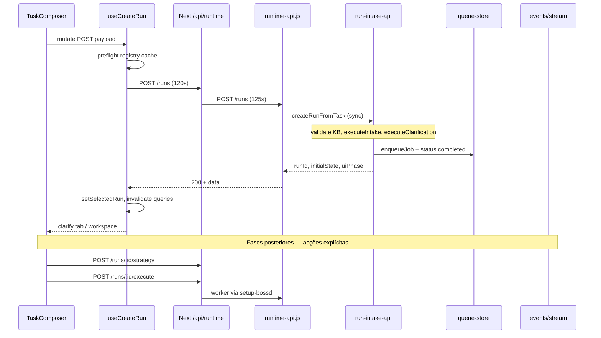

# Phase 1 — Runtime Execution Real Flow (Discovery)

**Execução:** 2026-05-16T22:30:00 (local)  
**Modo:** discovery-only

---

## 1. Arquitetura actual do fluxo runtime

**Descoberta crítica:** `POST /runs` **não** é “enqueue async”. O intake + clarificação correm **dentro do request HTTP** (até ~120s). O job na fila é registado e marcado `completed` de imediato (`run-intake-api.js` L529–555). A execução real do pipeline usa endpoints posteriores (`/strategy`, `/execute`, worker `executeJobLifecycle`).

### Camada → ficheiros

| Camada | Ficheiros |
|--------|-----------|
| UI intake | `TaskComposer.tsx`, `CreateTaskPanel.tsx`, `RunViewShell.tsx` |
| Hook mutation | `use-create-run.ts` |
| HTTP client | `intake-actions.ts` → `client.ts` |
| Proxy | `app/api/runtime/[[...segments]]/route.ts`, `runtime-proxy-timeouts.ts` |
| Daemon HTTP | `scripts/daemon/runtime-api.js` (L2150+) |
| Intake backend | `scripts/daemon/lib/run-intake-api.js` |
| Worker | `scripts/daemon/setup-bossd.js` (`runWorkerJob` → `executeJobLifecycle`) |
| Workspace | `RunViewShell.tsx`, `use-orchestration.ts`, painéis clarify/strategy/execution |
| Live sync | `use-runtime-sse.ts`, `use-runtime-events.ts`, `runtime-live-events-store` |
| Persistência shell | `mission-shell-store.ts` (localStorage) |

---

## 2. Lifecycle real da execução

### Estados no backend (intake)

| Estado | Origem |
|--------|--------|
| `intake_running` | clarificação falhou / LLM required |
| `clarification_required` | `phase2Status` questions_generated |
| `clarification_ready` | plan_refined / answers_recorded |
| `strategy_pending` | via `uiPhaseForInitialState` |
| `failed` | approval_rejected |

### UI states (`RuntimeUiState`)

`running`, `waiting_clarification_*`, `waiting_approval`, `blocked`, `failed`, `correcting`, `retrying`, `recovered`, `success`, `warning`

### Orchestration (`OrchestrationState`)

`ready_for_execution`, `queued`, `execution_starting`, `execution_running`, `execution_reviewing`, `execution_correcting`, `execution_blocked`, `execution_failed`, `execution_completed`, `execution_recovering`, `degraded`, `unavailable`

### Lifecycle phases UI (`LifecyclePhaseId`)

`intake` → `clarification` → `strategy` → `execution` → `review` → `correction` → `rollback` → `integrity` → `completed`

### Job queue status

`pending` | `running` | `completed` | `failed` | `cancelled` — **mas** jobs de mission_control intake ficam `completed` logo após create.

### Inconsistências FE/BE

| Problema | Detalhe |
|----------|---------|
| Job `completed` vs fase activa | Summary mostra `completed` enquanto clarificação/strategy ainda pendem |
| `mapStatusToPhase` | `completed` → `done` ignora `metadata.uiPhase` se ausente |
| Orchestration vs job | `deriveOrchestrationState` mistura bootstrap, execution bundle e `jobStatus` |
| `waiting_user` | Não existe como enum único; espalhado em `waiting_approval`, guards, CTAs |
| `timeout` | Só intake (`INTAKE_TIMEOUT`); execution timeout não surfaced de forma uniforme |
| `aborted` | Cancel existe na API; UX parcial |

---

## 3. Mapa componentes / hooks / stores

| Área | Hooks | Stores |
|------|-------|--------|
| Criar run | `use-create-run` | `intake-store`, `mission-shell-store`, `ui-diagnostics-store` |
| Lista runs | `use-runs`, `use-run-summary` | `mission-shell-store` (selectedRunId) |
| Fases | `use-orchestration` → clarify/strategy/execution | `orchestration-store`, `clarification-store` |
| Eventos | `use-run-events`, `use-runtime-events`, `use-runtime-sse` | `runtime-live-events-store`, audit stores |
| Observabilidade | `use-run-observability-bundle`, `use-pre-run-diagnostics` | `ui-diagnostics-store` |
| Conexão | `use-runtime-health` | `runtime-connection-store` |
| Governança | `use-project-governance` | — |

**Montagem global:** `MissionRuntimeRoot` → health + SSE + recovery.

---

## 4. Principais gargalos

1. **POST /runs síncrono pesado** — intake+clarify bloqueiam UI 15–120s; sensível a proxy/daemon.
2. **Polling em paralelo** — com runtime reachable: health ~8s, projects ~25s, runs ~18s, events 12–45s, pre-run 12s, observability 16s, execution 10–20s.
3. **Stale selection** — `selectedProjectId`/`selectedRunId` em localStorage sem reconciliação ao arranque.
4. **Governance API** — `GET /projects/:id/governance` exige `projectRootCanonical`; selector por `proj_*` devolve null → **400** mesmo com projeto na lista.
5. **Dupla fonte de verdade** — job summary vs orchestration bootstrap vs execution bundle vs SSE.
6. **Run key drift** — `runId` vs `jobId`; mitigado por `resolveCanonicalRunKey` mas frágil se lista ainda não refetchou.

---

## 5. Principais bugs encontrados

| Bug | Evidência | Impacto |
|-----|-----------|---------|
| `project_not_found` com `proj_*` órfão | traces `proj_75abd467`; não em `projects.json` | POST /runs 404 |
| Governance 400 por design | `runtime-api.js` L1258; `resolveProjectSelector` L82–87 | Cartão `.IA` inútil |
| Job marcado `completed` no intake | `run-intake-api.js` L543–555 | UI mostra “concluído” cedo demais |
| Preflight só valida cache projects | `use-create-run` L83–96 | shell pode ter ID que sumiu do registry |
| HMR/JSX histórico | ver discovery HMR 20260516-214800 | piscar no dev |
| Health 500 transitório | terminal durante recompilações | `reachable` oscila |

---

## 6. Riscos arquiteturais

- Intake síncrono no HTTP não escala nem isola falhas LLM.
- Muitos polls + SSE + invalidations amplificam carga e rerenders.
- Persistência de IDs sem TTL/validação → sessões “fantasma”.
- Contratos diferentes: pre-run errors estruturados vs job summary plano vs orchestration DTO.
- Worker queue desacoplado do intake mission_control (job já completed).

---

## 7. Top prioridades

1. Reconciliar **projectId/runId** ao hydrate (limpar stale, sync com GET /projects).
2. Corrigir **governance GET** para resolver `projectRoot` via registry.
3. Tornar **estado pós-create** honesto (job status vs `uiPhase`/`initialState`).
4. Reduzir **polling redundante** quando SSE connected.
5. Documentar/testar **fluxo humano** clarify → approve → strategy → execute.
6. Observabilidade: parar HMR loops; remover imports mortos.

---

## 8. Plano incremental recomendado

| Fase | Escopo | Esforço |
|------|--------|---------|
| P1a | Hydrate + stale ID guard | Pequeno |
| P1b | Governance 400 fix (registry lookup) | Pequeno |
| P1c | Job/summary truthfulness pós-intake | Médio |
| P1d | Polling budget + SSE-first | Médio |
| P1e | E2E smoke: create → clarify → execute | Médio |
| P2 | Async intake (opcional, maior) | Grande |

---

## 9. Pequenas fases sugeridas

- **P1a-stale-shell** — validar selection no boot; toast se projeto desapareceu.
- **P1b-governance-resolve** — backend: `findProjectRecord` antes do 400.
- **P1c-intake-status** — não marcar job `completed` até fase terminal ou usar `uiPhase` na sidebar.
- **P1d-poll-tune** — alinhar intervals; desligar pre-run poll sem `newActivityFlow`.
- **P1e-human-smoke** — script/manual checklist no Mission Control.

---

## 10. Quick wins

1. Limpar `selectedProjectId`/`selectedRunId` se `GET /projects` não contém o ID.
2. Fix governance resolver (1 função no daemon).
3. Remover `ScrollArea` import morto em `RuntimeObservabilityLogs.tsx`.
4. Mostrar `initialState` / `uiPhase` no badge pós-create (já parcial em `TaskComposer`).
5. Alinhar mensagem `project_not_found` com acção “Atualizar projetos”.
6. Desactivar `refetchInterval` de pre-run quando há run seleccionado.
7. Hard refresh doc para HMR stale após JSX fix.

---

## Observabilidade (resumo)

| Canal | Intervalo / trigger | Persistência |
|-------|---------------------|--------------|
| SSE `events/stream` | por `projectId` | bus em memória + merge store |
| GET `/events` | 12–45s | daemon `runtime-events` |
| Traces | daemon `runtime-trace.jsonl` | disco `.setup-boss/traces` |
| Pre-run diagnostics | GET `/diagnostics/events?channel=pre_run` 12s | API + ui-diagnostics-store |
| Logs UI | merge events + daemon + ui diagnostics | últimos 500 rows |

**Gargalos UX:** scrollIntoView em logs; muitos cards; orchestration state vs job badge confunde; erros pre-run bons, erros mid-run menos guiados.

---

## Fluxo humano (resumo)

1. Seleccionar projeto → (opcional) ver governança pre-run.
2. Nova actividade → composer → **Iniciar execução** (espera longa).
3. Se OK → run seleccionada → clarificação (perguntas/respostas/aprovação).
4. **Iniciar estratégia** (explícito).
5. **Executar** quando guards permitem.
6. Acompanhar timeline central + painel observabilidade.

**Onde o utilizador se perde:** espera silenciosa no POST /runs; job parece “completed”; governance 400; múltiplos badges; botão execute bloqueado sem mensagem clara (guards existem mas dispersos).

---

## Top 10 problemas UX reais

1. Espera longa sem progresso granular no intake HTTP.
2. Projeto fantasma na sidebar (localStorage).
3. Governança `.IA` falha com 400 opaco.
4. Estado “concluído” prematuro na lista de runs.
5. Clarificação vs estratégia vs execução — ordem nem sempre óbvia.
6. Botão executar bloqueado — motivo enterrado em guards.
7. Observabilidade com muitos polls / possível flicker dev.
8. Erro `project_not_found` após projeto válido antes.
9. Offline/degraded — drafts sem distinguir de erro real.
10. Run key (`runId`/`jobId`) inconsistente em links internos.

---

## Testes / validação manual recomendados

1. Projeto registado com `docs/.IA` → create run → ver run na sidebar & phase.
2. Projeto inexistente → mensagem clara, shell não fica preso.
3. Clarify → approve → strategy kickoff → execute (com runtime online).
4. Network: contagens de polls com run activa vs idle.
5. Reload página — selection válida ou limpa.
6. Governance card com mesmo `projectId` da sidebar.
