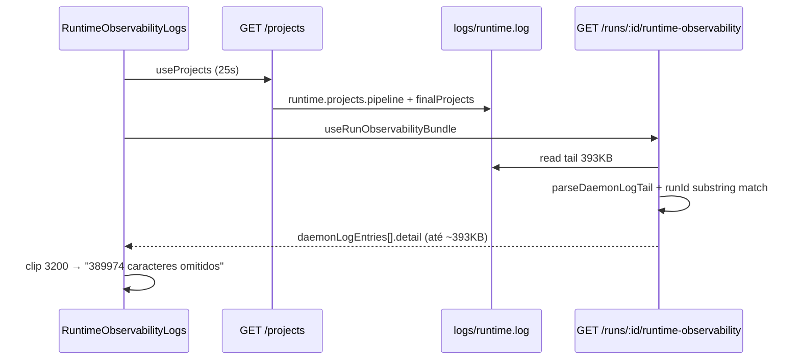

# Discovery — Runtime logs payload gigante + strategy pending UX

**Timestamp:** 2026-05-16T16:44:23 (local)  
**Modo:** discovery only — sem alteração de código.  
**Contexto observado:** intake OK → clarificação OK → plano refinado aprovado → `strategy_waiting_user_action` / `strategy_pending` → UI com etapa Estratégia pouco clara; logs com `runtime.projects.pipeline` e payload com centenas de milhares de caracteres omitidos; warning React de keys duplicadas em `RefinedPlanReview.tsx`.

---

## Resumo executivo

| Problema | Causa raiz provável | Severidade UX |
|----------|---------------------|---------------|
| Payload ~393k omitidos nos logs | Tail de `runtime.log` (≈384KB) tratado como **um único bloco** quando o filtro `runId=` casa em qualquer linha do bloco; `detail` recebe quase o tail inteiro; `finalProjects` de `runtime.projects.pipeline` inflaciona o ficheiro | Alta |
| Eventos `runtime.projects.*` na corrida | Logs **globais** do daemon (cada `GET /projects`) misturados no mesmo `runtime.log`; filtro por run é por substring `runId=`/`jobId=`, não por exclusão de eventos globais | Média |
| Keys duplicadas React | `BulletList` usa `key={item}` (L48); itens repetidos em listas do plano refinado não são deduplicados (`scopeIncluded`, `scopeExcluded`, `risks`) | Baixa |
| Estratégia “PENDENTE” sem CTA óbvio | Desalinhamento badge (`PENDING` vs `WAITING_USER_ACTION`), CTA real só em `StrategyStageHero`, cartão da timeline com “Gerar estratégia” que **só faz scroll** (não POST), secção possivelmente abaixo da dobra após clarificação compactada | Alta |

---

## 1. Logs gigantes (`runtime.projects.pipeline` / `runtime.projects.list`)

### 1.1 Origem no backend

| Peça | Ficheiro | Comportamento |
|------|----------|---------------|
| Emissão | `scripts/daemon/runtime-api.js` L1203–1232 | Em **cada** `GET /projects`, `runtimeLogger.info("runtime.projects.pipeline", { …, finalProjects: diagnostics.finalProjects })` e `runtime.projects.list` |
| Payload | `scripts/daemon/lib/project-registry.js` L418–422 | `finalProjects` = array completo `{ projectId, projectRoot, displayName }` de todos os projetos operacionais |
| Formato log | `scripts/runtime/logger.js` L86–110 | Uma linha por chave; valores object/array via `JSON.stringify`; **truncate 4000 chars por chave** na escrita |
| Poll UI | `frontend/hooks/use-projects.ts` L50–55 | `refetchInterval: 25_000` enquanto runtime reachable → dezenas de entradas `pipeline` por sessão |

**Nota:** Cada entrada no ficheiro é “pequena” (≤4KB na chave `finalProjects`), mas o **tail acumulado** (`TAIL_BYTES` default **393216**) contém muitas entradas globais seguidas.

### 1.2 Como chegam à UI da corrida

| Peça | Ficheiro | Comportamento |
|------|----------|---------------|
| Bundle | `scripts/daemon/lib/run-observability-bundle.js` | Lê últimos `TAIL_BYTES` de `logs/runtime.log`; `parseDaemonLogTail` divide por `\n{2,}`; mantém blocos onde `logBlockMatchesRun` encontra `runId=<runKey>` ou `jobId=<jobId>` **em qualquer posição do bloco** |
| Filtro | L81–88 | Regex `(?:^|\n)(?:runId|jobId)=${esc}` — não exclui eventos `runtime.projects.*` |
| Limite | L14–16, L133–135 | `MAX_ENTRIES` 120; **sem cap de tamanho** em `detail` |
| UI | `frontend/components/features/observability/RuntimeObservabilityLogs.tsx` L167–189, L328–330 | `detail` = corpo do bloco daemon; `DETAIL_CAP = 3200` só na renderização → mensagem `"{n} caracteres omitidos"` com **n ≈ tamanho real − 3200** |

### 1.3 Por que ~389974 caracteres omitidos

- `389974 + 3200 ≈ 393174` ≈ **`SETUP_BOSS_RUNTIME_LOG_TAIL_BYTES` (393216)**.
- **Hipótese principal (alta confiança):** o tail de ~384KB é parseado como **um único bloco** (ausência efetiva de separador `\n\n` no segmento lido — corte a meio de registo, ficheiro denso, ou bloco gigante). Se **qualquer** `runId=` da corrida aparecer nesse segmento, **todo o bloco** (incluindo dezenas de `runtime.projects.pipeline` com `finalProjects=…`) entra em `daemonLogEntries[].detail`.
- **Hipótese secundária:** vários blocos grandes; um deles agrega linhas `finalProjects` até somar centenas de KB (menos provável dado o cap 4KB/linha no logger, salvo concatenação na UI).

### 1.4 O filtro por run puxa linhas globais?

| Pergunta | Resposta |
|----------|----------|
| O tail deve excluir eventos globais? | **Hoje não.** Qualquer bloco que contenha `runId=`/`jobId=` da corrida é incluído, mesmo que 99% do texto sejam logs `runtime.projects.*` sem relação causal com a run. |
| `GET /projects` na observabilidade? | `RuntimeObservabilityLogs` chama `useProjects()` (L220) para label do projeto — **reforça** a escrita de `pipeline` no log enquanto o painel de logs está aberto. |
| Payload devia truncar antes da UI? | **Recomendado:** cap server-side em `detail` + não logar `finalProjects` integral (só `finalCount` / amostra). |

### 1.5 Diagrama (fluxo actual)



---

## 2. Observabilidade UI (limites actuais)

| Constante | Valor | Ficheiro |
|-----------|-------|----------|
| `TAIL_BYTES` | 393216 (env `SETUP_BOSS_RUNTIME_LOG_TAIL_BYTES`) | `run-observability-bundle.js` L10–12 |
| `MAX_ENTRIES` | 120 (env `SETUP_BOSS_RUNTIME_LOG_TAIL_MAX`) | L14–16 |
| `DETAIL_CAP` (render) | 3200 | `RuntimeObservabilityLogs.tsx` L70 |
| Meta cap (render) | 1200 | L331 |
| Merge máximo | 500 linhas | L250 |
| Truncate logger (escrita) | 4000 chars/valor | `logger.js` L97 |

**Porque aparece texto omitido gigante:** o clip é só visual; o objeto em memória / cópia para clipboard (L302–307) pode ainda usar o `detail` completo.

**Compactar sem perder diagnóstico:** resumir `finalProjects` no daemon; no bundle, whitelist de eventos por run + cap `detail` (ex. 8–16KB) com sumário `keysTruncated`, `omittedBytes`.

---

## 3. React duplicate keys (`RefinedPlanReview.tsx`)

### 3.1 Localização

```47:51:frontend/components/features/clarification/RefinedPlanReview.tsx
      {items.map((item) => (
        <li key={item} className="flex gap-2">
```

Warning típico: *"Encountered two children with the same key"* → linha ~48 (`BulletList`).

### 3.2 Causa

| Lista | Dedup em `parse-refined-plan.ts`? |
|-------|-------------------------------------|
| `scopeChanges`, `acceptanceCriteria` | Sim (`filter indexOf`) |
| `scopeIncluded`, `scopeExcluded`, `executionOrder`, `risks` | **Não** — duplicados do markdown/DTO passam iguais |
| `NumberedList` | Usa `key={\`${i}-${item}\`}` — seguro |

### 3.3 Proposta (sem mudar layout)

- `BulletList`: `key={\`${index}-${item.slice(0, 40)}\`}` ou dedup opcional no parser.
- `risks.map` (L144): mesmo padrão.

---

## 4. Strategy pending UX

### 4.1 Estado runtime (confirmado em traces)

- Evento: `strategy_waiting_user_action` com `runtimePhase: "strategy_pending"`, hint `POST /runs/:runId/strategy` (`.setup-boss/daemon/events.jsonl`).
- Após approve: `clarification_approve` com `runtimePhase: "strategy_pending"`.

### 4.2 O que a UI deveria mostrar

| Elemento | Comportamento esperado | Ficheiro |
|----------|------------------------|----------|
| CTA primário | **POST** estratégia — botão «Iniciar estratégia» | `StrategyStageHero.tsx` L86–98 (`useStrategyStageGeneration` → `generateStrategy.mutate`) |
| Badge etapa | `WAITING_USER_ACTION` → «AGUARDA SI» | `MissionWorkspacePhase.tsx` L31–34 |
| Hint global | «Depende de si: inicie a geração… (botão na etapa Estratégia)» | `mission-workflow-stages.ts` L157–158 |
| Auto-scroll | Após handoff, scroll para âncora strategy | `RunViewShell.tsx` L130–137 |

### 4.3 Por que fica confuso (causas UX)

1. **Badge `PENDING` em inglês**  
   `deriveMissionWorkspaceStatuses` só promove para `WAITING_USER_ACTION` se `dominantStrategy \|\| srp === "strategy_pending"` (`mission-workflow-stages.ts` L103–104). Se `orch.strategy.applies === false` (fase summary ainda não reflete strategy) ou bundles em cache desalinhados → cai no `else strategy = "PENDING"` (L109). O utilizador vê «PENDENTE»/PENDING, não «AGUARDA SI».

2. **CTA não está no cartão da timeline**  
   `cardStrategyGenerated` (`build-execution-timeline-cards.ts` L701–713) expõe acção «Gerar estratégia» com `intent: "navigate"` / `scroll_focus` — **não chama POST**. O texto diz «Use o botão «Iniciar estratégia» **neste cartão**» (L660) mas o botão do cartão só navega — copy incorrecta.

3. **Hero condicionado**  
   `StrategyStageHero` só renderiza se `active={dominantStrategyHandoff}` (`RunViewShell.tsx` L351–355). `dominantStrategyHandoff` = `strategyAwaitingUserKickoff` (`strategy-operational-state.ts` L14–18). Se clarificação em cache não reflectir `strategy_pending` imediatamente após approve, `active` pode ser `false` → **sem botão**.

4. **Secção abaixo da dobra**  
   `workflowPostApproveCompact` colapsa `ClarificationPanel` (`ClarificationPanel.tsx` L55–57), mas `RefinedPlanPanel` + timeline longa mantêm o hero da estratégia longe do viewport; scroll automático depende de `dominantStrategyHandoff` passar a `true` no mesmo render.

5. **`strategy.applies` vs fase**  
   `strategyAppliesToRun` (`strategy-state.ts` L45–67) — em `clarification` + `success` aplica strategy; se `summary.phase`/`state` estiverem desactualizados no poll, a slot `strategy_generated` pode não montar (`RunViewShell.tsx` L342).

### 4.4 Ficheiros envolvidos (mapa)

| Área | Ficheiros |
|------|-----------|
| Shell / slots | `RunViewShell.tsx`, `MissionWorkspacePhase.tsx` |
| CTA POST | `StrategyStageHero.tsx`, `hooks/use-strategy-stage-generation.ts` |
| Status derivado | `mission-workflow-stages.ts`, `strategy-operational-state.ts`, `clarification-operational-state.ts` |
| Timeline / copy | `build-execution-timeline-cards.ts`, `semantic-workflow-mapper.ts` |
| Pós-approve compact | `ClarificationPanel.tsx`, `RefinedPlanPanel.tsx`, `RefinedPlanReview.tsx` |

---

## 5. Plano cirúrgico de correção (fases pequenas)

### Fase A — Logs daemon (backend, baixo risco)

1. `runtime-api.js`: logar `finalCount` + amostra (≤5 projectIds); remover `finalProjects` integral do `info`.
2. `run-observability-bundle.js`: denylist `runtime.projects.pipeline`, `runtime.projects.list`; cap `detail` (ex. 12KB) com metadados `detailTruncated`, `detailBytes`.
3. Testes em `run-observability-bundle.test.js`: bloco gigante + evento global não entra na run.

### Fase B — Logs UI (frontend)

1. `RuntimeObservabilityLogs.tsx`: não expandir payload >N KB por defeito; sumário colapsado («payload truncado no servidor»).
2. Opcional: desactivar `useProjects` dentro do painel de logs da run (só usar `projectId` já conhecido).

### Fase C — React keys

1. `RefinedPlanReview.tsx`: keys estáveis com índice em `BulletList` e `risks`.
2. Teste snapshot ou unitário com itens duplicados (sem warning).

### Fase D — Strategy UX

1. Alinhar badge: se `strategyAwaitingUserKickoff` → forçar `WAITING_USER_ACTION` mesmo com `srp === "unavailable"`.
2. Timeline: renomear «Gerar estratégia» → «Ir para estratégia» **ou** wire POST no cartão; corrigir copy L660.
3. `StrategyStageHero`: fallback visível quando `srp === "strategy_pending"` no bundle de clarificação, mesmo se strategy bundle ainda a carregar.
4. Banner sticky curto no topo pós-approve: «Plano aprovado — Iniciar estratégia» com `data-runtime-focus="strategy-primary"`.

---

## 6. Testes recomendados

| # | Tipo | O quê |
|---|------|--------|
| 1 | Unit | `parseDaemonLogTail`: tail 300KB com um `runId=` no meio → `detail` ≤ cap; sem `runtime.projects.pipeline` |
| 2 | Unit | `logBlockMatchesRun` + exclusão de eventos globais |
| 3 | Integration | Abrir observabilidade numa run real → expandir payload → omitidos < 20k |
| 4 | Manual | Após approve plano: badge «AGUARDA SI», botão «Iniciar estratégia» visível sem scroll excessivo |
| 5 | Manual | Clicar «Gerar estratégia» na timeline → scroll + POST ou copy alinhada |
| 6 | Unit | `parseRefinedPlanPresentation` com linhas duplicadas → render `RefinedPlanReview` sem warning keys |
| 7 | E2E smoke | Fluxo intake → clarify → approve → POST strategy (existente em `p1e-human-e2e-live-smoke.js`) após Fase D |

---

## 7. Comandos / investigação executada

```text
# Grep / leitura estática (sem alterar código)
- scripts/daemon/runtime-api.js (GET /projects logging)
- scripts/daemon/lib/run-observability-bundle.js (tail + filter)
- scripts/runtime/logger.js (formato + truncate 4KB)
- frontend/.../RuntimeObservabilityLogs.tsx (DETAIL_CAP, merge)
- frontend/.../RefinedPlanReview.tsx (keys L48)
- frontend/.../RunViewShell.tsx, StrategyStageHero.tsx, mission-workflow-stages.ts
- docs/mission-control-runtime-front-flow-discovery.md (alinhamento badge vs CTA)
```

---

## 8. Observações importantes

1. O número **~389974** correlaciona-se com o **tail inteiro**, não com um único `finalProjects` no logger (cap 4KB/linha).
2. Corrigir só a UI (`DETAIL_CAP`) **não resolve** peso de rede/memória se o bundle já envia `detail` gigante.
3. O warning React é **independente** dos logs; aparece após aprovação do plano quando listas refinadas têm bullets repetidos.
4. O runtime está **correcto** em `strategy_pending`; o gap é sobretudo **discoverability do CTA** e **observabilidade poluída**.

---

**Próximo passo sugerido:** implementar Fase A + Fase D primeiro (maior impacto operacional com diff pequeno).
