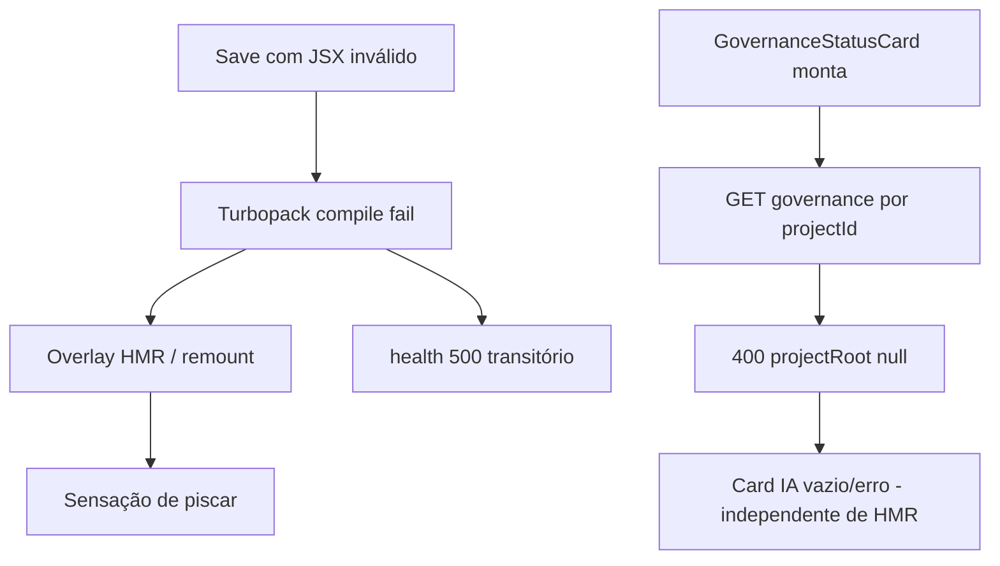

# Discovery — RuntimeObservabilityLogs JSX/HMR Loop

**Execução:** 2026-05-16T21:48:00 (local)  
**Modo:** discovery-only (sem alterações de código)

## Resumo executivo

O “piscar” no Mission Control é **muito provavelmente** o ciclo de **HMR/Turbopack** a recompilar após saves com JSX inválido no painel de logs. Os erros `Expected '</', got 'jsx text'` e `compact is not defined` batem com um refactor incompleto (`motion` / `ScrollArea` / restos de prop `compact`) feito na Phase 10. **No disco, o ficheiro já está sintaticamente válido**; se o browser ainda mostra erro, pode ser cache HMR ou buffer não gravado.

Os `GET /api/runtime/health → 500` são **transientes** (correlacionam com rajadas de `✓ Compiled` no dev server), não são a causa raiz do JSX. O `GET .../governance → 400` é um **problema separado de backend** (resolução de `projectRoot` por `projectId`).

---

## 1. Causa raiz provável

| Camada | Causa |
|--------|--------|
| **Primária** | JSX inválido em `RuntimeObservabilityLogs.tsx` durante refactor scroll/governança: tags `motion`/`ScrollArea`/`div` desalinhadas e possível texto/identificador `compact` solto perto da linha ~485. |
| **Mecanismo do piscar** | Turbopack falha compile → overlay/refresh → save seguinte → novo compile (~110–140 ms cada). Terminal mostra rajadas `✓ Compiled in …ms` intercaladas com falhas. |
| **Secundária (UX, não reload)** | `useEffect` com `scrollIntoView` em cada mudança de `filtered` pode “saltar” o scroll do painel quando há polling de eventos. |

Histórico: sessão [phase10 / runtime-logs UX](7f859b54-4f62-4aeb-ad39-4f6d6987bca7) aplicou substituições globais (`motion`↔`div`, `</ScrollArea>`→`</motion>`) via scripts Node/PowerShell em vários ficheiros, incluindo `RuntimeObservabilityLogs.tsx`.

---

## 2. Ficheiro e linhas envolvidas

**Ficheiro principal:** `frontend/components/features/observability/RuntimeObservabilityLogs.tsx`

| Região | Linhas (aprox.) | Estado actual no disco |
|--------|-----------------|-------------------------|
| Import órfão | 4 | `ScrollArea` importado mas **não usado** (resto do refactor) |
| Branch sem run + governança | 440–490 | JSX **válido**: `GovernanceStatusCard` sem prop `compact`, `div` aninhados fechados correctamente |
| Lista principal | 588–613 | `motion`/`ScrollArea` **removidos**; scroll via `overflow-y-auto` |
| `compact` | — | **Não existe** no ficheiro (só comentário “JSON compacto” L93) |

**Relacionados (não causam o parse error, mas montam com o painel):**

- `frontend/components/features/execution-timeline/RightTimelinePanel.tsx` (~192) — monta `<RuntimeObservabilityLogs />`
- `frontend/components/features/governance/GovernanceStatusCard.tsx` — chamado em L449 **sem** `compact`
- `frontend/components/features/intake/TaskComposer.tsx` (~399) — usa `compact` **correctamente** como boolean prop

---

## 3. Por que a tela pisca

1. **Erro de compilação React/Next (principal):** com módulo inválido, o dev server re-executa compile a cada save; o overlay e o remount da árvore client dão sensação de “Chrome a abrir/fechar”.
2. **Não é `window.open`:** já descartado em `runtime-logs-ux-timeout-fix-20260516-211500.md`.
3. **Polling normal:** `useRuntimeHealth` (8s), `usePreRunDiagnostics` (12s), `useProjects` (25s) geram re-renders mas **não** full page reload; amplificam flicker visual se o painel remonta por HMR.
4. **`scrollIntoView`:** L270–273 — pode mover o viewport do painel de logs; não explica reload global.

Evidência terminal (`terminals/4.txt`): blocos `✓ Compiled in 105–137ms` seguidos de `GET /api/runtime/health 500`, depois recuperação `200`.

---

## 4. `compact` — bug real ou sintoma?

| Tipo | Conclusão |
|------|-----------|
| **Sintoma de refactor** | Sim. `compact` como prop válida existe em `GovernanceStatusCard` e `TaskComposer`; no logs **não devia** aparecer (card full-size). |
| **Erro `compact is not defined`** | Típico de `{compact}` ou identificador solto no JSX — **não** de `<Component compact />`. Provável artefacto temporário durante edição/copy-paste da variante compact do TaskComposer. |
| **Estado actual** | Ficheiro no disco **não** referencia `compact`; erro no console → HMR stale ou versão intermédia ainda aberta no editor. |

---

## 5. Endpoints 500/400 — relacionados?

| Endpoint | Classificação | Relação com JSX/HMR |
|----------|---------------|---------------------|
| `GET /api/runtime/health` → **500** | **Secundário / ruído durante compile** | Surge em rajadas junto com recompilações; depois `200`. Proxy repassa status upstream; não bloqueia parse. |
| `GET /api/runtime/projects/{id}/governance` → **400** | **Separado / bloqueante para cartão IA** | `resolveProjectSelector('proj_…')` devolve `projectRootCanonical: null` (`project-registry.js` L82–87). Handler exige ambos (`runtime-api.js` L1258–1260) **antes** de usar `findProjectRecord`. Projeto `proj_75abd467` aparece na UI/jobs mas **não** está em `.setup-boss/projects.json` (traces: `project_not_found`). |
| `GET /api/runtime/projects/{id}` → **200** | Dados de jobs/overview | Coexiste com governance 400 — confirma bug de resolução no endpoint governance, não crash frontend. |

**Não corrigir backend nesta fase** — apenas registar: governance 400 impede cartão `.IA` útil; não causa loop HMR.

---

## 6. Plano cirúrgico de correção (não executado)

### A. Frontend — `RuntimeObservabilityLogs.tsx` (mínimo)

1. Confirmar no editor que o conteúdo gravado coincide com o disco (sem `motion`, sem `compact` solto, tags balanceadas em 440–490).
2. Remover import morto: `ScrollArea` (L4).
3. Hard refresh ou reiniciar `npm run dev:stack` se overlay persistir após ficheiro válido.
4. (Opcional) Avaliar `compact` no cartão de observabilidade — só se UX pedir variante reduzida; hoje **não é necessário**.

### B. Backend — governance (fora do scope JSX, mas bloqueante funcional)

- Em `GET /projects/:id/governance`, resolver `projectRoot` via `findProjectRecord(projectId)` quando `projectRootCanonical` for null.
- Ficheiro: `scripts/daemon/runtime-api.js` (~1252–1275).

### Riscos

- Reintroduzir tags `motion` sem Framer Motion quebra de novo.
- Scripts globais de replace (`fix-logs-scroll-tags.mjs` — já ausente) podem corromper JSX outra vez.

### Ficheiros prováveis na correção frontend

| Ficheiro | Acção |
|----------|--------|
| `frontend/components/features/observability/RuntimeObservabilityLogs.tsx` | Validar JSX L440–490; remover import `ScrollArea` |
| (nenhum outro obrigatório para parar HMR) | — |

---

## 7. Testes e validação manual

```bash
cd frontend && npx tsx --test lib/runtime/observability/runtime-logs-scroll.test.ts
```

**Manual:**

1. Abrir Mission Control → painel direito → tab **Logs** (sem run seleccionado).
2. DevTools → Console: **zero** erros de parse/`compact` após hard refresh.
3. Terminal Next: sem rajadas contínuas de `Compiled` sem editar ficheiros.
4. Scroll na lista pre-run: último card visível (`pb-4`).
5. Network: `health` estável `200`; `governance` — esperar `400` até fix backend (não confundir com HMR).

---

## Diagrama causal (simplificado)



---

## Resultado do discovery

- **Causa do piscar:** loop HMR por JSX inválido (histórico motion/ScrollArea/compact); ficheiro no disco já corrigido estruturalmente.
- **Acção mínima frontend:** limpar import órfão + garantir gravação/cache limpo.
- **Endpoints:** health 500 = ruído de compile; governance 400 = bug API/registry separado.
