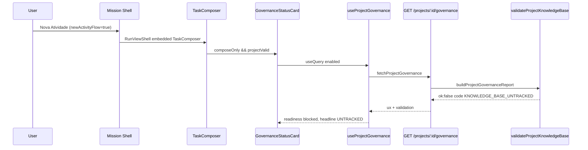

# Discovery — Spawn loop no erro `KNOWLEDGE_BASE_UNTRACKED` (Nova Atividade)

**Timestamp:** 2026-05-16T22:35:00 (local)  
**Modo:** discovery only — sem correção, sem execução de `git`/shell que possa abrir janelas no Windows.  
**Projeto-alvo reportado:** `wiser-bot-front` (docs/.IA local, não versionada).

---

## Resumo executivo

| Pergunta | Conclusão |
|----------|-----------|
| Existe loop infinito de refetch HTTP? | **Não** — governance usa React Query com `refetchInterval: false`, `staleTime: 30s`, sem invalidação automática ligada ao erro. |
| O frontend dispara `git`/`cmd`? | **Não** — só clipboard e navegação interna; `intake-no-window-open.test.ts` cobre ausência de `window.open`. |
| O que abre janelas no Windows? | **`execFileSync("git", …)` no daemon** (`core/validate-project-knowledge-base.js`) **sem `windowsHide: true`**, repetido até **~26 vezes por validação** no ramo UNTRACKED com árvore `docs/.IA` populada. |
| Por que parece “loop”? | Rajada síncrona de processos Git visíveis (1× `rev-parse` + 1× `ls-files` + até 24× `check-ignore`), possivelmente **×2** em dev (Strict Mode Next) e **×2** se painel Observabilidade + TaskComposer montados (mesma query, mas o servidor ainda processa cada GET). |
| Correção cirúrgica | `windowsHide: true` em todos os `execFileSync` Git + **uma** chamada `git check-ignore` em lote (em vez de N). |

---

## 1. Fluxo exato do erro `KNOWLEDGE_BASE_UNTRACKED`

### 1.1 UI — Nova Atividade



| Peça | Ficheiro | Papel |
|------|----------|--------|
| **TaskComposer** | `frontend/components/features/intake/TaskComposer.tsx` | `composeOnly = newActivityFlow && !runId`; monta `<GovernanceStatusCard compact />` quando `projectValid` (L398–400). Erro de submit via `lastPreRunError` + `intakeInlineTitle/Body` para `KNOWLEDGE_BASE_UNTRACKED`. |
| **GovernanceStatusCard** | `frontend/components/features/governance/GovernanceStatusCard.tsx` | `useProjectGovernance(projectId)`; mostra readiness/headline; quick actions: clipboard, tab `observe`, **Revalidar** (`retryValidation`). |
| **useProjectGovernance** | `frontend/hooks/use-project-governance.ts` | `GET /projects/:id/governance`; `staleTime: 30_000`, `refetchInterval: false`, `refetchOnWindowFocus: false`. |
| **canFetchProjectGovernance** | `frontend/lib/runtime/intake/project-registry-validation.ts` | Só fetch se runtime reachable + lista de projetos pronta + `projectId` no registry. |
| **fetchProjectGovernance** | `frontend/lib/api/runtime-api.ts` L211–225 | Proxy runtime; timeout 45s. |
| **Endpoint** | `scripts/daemon/runtime-api.js` L1255–1291 | `resolveGovernanceProject` → `buildProjectGovernanceReport`. |
| **buildProjectGovernanceReport** | `scripts/daemon/lib/project-governance-api.js` L80–104 | `validateProjectKnowledgeBase` → `enrichPreRunError` → `buildGovernanceUxPayload`. |
| **validateProjectKnowledgeBase** | `core/validate-project-knowledge-base.js` | Git + ramo UNTRACKED (L550–587). |
| **suggestedActions** | `core/pre-run-error.js` L41–47 | Texto estático: revisar `.IA`, `git add`, commit/push — **não executados** pela UI. |
| **Segundo card (opcional)** | `RuntimeObservabilityLogs.tsx` L442–451 | Com `newActivityFlow` e painel observe aberto, outro `GovernanceStatusCard` (mesma query key → dedupe no cliente). |

### 1.2 Ramo UNTRACKED no core

Condições (após `git ls-files -- docs/.IA` vazio):

1. `docs/.IA` existe como diretório (`docsIaLocal`).
2. Repositório Git válido (`isGitRepository`).
3. `classifyDocsIaGitIgnoreState` → **não** “tudo ignorado” → `KNOWLEDGE_BASE_UNTRACKED`.

Código de emissão:

```576:587:core/validate-project-knowledge-base.js
    return buildFailure({
      code: "KNOWLEDGE_BASE_UNTRACKED",
      phase: "knowledge_bootstrap_untracked",
      title: ERROR_TITLE_UNTRACKED,
      message: ERROR_MESSAGE_UNTRACKED,
      description: ERROR_UNTRACKED_DESCRIPTION,
      docsIaPath,
      details: {
        addableFiles: gitIgnoreState.addableFiles.slice(0, 8),
        sampleFiles: gitIgnoreState.sampleFiles.slice(0, 8),
      },
    });
```

`enrichPreRunError` acrescenta `suggestedActions` do catálogo; `buildGovernanceUxPayload` define headline *"Knowledge base not tracked in Git"* e timeline estágio `git` falhado.

### 1.3 Submit (POST /runs) — mesmo erro, segunda validação

Se o utilizador clica **Iniciar execução**, `scripts/daemon/lib/run-intake-api.js` L253–257 chama **de novo** `validateProjectKnowledgeBase` no mesmo `targetProjectRoot` → outro conjunto de processos Git no daemon (independente do GET governance).

---

## 2. Comandos locais disparados (backend / frontend)

### 2.1 Frontend — sem spawn de shell

| Mecanismo | Resultado |
|-----------|-----------|
| `child_process.spawn/exec` em `frontend/**` | **Nenhum** uso em fluxo governance/intake. |
| `window.open` | Proibido por teste `frontend/lib/runtime/intake/intake-no-window-open.test.ts`. |
| Quick actions `GovernanceStatusCard` | `navigator.clipboard.writeText`, `setRightPanelTab("observe")`, `retryValidation()` → só HTTP. |
| `suggestedActions` | Renderizados como texto em cards pre-run; **sem runner**. |

### 2.2 Daemon / core — Git via `execFileSync` (síncrono)

| Função | Ficheiro | Comando Git | `windowsHide` |
|--------|----------|-------------|---------------|
| `isGitRepository` | `validate-project-knowledge-base.js` L129 | `git -C <root> rev-parse --git-dir` | **Ausente** |
| `gitLsFilesDocsIa` | L146–149 | `git -C <root> ls-files -- docs/.IA` | **Ausente** |
| `isGitPathIgnored` | L222–224 | `git -C <root> check-ignore -q -- <relPosix>` | **Ausente** |

Contraste (já correto noutro módulo):

```262:267:scripts/daemon/lib/project-git-register.js
    const child = spawn("git", args, {
      shell: false,
      windowsHide: true,
```

`project-git-register.js` **não** participa do GET `/governance` analisado; só registo remoto de projeto.

### 2.3 Outros spawns no repo (fora do fluxo UNTRACKED ao abrir Nova Atividade)

| Local | Notas |
|-------|--------|
| `scripts/dev/start-stack.js` | `spawn`/`spawnSync` com `shell: true` para npm — stack dev, não governance por request. |
| `scripts/daemon/setup-bossd.js` | `spawn` jobs com `windowsHide: true`. |
| `scripts/validation-runtime/validators/base-validator.js` | `spawn` externos com `windowsHide: true`. |

Nenhum `Start-Process`, `explorer`, `cmd /c start`, ou fallback clipboard→abrir pasta no fluxo governance.

---

## 3. Git repetido — frequência por validação (ramo UNTRACKED)

### 3.1 Por chamada `validateProjectKnowledgeBase`

| Passo | Chamadas Git |
|-------|----------------|
| `isGitRepository` | 1 × `rev-parse` |
| `gitLsFilesDocsIa` (tracked vazio → ramo UNTRACKED) | 1 × `ls-files` |
| `classifyDocsIaGitIgnoreState` | até **24** × `check-ignore` (`listDocsIaFilePaths` default `limit = 24`, L167) |
| Pipeline SPEC (seed/version/…) | **0** — só corre se `trackedFiles.length > 0` (L485+) |

**Total típico wiser-bot-front (`.IA` com muitos ficheiros locais): 26 processos Git / validação.**

Se `docs/.IA` estiver vazio (só pasta): `sampleFiles.length === 0` → **0** `check-ignore` → **2** processos Git apenas.

### 3.2 Quantas vezes o governance HTTP corre ao abrir Nova Atividade

| Gatilho | Comportamento |
|---------|----------------|
| Montagem `GovernanceStatusCard` | **1** `useQuery` fetch (deduplicado se 2 cards, mesma `queryKey`) |
| `refetchInterval` | `false` |
| Polling pre-run | `usePreRunDiagnostics` 15s — **só** eventos trace HTTP, **não** revalida governance |
| `reachable` na query key | Se health oscilar false→true, **+1** fetch; health poll 12s — oscilação improvável com daemon estável |
| Botão **Revalidar** | `invalidateQueries` + `refetch` manual |
| Strict Mode (Next dev) | Possível **double mount** → até **2** GETs iniciais |

**Não há loop de invalidação automática** ligado a `KNOWLEDGE_BASE_UNTRACKED` no código revisto.

### 3.3 Cenário “rajada” percebida como loop

| Multiplicador | Efeito |
|---------------|--------|
| 26 × `execFileSync` sem `windowsHide` | Até 26 flashes de consola/cmd no Windows em ~centenas de ms |
| 2× `GovernanceStatusCard` (TaskComposer + Observabilidade) | Cliente: 1 fetch; servidor: ainda 1 worker por request (não N×26 no browser) |
| Dev double-fetch | 2×26 = **52** processos no daemon |
| Utilizador clica **Revalidar** ou **Iniciar execução** | +26 (ou +52) cada acção |

---

## 4. Windows-specific

| Factor | Detalhe |
|--------|---------|
| API usada | `execFileSync("git", …)` — no Windows o Node pode criar janela de consola **se `windowsHide` não for `true`**. |
| Wrapper Git | Instalações Git for Windows (`git.cmd`) aumentam risco de janela visível com spawn sem hide. |
| `shell: true` | **Não** usado nos `execFileSync` de KB validation. |
| `detached` | **Não** — processos síncronos, filhos curtos. |
| Frontend | Não abre terminal; problema está no **processo Node do runtime-api/daemon**. |

**Comando exacto que mais provavelmente abre janelas (repetido):**

```text
git -C <projectRootAbs> check-ignore -q -- <relPosix>
```

Invocado em loop em `isGitPathIgnored` → `classifyDocsIaGitIgnoreState` → ramo UNTRACKED.

**Linha provável:** `core/validate-project-knowledge-base.js` **L222–224** (e chamadas em cascata L242–243), mais **L129** e **L146–149** no início da validação.

---

## 5. Hipótese principal (confirmada por código)

> Várias invocações síncronas de `git` **sem `windowsHide: true`** durante `GET /projects/:id/governance` (e opcionalmente `POST /runs`) no ramo UNTRACKED, com amostra de até 24 ficheiros → rajada de janelas de consola no Windows — **não** um loop infinito de UI nem `window.open`.

Evidência complementar:

- Doc anterior `docs/executions/runtime-logs-ux-timeout-fix-20260516-211500.md` já descartou abas Chrome no intake/governança.
- `project-git-register.js` já usa `windowsHide: true`; KB validation ficou inconsistente.

---

## 6. Correção cirúrgica recomendada (não implementada)

1. **Obrigatório Windows:** em `validate-project-knowledge-base.js`, passar `{ windowsHide: true, stdio: … }` em **todos** os `execFileSync("git", …)` (L129, L146–149, L222–224).
2. **Reduzir cardinalidade:** em `classifyDocsIaGitIgnoreState`, substituir N× `check-ignore` por **uma** chamada:
   `git -C <root> check-ignore -q -- <file1> <file2> …` (ou parse de saída sem `-q` se precisar distinguir ficheiros).
3. **Opcional:** cache in-memory por `projectRoot` + mtime `.git` (TTL curto) no handler `/governance` para evitar revalidação pesada em cliques Revalidar.
4. **Não** mover validação Git para o browser.

---

## 7. Testes / validação segura (sem travar o PC)

| Teste | Como |
|-------|------|
| Unitário opções Git | Mock `child_process.execFileSync` e assert `windowsHide === true` + contagem de chamadas ≤ 3 no caso UNTRACKED com 24 ficheiros mock. |
| Contagem servidor | Instrumentar temporariamente contador em `validateProjectKnowledgeBase` (env `SB_GIT_SPAWN_DEBUG=1` → log só número, sem spawn extra). |
| E2E manual pós-fix | Abrir Nova Atividade em `wiser-bot-front` untracked: **0** janelas cmd; card governance mostra blocked; um flash máximo aceitável. |
| Regressão UI | `npm test` em `core/validate-project-knowledge-base.test.js` + `frontend/.../intake-no-window-open.test.ts`. |
| Evitar durante discovery | Não correr `git`/`validate` CLI repetido no repo real untracked no Windows até `windowsHide` + batch `check-ignore`. |

**Não usar** como prova: abrir Observabilidade + spam em Revalidar antes do fix — multiplica rajadas no daemon.

---

## 8. Mapa rápido suggestedActions vs quick actions

| Origem | Conteúdo UNTRACKED | Executado? |
|--------|-------------------|------------|
| `core/pre-run-error.js` | Revisar `.IA`, `git add docs/.IA`, commit/push | Não |
| `GovernanceStatusCard` | Copiar relatório / caminho / docs governança / Revalidar / Diagnósticos | Só UI + HTTP |
| `TaskComposer` pre-run | Copiar diagnóstico, Observabilidade, Tentar novamente | Só UI |

---

## 9. Ficheiros tocados na investigação

- `core/validate-project-knowledge-base.js` — **fonte dos spawns Git**
- `scripts/daemon/lib/project-governance-api.js`, `scripts/daemon/runtime-api.js`
- `scripts/daemon/lib/run-intake-api.js` — segunda validação no submit
- `frontend/hooks/use-project-governance.ts`, `GovernanceStatusCard.tsx`, `TaskComposer.tsx`
- `frontend/lib/runtime/polling/mission-polling-policy.ts`
- `core/pre-run-error.js`, `core/ia-governance-ux.js`
- `scripts/daemon/lib/project-git-register.js` — referência de `windowsHide` correcto

---

## 10. Próximo passo (fora deste discovery)

Implementar fix mínimo em `validate-project-knowledge-base.js` (windowsHide + batch `check-ignore`) e validar com uma abertura de Nova Atividade no `wiser-bot-front` untracked.
