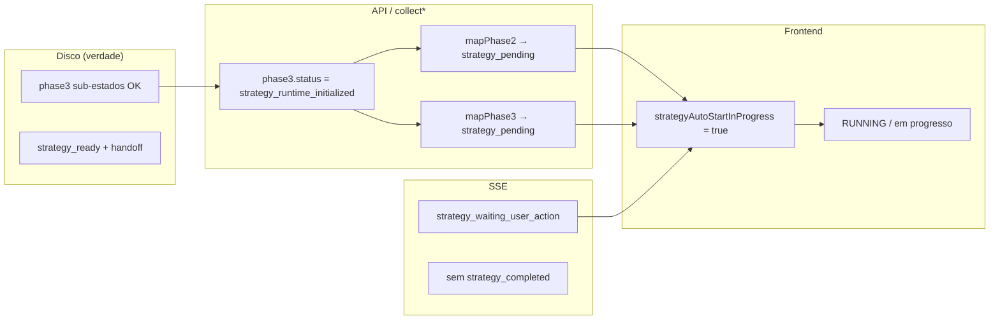

# Discovery — Strategy “em progresso” após approve (run 20260516-163856)

**Data:** 2026-05-16  
**Run:** `20260516-163856-na-tela-de-integracao-criar-componente-de-chat-botao-de-abri`  
**Projeto:** `bitbucket-org-systemwiser-wiser-bot-front`  
**Escopo:** diagnóstico apenas — sem alterações de código.

---

## Resumo executivo

**A estratégia não estava a executar há 20 minutos.** Concluiu em **~21 ms** no approve (19:40:51 UTC). O que persistiu foi **estado derivado incorreto na UI**: `strategy_pending` + `strategyAutoStartInProgress === true` → cartão «Estratégia gerada» com status **running** / «em progresso», mesmo com todos os artefatos finais no disco.

O palpite do utilizador confirma-se: **execução real terminou; UI/state ficou preso**.

---

## 1. Estado real atual do run

| Dimensão | Valor observado |
|----------|-----------------|
| **phase2** (`run-context.json`) | `ready_for_execution` |
| **phase3** (`run-context.json`) | `strategy_runtime_initialized` — sub-estados todos OK (`ai_strategy_completed`, `strategy_ready`, handoff `execution_ready_handoff_completed`) |
| **clarification-session.json** | `status: ready_for_execution` |
| **approval-state.json** | `approved` @ 2026-05-16T19:40:51.570Z |
| **Daemon worker** | `idle`, `currentJobId: null`, `runningJobsCount: 0` |
| **API derivada (simulada)** | clarification `runtimePhase: strategy_pending`; strategy `phase3Status: strategy_runtime_initialized`, `operationalReadiness: ready` |

---

## 2. Ainda está executando?

**Não.**

- Nenhum job activo no daemon para este run.
- Última actividade de strategy: **2026-05-16 19:40:51 UTC** (~21 ms de pipeline em `strategy-diagnostics.json`).
- Artefatos finais presentes e estáveis desde essa data.

---

## 3. Artefatos no outputDir

**Base:**  
`C:\Users\pierr\setup-boss-projects\bitbucket-org-systemwiser-wiser-bot-front\docs\.IA\outputs\20260516-163856-na-tela-de-integracao-criar-componente-de-chat-botao-de-abri`

| Artefato | Presente | Notas |
|----------|----------|--------|
| `run-context.json` | Sim | phase2/phase3 completos |
| `approval-state.json` | Sim | approved |
| `task-plan-refined.md` | Sim | |
| `strategy/ai-strategy.json` | Sim | `ai_strategy_completed` |
| `strategy/strategy-readiness.json` | Sim | `strategy_ready`, 5 subtasks |
| `strategy/execution-ready-handoff.json` | Sim | handoff completo |
| `strategy/subtasks/001–005.json` | Sim | 5 subtarefas |
| `strategy/strategy-diagnostics.json` | Sim | `strategy_runtime_completed` @ 19:40:51.593Z |

**Conclusão:** existe **artefacto final completo** da strategy. A geração **concluiu**.

---

## 4. Últimos eventos significativos

### Timeline (UTC)

| Hora | Evento |
|------|--------|
| 19:38:56 | intake + clarification questions |
| 19:40:11 | respostas + plano refinado + `approval_requested` |
| 19:40:51.572–593 | strategy runtime (diagnostics: started → completed) |
| 19:40:51.596 | SSE `strategy_waiting_user_action` (`strategy_pending`, hint POST strategy) |
| 19:40:51.597 | SSE `clarification_approve` (`runtimePhase: strategy_pending`) |
| *depois* | sem `strategy_started` / `strategy_completed` SSE para este run |

### O que o utilizador viu nos logs

- `strategy started` / `strategy completed` — consistentes com **`strategy-diagnostics.json`** (`strategy_runtime_started` / `strategy_runtime_completed`) ou normalização UI de eventos de approve; **não** implicam job de longa duração.
- `strategy_pending` + `hint=POST /runs/:runId/strategy` — vêm do SSE **`strategy_waiting_user_action`** emitido **no approve**, mesmo com strategy já gerada inline (evento legado / desalinhado).

---

## 5. Onde o estado diverge



| Camada | Estado exposto | Deveria ser (produto) |
|--------|----------------|------------------------|
| **Ficheiros** | Strategy completa | OK |
| **run-context.phase3.status** | `strategy_runtime_initialized` | Valor canónico pós-runtime (OK no backend) |
| **Clarification API** | `runtimePhase: strategy_pending` | `ready_for_execution` ou `strategy_ready` |
| **Strategy API (frontend map)** | `runtimePhase: strategy_pending` | `strategy_ready` |
| **SSE** | `strategy_pending` + hint POST; sem `strategy_completed` | `strategy_completed` ou ausência de “waiting” |
| **UI** | «A gerar…» / «Estratégia gerada — em progresso» | «Estratégia gerada» — aguarda revisão/aprovação |

---

## 6. Causa provável

### 6.1 Strategy corre no approve, mas o mapeamento de fase não avança

No approve, `executeClarification` chama **`runStrategyRuntimeBase` inline** (`scripts/runtime/clarification/clarification-runtime.js` ~1065–1080). Isso gera os artefatos em milissegundos.

O `phase3.status` final no `run-context` fica **`strategy_runtime_initialized`** (constante em `run-strategy-runtime.js`), não `strategy_ready` no topo.

Dois mapeadores tratam isso como **ainda pendente**:

1. **`mapPhase2ToRuntimePhase`** (`run-clarification.js` 44–48): se `phase2 === ready_for_execution` e `phase3.status` não é `strategy_ready` nem `ready_for_execution` → **`strategy_pending`**.

2. **`mapPhase3StatusToRuntimePhase`** (`frontend/.../strategy-state.ts` 30–42): só promove a `ready_for_execution` se `phase3Status === ready_for_execution` **e** `operationalReadiness === ready`; com `strategy_runtime_initialized` cai no **default `strategy_pending`**.

### 6.2 UI interpreta `strategy_pending` como “auto-start em curso”

`strategyAutoStartInProgress` (`strategy-auto-start-policy.ts`) retorna `true` para:

- `strategy.summary.runtimePhase === strategy_pending`
- `clarification.session.runtimePhase === strategy_pending`
- `clarificationApprovedAwaitingStrategy` (approved + `ready_for_execution` **ou** `strategy_pending`)

Isso força:

- `mission-workflow-stages.ts` → strategy = **RUNNING**
- `semantic-workflow-mapper.ts` → op = **running**
- `build-execution-timeline-cards.ts` → «A gerar estratégia…» + secção «Em progresso»
- `runtime-translation-layer.ts` → step running → **«… em progresso»** sobre o título «Estratégia gerada»

**Resultado:** UI presa indefinidamente após approve, sem trabalho real em background.

### 6.3 SSE desalinhado (não é a causa principal do “20 min”, mas confunde)

Para este run **não há** `strategy_started` / `strategy_completed` em `.setup-boss/daemon/events.jsonl` — a strategy correu pela via **clarification-runtime**, não por `triggerStrategyRun` (`run-strategy-api.js`), que é quem emite esses eventos.

Ainda assim foi emitido **`strategy_waiting_user_action`** com hint `POST /runs/:runId/strategy` (código legado no momento do approve; removido/substituído depois pelo auto-start em `docs/executions/auto-start-strategy-after-approval-20260516-201200.md`).

### 6.4 Não houve duplo POST de strategy neste run

- Sem `strategy_auto_started_after_approval` no trace para este runId.
- Approve às 19:40:51 ocorreu **antes** do fix de auto-start documentado (~20:12 local).
- Strategy única: inline no approve (~21 ms).

---

## 7. Respostas às perguntas do prompt

| # | Pergunta | Resposta |
|---|----------|----------|
| 1 | Ainda executando? | **Não** |
| 2 | Job activo? | **Não** (`currentJobId: null`) |
| 3 | Strategy concluída e UI não percebeu? | **Sim** |
| 4 | Preso em `strategy_pending` após complete? | **Sim** (derivado, não no disco) |
| 5 | Conflito entre eventos/ficheiros? | **Sim** — artefatos OK vs `runtimePhase` API/UI `strategy_pending` |
| 6 | Approve disparou strategy 2×? | **Não** evidência; 1× inline no approve |
| 7 | API correcta? | **Parcialmente** — bundles derivam `strategy_pending` apesar de readiness `ready` |
| 8 | SSE emitiu conclusão? | **Não** `strategy_completed` para este run |
| 9 | UI ignorou `strategy_completed`? | **N/A** — evento não chegou; UI ficou em auto-start por `strategy_pending` |

---

## 8. Fluxo observado vs esperado

```txt
approve plano
  → executeClarification (--approve)
  → runStrategyRuntimeBase inline (~21 ms)     ✓ artefatos
  → phase3.status = strategy_runtime_initialized ✓ disco
  → SSE strategy_waiting_user_action (pending)   ✗ desalinhado
  → SSE clarification_approve (strategy_pending) ✗ desalinhado
  → (sem strategy_completed SSE)                 ✗
  → API: mapPhase2/3 → strategy_pending          ✗
  → UI: strategyAutoStartInProgress → RUNNING    ✗ preso
```

**Próximo estado esperado pelo produto:** `strategy_ready` → revisão/aprovação da estratégia → execução.

---

## 9. Ficheiros envolvidos

| Ficheiro | Papel |
|----------|--------|
| `scripts/runtime/clarification/clarification-runtime.js` | Strategy inline no approve |
| `scripts/runtime/strategy-runtime/run-strategy-runtime.js` | `PHASE3_STATUS = strategy_runtime_initialized` |
| `scripts/daemon/lib/run-clarification.js` | `mapPhase2ToRuntimePhase`, approve, auto-start (pós-fix) |
| `scripts/daemon/lib/run-strategy.js` | `collectStrategyBundle` / `phase3Status` |
| `scripts/daemon/lib/run-strategy-api.js` | `triggerStrategyRun` + SSE started/completed |
| `frontend/lib/runtime/strategy/strategy-state.ts` | `mapPhase3StatusToRuntimePhase` |
| `frontend/lib/runtime/strategy/strategy-auto-start-policy.ts` | `strategyAutoStartInProgress` |
| `frontend/lib/runtime/clarification/clarification-operational-state.ts` | `clarificationApprovedAwaitingStrategy` |
| `frontend/lib/runtime/mission/mission-workflow-stages.ts` | strategy = RUNNING |
| `frontend/lib/runtime/execution/build-execution-timeline-cards.ts` | copy «A gerar…» / «Em progresso» |
| `frontend/lib/runtime/execution/semantic-workflow-mapper.ts` | `strategyAutoGenerating` |
| `frontend/lib/runtime/translation/runtime-translation-layer.ts` | «Estratégia gerada» + running → «em progresso» |
| `frontend/lib/runtime/strategy/strategy-readiness.ts` | `isStrategyGenerationComplete` não cobre `strategy_runtime_initialized` |

---

## 10. Recomendações (sem implementar)

1. **Unificar semântica de fase pós-strategy**  
   Quando `phase3.readiness.status === strategy_ready` (ou `operationalReadiness === ready` + handoff completo), mapear para `strategy_ready` / `ready_for_execution` — **não** `strategy_pending` — em `mapPhase2ToRuntimePhase` e `mapPhase3StatusToRuntimePhase`.

2. **Ajustar `strategyAutoStartInProgress`**  
   Retornar `false` se `isStrategyGenerationComplete(bundle)` ou se artefatos `strategy/strategy-readiness.json` indicam `strategy_ready`.

3. **Alinhar SSE com execução inline**  
   Após strategy no approve: emitir `strategy_completed` (ou deixar de emitir `strategy_waiting_user_action` quando artifacts já existem).

4. **Uma via de geração**  
   Preferir só `triggerStrategyRun` **ou** só inline + eventos consistentes, para logs/UI previsíveis.

5. **Teste de regressão**  
   Approve → reload após 1 min → UI deve mostrar strategy **waiting_user** (revisão), não **running**.

6. **Validação manual rápida**  
   `GET` bundles do run e confirmar `runtimePhase !== strategy_pending` quando `strategy-diagnostics` tem `strategy_runtime_completed`.

---

## 11. Evidência reproduzida localmente

```bash
node -e "
const { collectStrategyForRun } = require('./scripts/daemon/lib/run-strategy');
const { collectClarificationForRun } = require('./scripts/daemon/lib/run-clarification');
const rid = '20260516-163856-na-tela-de-integracao-criar-componente-de-chat-botao-de-abri';
const s = collectStrategyForRun(rid);
const c = collectClarificationForRun(rid);
console.log('strategy phase3:', s.data?.summary?.phase3Status, 'readiness:', s.data?.summary?.operationalReadiness);
console.log('clarification runtimePhase:', c.data?.session?.runtimePhase);
"
# strategy phase3: strategy_runtime_initialized readiness: ready
# clarification runtimePhase: strategy_pending
```

---

*Discovery fechado. Próximo passo sugerido: fix mínimo em mapeamento de fase + política auto-start (P0), sem refactor da timeline.*
