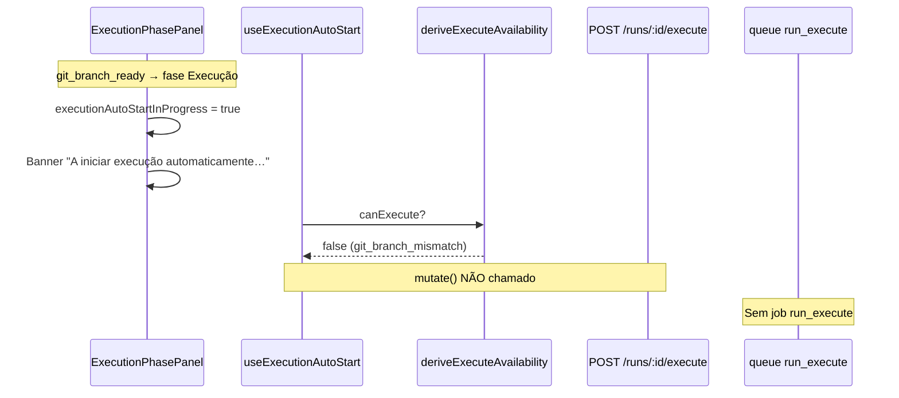

# Discovery — Execução travada após «Branch Git preparada»

**Data:** 2026-05-17  
**Tipo:** append-only (discovery apenas — sem alterações de código)  
**Escopo:** Por que a UI fica em «A iniciar execução automaticamente…» após `git_branch_prepared`, sem `execution_triggered` / job `run_execute`

---

## Resumo executivo

A transição **Versionamento → Execução** na UI funciona: com `git.status === git_branch_ready`, o painel de execução aparece e o banner de auto-start é mostrado. **A execução real não arranca** porque o frontend **não chega a chamar** `POST /runs/:id/execute` quando `availability.canExecute === false`.

Na corrida reproduzida (`20260517-105727-…`), o bloqueio concreto é **`git_branch_mismatch`**: o repositório está em HEAD diferente da `activityBranch` persistida, embora o estado da run diga `git_branch_ready`. O banner «A iniciar execução automaticamente…» **não reflete** esse bloqueio — `executionAutoStartInProgress` ignora `canExecute`, e o `executeHint` fica oculto enquanto `autoStartActive` é true.

**Causa raiz provável (dupla):**

1. **UX / política de auto-start:** desacoplamento entre «em progresso» (UI) e elegibilidade real (`deriveExecuteAvailability`).
2. **Git operacional:** HEAD ≠ `activityBranch` após versionamento (duas branches `setup-boss/…` semelhantes no mesmo repo; prepare pode ter gravado uma branch e o workspace estar noutra).

---

## Corrida de referência (evidência)

| Campo | Valor |
|-------|--------|
| `runId` | `20260517-105727-na-tela-de-integracao-criar-componente-visual-de-chat` |
| `phase2.status` (disco) | `ready_for_execution` |
| `phase3.status` | `strategy_ready` |
| `git.status` | `git_branch_ready` |
| `git.activityBranch` | `setup-boss/20260517-na-tela-de-integracao-criar-componente-visual-de-c` |
| HEAD actual (repo) | `setup-boss/20260517-na-tela-de-integracao-criar-componente-de-chat-tas` |
| Eventos pós-prepare | `git_branch_prepared` (19:13:45) — **sem** `execution_triggered`, `execution_started`, job `run_execute` |
| Jobs na fila | Intake `completed`; **nenhum** `jobKind: run_execute` |

Simulação local de `validateGitExecuteGate` com o estado persistido:

```json
{
  "head": "setup-boss/20260517-na-tela-de-integracao-criar-componente-de-chat-tas",
  "gate": {
    "ok": false,
    "code": "git_branch_mismatch",
    "message": "A branch actual não coincide com a branch preparada para esta atividade."
  }
}
```

Branches locais no projecto-alvo:

- `setup-boss/20260517-na-tela-de-integracao-criar-componente-visual-de-c` (persistida)
- `setup-boss/20260517-na-tela-de-integracao-criar-componente-de-chat-tas` (**checkout actual**)

---

## Fluxo esperado vs observado



| Etapa | Esperado | Observado |
|-------|----------|-----------|
| Plano aprovado | `phase2` / approval OK | OK (`ready_for_execution`) |
| Branch preparada | `git_branch_ready` + checkout na `activityBranch` | Estado READY OK; **HEAD noutra branch** |
| Auto-start UI | Dispara POST /execute | Banner activo; **POST ausente** |
| Backend | `execution_triggered` + enqueue | **Ausente** |
| Worker | Job `run_execute` | **Ausente** |

---

## Respostas às 8 perguntas

### 1. O frontend chama `/execute`?

**Não**, nesta corrida. Não há `execution_triggered` em `events.jsonl` / `runtime-trace.jsonl` para este `runId`, nem job `run_execute` em `queue.json`.

O hook `useExecutionAutoStart` só chama `executeRun.mutate()` quando `availability.canExecute` é true:

```59:67:frontend/hooks/use-execution-auto-start.ts
  useEffect(() => {
    if (!runKey || !autoStartEligible) return;
    if (!availability.canExecute) return;
    if (executeRun.isPending || executeRun.isSuccess) return;
    if (autoStartFailed) return;
    if (attemptedRef.current === runKey) return;

    attemptedRef.current = runKey;
    executeRun.mutate();
```

Com `canExecute === false`, o efeito termina antes do `mutate()` — **bloqueio silencioso no cliente** (sem erro de mutation, logo sem `autoStartFailed`).

### 2. Se chama, qual resposta recebe?

**N/A** — não houve chamada. Se fosse chamada com o HEAD actual, o backend responderia **409** com `git_branch_mismatch` (`validateGitExecuteGate` em `run-execute-api.js` / `core/validate-git-execute-gate.js`).

### 3. Se não chama, qual condição bloqueia?

**`availability.canExecute === false`** com `reason: git_branch_mismatch` (via `summary.git.executeBlockCode` derivado em `resolveRunGitUiEnvelope` → `deriveGitExecuteBlock`).

Condições já satisfeitas (não são o bloqueio aqui):

- `git_branch_ready` → auto-start elegível (`shouldAutoStartExecutionAfterVersioning`)
- `phase2Status` / approval → OK no disco e na session
- `strategy_ready` → OK
- Runtime online → pressuposto (daemon activo; prepare Git correu)

### 4. O backend aceita execução nessa fase?

**Sim, em princípio** — `phase2.status === ready_for_execution`, strategy pronta, sem job `run_execute` activo. O gate que falha é **Git**: HEAD deve coincidir com `activityBranch` quando `git_branch_ready`.

### 5. Algum estado técnico antigo impede execução?

**Não** `runtimePhase` / `phase2Status` desactualizados no artefacto principal. O `run-context.json` está coerente com execução.

O impeditivo é **operacional Git + envelope UI**:

- Persistência: `git_branch_ready` + `activityBranch` = `…-visual-de-c`
- Workspace: HEAD = `…-de-chat-tas`
- Summary expõe `executeBlockCode: git_branch_mismatch` → frontend bloqueia

A UI de execução usa `git.status` para «versionamento completo», mas **não** exige `executeBlockCode` ausente para mostrar auto-start «em curso».

### 6. O worker recebe job?

**Não.** Nenhum `run_execute` enfileirado para esta corrida. `triggerRunExecution` → `enqueueJob` com `jobKind: run_execute` só corre após POST /execute bem-sucedido.

### 7. Qual é a causa raiz provável?

**Primária (regressão auto-start Fase 7):** `executionAutoStartInProgress` devolve `true` só com `git_branch_ready` + `execution_pending` + `ready_for_execution`, **sem** `availability.canExecute`. O painel mostra spinner indefinido e esconde o hint de bloqueio:

```298:300:frontend/components/features/planning/ExecutionPhasePanel.tsx
      {executeHint && status === "awaiting_start" && !canStart && !autoStartActive ? (
        <p className="text-[11px] text-muted-foreground">{executeHint}</p>
      ) : null}
```

**Secundária (dados Git):** mismatch HEAD vs `activityBranch` — duas branches truncadas diferentes no mesmo repo; possível combinação de (a) nome sugerido/confirmado diferente entre tentativas, (b) checkout não garantido no caminho idempotente de `prepareRunGitBranch` quando já existe `git_branch_ready`, (c) troca manual de branch após prepare.

### 8. Qual a menor correção segura?

**Correção UX mínima (recomendada primeiro):**

1. Alinhar `executionAutoStartInProgress` com `availability.canExecute` (ou passar `canExecute` nos opts) — banner só quando o POST pode mesmo disparar.
2. Em `ExecutionPhasePanel`, se `autoStartEligible && !availability.canExecute`, mostrar `executeHint` / mensagem de bloqueio **em vez de** spinner infinito (incluir `git_branch_mismatch`).

Ficheiros: `execution-auto-start-policy.ts`, `ExecutionPhasePanel.tsx`, testes em `execution-auto-start-policy.test.ts`.

**Correção operacional Git (complementar, baixo risco):**

3. Em `prepareRunGitBranch`, no retorno idempotente com `git_branch_ready`, **verificar HEAD** e fazer `checkout` para `activityBranch` se diferente (`run-git-branch-api.js`).

**Mitigação imediata para utilizador (sem deploy):** `git checkout setup-boss/20260517-na-tela-de-integracao-criar-componente-visual-de-c` no projecto-alvo, ou voltar a confirmar versionamento após alinhar branch.

---

## Mapa de componentes

| Área | Ficheiro | Papel no bug |
|------|----------|----------------|
| Política auto-start | `frontend/lib/runtime/execution/execution-auto-start-policy.ts` | `executionAutoStartInProgress` sem `canExecute` |
| Hook disparo | `frontend/hooks/use-execution-auto-start.ts` | Guard `!availability.canExecute` → sem POST |
| UI execução | `frontend/components/features/planning/ExecutionPhasePanel.tsx` | Banner + ocultação de hint |
| Disponibilidade | `frontend/lib/runtime/orchestration/orchestration-state.ts` | `deriveExecuteAvailability` / `deriveGitExecuteBlock` |
| Mutação | `frontend/hooks/use-orchestration-mutations.ts` | Segundo guard `canExecute` no `mutationFn` |
| Gate Git UI | `scripts/daemon/lib/run-git-ui-envelope.js` | `executeBlockCode` em tempo real |
| Gate Git core | `core/validate-git-execute-gate.js` | `git_branch_mismatch` |
| Execute API | `scripts/daemon/lib/run-execute-api.js` | `validateExecuteReadiness` + `triggerRunExecution` |
| Prepare branch | `scripts/daemon/lib/run-git-branch-api.js` | Persiste `git_branch_ready`; idempotência sem re-checkout |
| Transição fase | `frontend/lib/runtime/operational/versioning-operational-state.ts` | `isVersioningOperationallyComplete` só olha `git.status` |
| Visibilidade exec | `frontend/lib/runtime/operational/execution-operational-state.ts` | `shouldShowExecutionPhasePanel` após branch ready |

---

## Estados relevantes (corrida 105727)

| Campo | Valor | Impacto |
|-------|--------|---------|
| `summary.git.status` | `git_branch_ready` | Mostra fase Execução + auto-start «activo» |
| `summary.git.activityBranch` | `…-visual-de-c` | Gate espera esta branch |
| `summary.git.executeBlockCode` | `git_branch_mismatch` (derivado) | `canExecute: false` |
| `clarification.session.runtimePhase` | `ready_for_execution` (após approve) | Não bloqueia |
| `phase2Status` (disco) | `ready_for_execution` | Backend OK |
| `execution.lifecyclePhase` | `execution_pending` (default) | `awaiting_start` na UI |
| `orchestrationState` | `ready_for_execution` | Compatível com auto-start UI |
| `jobStatus` (intake) | `completed` | Não bloqueia execute |

---

## Conclusão

O travamento **não** é falha do worker nem ausência de transição de fase na UI operacional: a fase **Execução** abre correctamente após `git_branch_prepared`. O problema é um **dead-end de auto-start**: a UI promete arranque automático enquanto o cliente recusa disparar o POST por gate Git, sem feedback visível.

Prioridade de fix: **alinhar banner de auto-start com `canExecute` e surface do `executeBlockCode`**. Opcionalmente, **garantir checkout** no prepare idempotente para evitar mismatch após «branch preparada».

---

## Validação pós-fix (sugestão)

1. Repetir fluxo até `git_branch_ready` com HEAD = `activityBranch`.
2. Confirmar um único `POST /runs/:id/execute` na rede.
3. Confirmar `execution_triggered` + job `run_execute` na fila.
4. Caso mismatch: UI deve mostrar mensagem clara (não spinner eterno).
5. `node --test frontend/lib/runtime/execution/execution-auto-start-policy.test.ts` após alterar política.

---

## Critérios de aceite (discovery)

| Critério | Estado |
|----------|--------|
| Causa raiz provável identificada | OK |
| Ficheiros envolvidos listados | OK |
| Correção pequena e segura proposta | OK |
| Nenhum código funcional alterado | OK |
