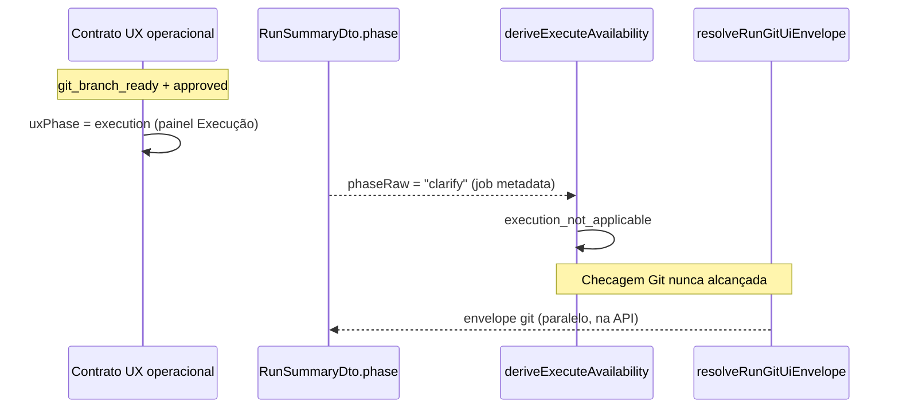

# Discovery — `execution_not_applicable` com `currentBranch: null` após aprovação/versionamento

**Data:** 2026-05-17  
**Tipo:** append-only (discovery apenas — sem alterações de código)  
**Escopo:** Por que a UI entra em **Execução** mas bloqueia com «Execução não aplicável nesta fase» e logs com `canExecute: false`, `blockReason: execution_not_applicable`, `expectedBranch` preenchido e `currentBranch: null`

---

## Resumo executivo

A fase visual **Execução** abre correctamente quando `git.status === git_branch_ready` e o plano está aprovado (contrato UX operacional). O gate de **disparo** (`deriveExecuteAvailability`) usa outra fonte: `RunSummaryDto.phase`, derivado de `job.metadata.uiPhase` no job de intake.

Esse `uiPhase` **permanece `clarify` para todo o ciclo de vida** após o intake — o daemon não o promove em aprovação, strategy nem `git_branch_prepared`. Com `phaseRaw ∈ {intake, clarify, clarification}`, o frontend devolve `execution_not_applicable` **antes** de avaliar Git.

`currentBranch: null` nos logs **não indica** falha do backend em resolver HEAD: o envelope Git só expõe `currentBranch` quando `validateGitExecuteGate` falha. Com gate OK (HEAD = `activityBranch`), `currentBranch` fica ausente do summary — comportamento esperado.

**Causa raiz provável:** desalinhamento **metadata do job (`uiPhase`) vs estado real dos artefactos** (phase2/phase3/git), combinado com UI operacional que avança por `git_branch_ready` independentemente de `summary.phase`.

**Correção mínima segura (recomendada):** alinhar `deriveExecuteAvailability` aos mesmos sinais que a fase operacional (aprovação + `ready_for_execution` + versionamento completo), **ou** promover `uiPhase` no daemon nos marcos `strategy_ready` / `git_branch_ready`.

---

## Sintoma observado (logs UI)

```json
{
  "canExecute": false,
  "blockReason": "execution_not_applicable",
  "expectedBranch": "setup-boss/...",
  "currentBranch": null
}
```

Mensagem ao utilizador: «Execução não aplicável nesta fase.»

---

## Corridas de referência (evidência em disco)

| `runId` | `git_branch_prepared` | Git persistido | Job `metadata.uiPhase` | Gate Git (simulado) |
|---------|----------------------|----------------|------------------------|---------------------|
| `20260517-105727-…-visual-de-chat` | Sim (19:13:45) | `git_branch_ready` + `activityBranch` | `clarify` (inalterado) | `git_branch_mismatch` (HEAD ≠ branch persistida) |
| `20260517-165042-…-de-chat` | Sim (19:53:45) | `git_branch_ready` | `clarify` | Depende do HEAD |
| `20260517-172516-…-de-chat` | Não em `events.jsonl`* | `git_branch_ready` | `clarify` | **OK** (sem `executeBlockCode`) |

\* `172516` tem `git` em `run-context.json` com `updatedAt`; prepare pode ter corrido sem evento indexado ou reutilizando estado — irrelevante para o gate `execution_not_applicable`.

Estado comum nas três corridas (`run-context.json` no projecto-alvo):

- `phase2.status`: `ready_for_execution`
- `phase2.approval.status`: `approved`
- `phase3.status`: `strategy_ready`
- `git.status`: `git_branch_ready`

Job de intake em `.setup-boss/daemon/queue.json` (exemplo `105727`):

```json
"metadata": {
  "initialState": "clarification_required",
  "uiPhase": "clarify",
  "uiState": "waiting_clarification_answers"
}
```

---

## Fluxo: duas fontes de «fase»



| Sinal | Fonte | Valor após versionamento |
|-------|--------|---------------------------|
| Mostrar painel Execução | `shouldShowExecutionPhasePanel` + `isVersioningOperationallyComplete` | **Sim** (`git_branch_ready`) |
| `operationalUx.uxPhase` | `resolveExecutionPreStartActive` | **execution** |
| `summary.phase` / `phaseRaw` | `map-job.ts` ← `job.metadata.uiPhase` | **clarify** (stale) |
| `canExecute` | `deriveExecuteAvailability` | **false** (`execution_not_applicable`) |

---

## Respostas às 8 perguntas

### 1. A run tem `git_branch_prepared`?

**Sim** nas corridas reproduzidas com versionamento completo (`105727`, `165042`). Evidência em `.setup-boss/daemon/events.jsonl` com `type: git_branch_prepared` e `activityBranch` no payload.

### 2. A branch foi persistida no estado da run?

**Sim.** `run-context.json` → `git.status: git_branch_ready`, `git.activityBranch` preenchida, `updatedAt` coerente com o evento.

### 3. O backend consegue resolver HEAD / `currentBranch`?

**Sim**, quando o gate falha. `resolveRunGitUiEnvelope` chama `getCurrentBranch(projectRoot)` e inclui `currentBranch` só se `validateGitExecuteGate` devolver `ok: false`:

```38:56:scripts/daemon/lib/run-git-ui-envelope.js
  let executeBlockCode = null;
  let currentBranch = null;
  try {
    const gate = validateGitExecuteGate({ projectRoot, gitState });
    if (!gate.ok) {
      executeBlockCode = gate.code;
      if (isGitRepository(projectRoot)) {
        try {
          currentBranch = getCurrentBranch(projectRoot);
        } catch {
          /* */
        }
      }
    }
  } catch {
    executeBlockCode = "git_branch_unknown";
  }

  return mapRunGitForUi(gitState, { executeBlockCode, currentBranch });
```

Simulação `172516` (gate OK):

```json
{
  "branchHint": "setup-boss/20260517-na-tela-de-integracao-criar-componente-de-chat-tas",
  "git": {
    "status": "git_branch_ready",
    "activityBranch": "setup-boss/20260517-na-tela-de-integracao-criar-componente-de-chat-tas"
  }
}
```

Sem `executeBlockCode` → **sem `currentBranch` no summary** — alinhado com `currentBranch: null` nos logs.

### 4. De onde vem `execution_not_applicable`?

Único sítio no código de disponibilidade:

```250:257:frontend/lib/runtime/orchestration/orchestration-state.ts
  const phase = String(input.phaseRaw || "").toLowerCase();
  if (phase === "intake" || phase === "clarify" || phase === "clarification") {
    return {
      canExecute: false,
      reason: "execution_not_applicable",
      message: GUARD_MESSAGES.execution_not_applicable,
      degraded: false,
    };
  }
```

`phaseRaw` vem de `summary?.phase` em `use-orchestration.ts` (L35, L70), mapeado de `metadata.uiPhase` em `map-job.ts` (L62–68).

### 5. Qual gate específico falha?

**Gate de fase do job (`summary.phase` / `uiPhase`), não Git.**

Ordem em `deriveExecuteAvailability`:

1. `runKey`, runtime, orchestration activa, clarification, strategy — **passam** nas corridas analisadas (aprovado, `ready_for_execution`, strategy_ready).
2. **`phaseRaw === "clarify"`** → `execution_not_applicable` (**falha aqui**).
3. `deriveGitExecuteBlock` — **não executado** neste cenário.

`executeBlockCode` no summary é orthogonal: pode existir (ex. `git_branch_mismatch` em `105727`) mas o bloqueio reportado pelo utilizador é **`execution_not_applicable`**.

### 6. A UI entrou em Execução cedo demais?

**Não relativamente ao versionamento** — `git_branch_ready` é o critério correcto para a fase operacional:

```79:85:frontend/lib/runtime/operational/versioning-operational-state.ts
export function isVersioningOperationallyComplete(
  summary: RunSummaryDto | null | undefined,
): boolean {
  if (!summary) return false;
  return String(summary.git?.status ?? "") === "git_branch_ready";
}
```

```325:332:frontend/lib/runtime/operational/derive-operational-ux-contract.ts
  if (
    resolveExecutionPreStartActive(
      summary,
      approvalActive,
      executionLifecyclePhase,
    )
  ) {
    return "execution";
  }
```

**Sim relativamente ao gate de execute** — o painel Execução aparece enquanto `summary.phase` ainda diz `clarify`, criando expectativa de auto-start sem elegibilidade.

### 7. O problema é frontend, backend, persistência ou timing?

| Camada | Papel |
|--------|--------|
| **Backend (contrato job)** | `uiPhase` definido só no intake (`run-intake-api.js`); **não actualizado** em approve / strategy / `git_branch_prepared`. Única promoção posterior: `uiPhase: "execution"` ao enfileirar `run_execute`. |
| **Frontend (gate execute)** | Bloqueia por `summary.phase` stale; ignora bundles/artefactos já prontos. |
| **Frontend (UX operacional)** | Avança por `git_branch_ready` — comportamento intencional Fase 7. |
| **Persistência Git** | **OK** — `run-context.git` coerente. |
| **Timing** | Não é corrida prepare↔envelope; é **desync estrutural** job metadata vs artefactos. |

`currentBranch: null` é **efeito colateral** da política de envelope (só preencher em falha de gate), não ausência de `git rev-parse`.

### 8. Qual a menor correção segura?

**Opção A — Frontend (menor diff, baixo risco):** em `deriveExecuteAvailability`, **não aplicar** o guard `execution_not_applicable` quando o operador já está elegível para execução pelos mesmos critérios do painel, por exemplo:

- `clarification.approval === "approved"` **ou** `session.runtimePhase === "ready_for_execution"`
- `session.phase2Status === "ready_for_execution"` (quando presente)
- `isVersioningOperationallyComplete(git)` (`git_branch_ready`)

Manter `deriveGitExecuteBlock` a seguir (L260+).

Ficheiros: `frontend/lib/runtime/orchestration/orchestration-state.ts`, testes em `orchestration-state-git.test.ts` (+ novo caso `phaseRaw=clarify` + git ready).

**Opção B — Backend (corrige a raiz do espelho):** promover `job.metadata.uiPhase` para `strategy` em `strategy_ready` / approve e para `execution` (ou `ready`) em `git_branch_prepared` — pontos: APIs de approve/strategy/prepare branch + `updateJob` em `queue-store`.

Ficheiros: handlers de approve/strategy, `run-git-branch-api.js`, possivelmente `run-orchestration-sync.js`.

**Opção C — Mitigação imediata (sem deploy):** nenhuma — o utilizador não consegue desbloquear só com Git; precisa de fix de fase ou checkout não resolve `execution_not_applicable`.

**Secundário (outra corrida):** em `105727`, após desbloquear fase, ainda haverá `git_branch_mismatch` — ver discovery `2026-05-17-discovery-execucao-travada-apos-branch.md`.

**Recomendação:** **Opção A** primeiro (1 ficheiro + testes); **Opção B** como endurecimento de contrato para lista de jobs e badges.

---

## Origem dos campos nos logs

| Campo | Origem |
|-------|--------|
| `canExecute` | `deriveExecuteAvailability` → `useOrchestration` |
| `blockReason` | `availability.reason` (`execution_not_applicable`) |
| `expectedBranch` | `summary.git.activityBranch` em `logExecutionAutoStartEvaluated` |
| `currentBranch` | `summary.git.currentBranch` (só se envelope incluir — gate falhou) |
| `executeBlockCode` | `resolveRunGitUiEnvelope` → `mapRunGitForUi` (API jobs/runs) |

```86:94:frontend/hooks/use-execution-auto-start.ts
    logExecutionAutoStartEvaluated({
      runId: runKey,
      projectId,
      canExecute: availability.canExecute,
      blockReason: availability.reason,
      blockMessage: blockCopy?.body ?? availability.message,
      expectedBranch: summary.git?.activityBranch ?? null,
      currentBranch: summary.git?.currentBranch ?? null,
    });
```

---

## Onde `uiPhase` é (e não é) actualizado

| Momento | `uiPhase` |
|---------|-----------|
| Intake / create job | `clarify` (se `clarification_required`) — `run-intake-api.js` |
| Approve / strategy / prepare branch | **Sem alteração** (grep vazio em `scripts/daemon/lib/*`) |
| POST `/execute` | `execution` — `run-execute-api.js` |
| Orchestration sync em execução | `execution` — `run-orchestration-sync.js` |

```71:77:scripts/daemon/lib/run-intake-api.js
function uiPhaseForInitialState(initialState) {
  if (initialState === "clarification_required" || initialState === "clarification_ready") {
    return "clarify";
  }
  if (initialState === "strategy_pending") return "strategy";
  ...
}
```

---

## Mapa de ficheiros envolvidos

| Área | Ficheiro | Papel |
|------|----------|--------|
| Gate execute | `frontend/lib/runtime/orchestration/orchestration-state.ts` | `execution_not_applicable` por `phaseRaw` |
| Wiring | `frontend/hooks/use-orchestration.ts` | `phaseRaw: summary.phase` |
| Fase summary | `frontend/lib/runtime/adapters/map-job.ts` | `phase` ← `metadata.uiPhase` |
| UX Execução | `frontend/lib/runtime/operational/execution-operational-state.ts` | Painel sem olhar `summary.phase` |
| UX fase | `frontend/lib/runtime/operational/derive-operational-ux-contract.ts` | `uxPhase: execution` com `git_branch_ready` |
| Versionamento | `frontend/lib/runtime/operational/versioning-operational-state.ts` | `isVersioningOperationallyComplete` |
| Logs | `frontend/lib/runtime/execution/log-execution-auto-start-observation.ts` | `expectedBranch` / `currentBranch` |
| Envelope Git | `scripts/daemon/lib/run-git-ui-envelope.js` | `currentBranch` condicional |
| Gate Git | `core/validate-git-execute-gate.js` | HEAD vs `activityBranch` |
| Job metadata | `scripts/daemon/lib/run-intake-api.js` | `uiPhase` inicial e freeze |
| Fila | `.setup-boss/daemon/queue.json` | Evidência `uiPhase: clarify` persistente |
| Estado run | `run-context.json` (outputDir) | phase2/phase3/git reais |

---

## Conclusão

O bloqueio **`execution_not_applicable` com `currentBranch: null`** reflecte sobretudo:

1. **Job `uiPhase` congelado em `clarify`** enquanto artefactos e Git estão prontos para executar.
2. **UI operacional e gate de execute usam critérios diferentes** — a UI não está «cedo» no versionamento; o execute está «tarde» na fase do job.
3. **`currentBranch: null` é esperado** quando o gate Git passa; não contradiz prepare bem-sucedido.

Não é bug de persistência Git nem de leitura errada da run no envelope. É **contrato de fase desactualizado** entre job metadata e pipeline real.

---

## Critérios de aceite (discovery)

| Critério | Estado |
|----------|--------|
| Causa raiz provável identificada | OK |
| Ficheiros envolvidos listados | OK |
| Correção pequena e segura proposta | OK |
| Nenhum código funcional alterado | OK |

---

## Validação pós-fix (sugestão)

1. Corrida até `git_branch_ready` com job intake `uiPhase: clarify`.
2. Confirmar `deriveExecuteAvailability.canExecute === true` (ou `reason !== execution_not_applicable`).
3. Confirmar um `POST /runs/:id/execute` e `execution_triggered`.
4. Logs: se gate Git falhar, `currentBranch` deve aparecer; se passar, `null` é OK.
5. `node --test frontend/lib/runtime/orchestration/orchestration-state-git.test.ts` após alteração.
