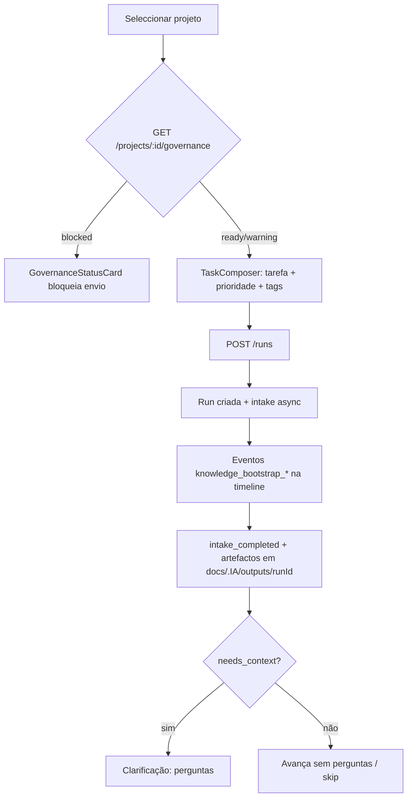
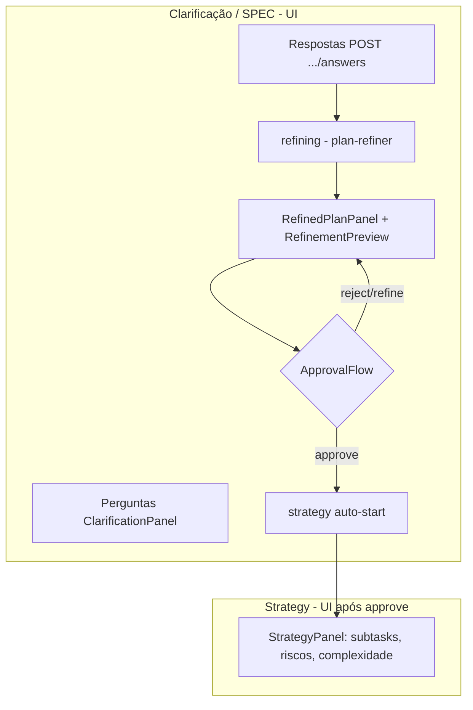

# Discovery — UX operacional: Inicialização → Montando o plano

**Data:** 2026-05-17  
**Escopo:** Discovery apenas — nenhuma alteração de código  
**Foco:** Fases operacionais **Inicialização** e **Montando o plano** (Mission Control / runtime front)

---

## Índice

1. [Estado atual do código](#1-estado-atual-do-código)
2. [Arquivos relevantes](#2-arquivos-relevantes)
3. [Como o fluxo funciona hoje](#3-como-o-fluxo-funciona-hoje)
4. [Divergências em relação ao fluxo definido](#4-divergências-em-relação-ao-fluxo-definido)
5. [O que pode ser reaproveitado](#5-o-que-pode-ser-reaproveitado)
6. [Mudanças necessárias no front](#6-mudanças-necessárias-no-front)
7. [Mudanças necessárias no backend/API](#7-mudanças-necessárias-no-backendapi)
8. [Dados em falta para a UI](#8-dados-em-falta-para-a-ui)
9. [Termos técnicos ainda visíveis na UI](#9-termos-técnicos-ainda-visíveis-na-ui)
10. [Mocks e fallbacks](#10-mocks-e-fallbacks)
11. [Riscos técnicos](#11-riscos-técnicos)
12. [Plano recomendado de implementação](#12-plano-recomendado-de-implementação)

---

## 1. Estado atual do código

O Mission Control já possui **camadas paralelas de “fase”**, sem uma única fonte de verdade alinhada às sete fases operacionais desejadas:

| Camada | Granularidade | Rótulos típicos hoje |
|--------|---------------|----------------------|
| Timeline semântica central | `SemanticWorkflowPhaseId` | `project_initialization` → “Inicialização”; `intake` → “Entrada da tarefa”; `clarification_spec` → “Clarificação / SPEC”; `refined_plan` → “Plano refinado”; `strategy` → **“Execução”** |
| Modelo visual UX (ribbon) | `OperationalVisualStepId` | Intake, Clarificação, Plano refinado, Versionamento, Execução |
| Workspace / missão | `intake \| clarify \| strategy \| exec` | Termos internos derivados de `summary.phase` + bundles |
| Pipeline grosso (nav lateral) | `CoarsePipelineId` | intake, clarification, strategy, executor, review, wrapup |

**Não existe** hoje o rótulo **“Montando o plano”** nem a agregação visual que una: perguntas → respostas → refinamento → revisão conversacional → plano final → (opcionalmente) decomposição strategy antes da fase **Aprovação**.

A fase **Inicialização** existe parcialmente como `project_initialization` + validação `.IA` no composer, mas o passo de **“gerar SPEC inicial”** não é um estado explícito na UI — só inferível por eventos/artefatos no output dir.

---

## 2. Arquivos relevantes

### Fases, timeline e tradução operacional

| Ficheiro | Papel |
|----------|--------|
| `frontend/lib/runtime/execution/semantic-workflow-mapper.ts` | Agrega cards da timeline em fases semânticas; títulos PT hardcoded |
| `frontend/lib/runtime/execution/semantic-workflow-phase-id.ts` | IDs de fase semântica |
| `frontend/lib/runtime/execution/execution-step-catalog.ts` | Catálogo fino de passos (`knowledge_bootstrap`, `task_intake`, `clarification`, …) |
| `frontend/lib/runtime/execution/build-execution-timeline-cards.ts` | Cards + slots embutidos (composer, clarificação, aprovação) |
| `frontend/lib/runtime/translation/runtime-translation-layer.ts` | Copy humana por `KnowledgeBootstrapPhase` e `ClarificationRuntimePhase` |
| `frontend/lib/runtime/mission/runtime-workflow-phases.ts` | Labels PT dos `runtimePhase` de clarificação/strategy |
| `frontend/lib/runtime/mission/mission-workflow-stages.ts` | Status `ACTIVE/WAITING/…` para intake/clarify/strategy/exec |
| `frontend/lib/runtime/mission/project-run-workflow-feedback.ts` | Faixa “Project → Run” pós-respostas (refino/aprovação/Git) |
| `frontend/lib/runtime/ux/operational-visual-model.ts` | Passos visuais simplificados (Intake, Clarificação, …) |
| `frontend/lib/runtime/ux/derive-run-ux-state.ts` | Active step interno (`intake`, `clarification`, `plan`, `approval`, `strategy`, …) |
| `frontend/lib/runtime/observability/coarse-pipeline.ts` | Agrupamento grosso para nav |
| `frontend/locales/pt-BR.ts` | `timeline.phases.*` (i18n das fases semânticas) |

### Shell central, painéis e CTAs

| Ficheiro | Papel |
|----------|--------|
| `frontend/components/features/run-detail/RunViewShell.tsx` | Orquestra timeline, slots, ribbon operacional |
| `frontend/components/features/run-detail/OperationalUxPanel.tsx` | Banner + checkpoints UX (intake → execução) |
| `frontend/components/features/run-detail/ActiveStepBanner.tsx` | Headline do passo activo |
| `frontend/components/features/execution-timeline/CentralExecutionTimeline.tsx` | Timeline central + conversation-stream |
| `frontend/components/features/run-detail/MissionWorkspacePhase.tsx` | Cartão de etapa (wrapper visual) |
| `frontend/components/features/run-detail/ProjectRunWorkflowStatusStrip.tsx` | Micro-progresso pós-clarificação |

### Inicialização (`.IA`, intake, SPEC)

| Ficheiro | Papel |
|----------|--------|
| `frontend/components/features/intake/TaskComposer.tsx` | Tarefa, prioridade, tags; governance `.IA` antes do POST |
| `frontend/components/features/governance/GovernanceStatusCard.tsx` | Estado governança / `.IA` |
| `frontend/hooks/use-project-governance.ts` | `GET /projects/:id/governance` |
| `frontend/lib/runtime/governance/ia-governance-ux.ts` | DTO UX governança |
| `frontend/hooks/use-create-run.ts` | `POST /runs` + bootstrap clarificação |
| `frontend/lib/runtime/intake/intake-types.ts` | Payload (priority, tags) e fases UI intake |
| `scripts/runtime/intake/intake-manifest.js` | Artefactos intake (`task-plan-initial.md`, …) |
| `scripts/daemon/lib/run-intake-api.js` | API intake + eventos `knowledge_bootstrap_*`, `intake_completed` |

### Montando o plano (clarificação + refinamento + strategy)

| Ficheiro | Papel |
|----------|--------|
| `frontend/components/features/clarification/ClarificationPanel.tsx` | Perguntas e respostas |
| `frontend/components/features/clarification/RefinedPlanPanel.tsx` | Plano refinado + gate aprovação |
| `frontend/components/features/clarification/ApprovalFlow.tsx` | Aprovar / Rejeitar / Pedir refinamento |
| `frontend/components/features/clarification/RefinementPreview.tsx` | Preview do refinement |
| `frontend/hooks/use-clarification.ts` | `GET /runs/:id/clarification` |
| `frontend/hooks/use-clarification-mutations.ts` | answers, approve, reject, refine |
| `frontend/lib/runtime/clarification/clarification-types.ts` | Contrato bundle + fases |
| `frontend/components/features/strategy/StrategyPanel.tsx` | Complexidade, subtasks, riscos, ordering |
| `frontend/hooks/use-strategy.ts` | `GET /runs/:id/strategy` |
| `scripts/runtime/clarification/clarification-runtime.js` | Motor phase2 (perguntas, respostas, refine, approve) |
| `scripts/daemon/runtime-api.js` | Rotas REST clarification |

### Stores e navegação

| Ficheiro | Papel |
|----------|--------|
| `frontend/stores/mission-shell-store.ts` | Projeto/run seleccionados, `newActivityFlow`, nav timeline |
| `frontend/stores/intake-store.ts` | Draft tarefa, fase UI intake, bootstrap scroll |
| `frontend/stores/clarification-store.ts` | Bootstrap scroll pós-approve → strategy |
| `frontend/lib/runtime/navigation/runtime-action-target.ts` | IDs de painéis (`clarification_spec`, `refined_plan`, …) |

---

## 3. Como o fluxo funciona hoje

### 3.1 Inicialização (estado actual)

**Detalhes:**

1. **Validar `.IA`** — Antes de criar corrida (`composeOnly`), `TaskComposer` chama `useProjectGovernance` → `GET /projects/:id/governance`. O card mostra `readiness`, erros SPEC, onboarding. Fases `knowledge_bootstrap_*` também aparecem na timeline via eventos do run (card `knowledge_bootstrap`).

2. **Carregar contexto** — Não há passo UI dedicado “contexto carregado”. O utilizador vê copy em `translateKnowledgeBootstrapPhase("knowledge_bootstrap_ready")` quando o evento existe.

3. **Input atividade / prioridade / tags** — Só no fluxo **Nova atividade** (`newActivityFlow && !runId`), embutido no slot `task_intake` da timeline. Após criar run, campos ficam read-only.

4. **Gerar SPEC inicial** — Backend gera `task-plan-initial.md` (e manifest intake) em `docs/.IA/outputs/<runId>/` quando LLM completa (`intake-manifest.js`). A UI **não** expõe um milestone “SPEC inicial pronta”; no máximo eventos como `task_plan_initial_created` / `spec_draft_ready` em copy de checkpoint (`runtime-checkpoint-copy.ts`).

5. **Resultado** — Transição implícita para clarificação (`clarification_required` / `questions_generated`) ou fim de intake sem perguntas.

### 3.2 Montando o plano (estado actual — disperso em 3 superfícies)

**Perguntas e loop:**

- `GET /runs/:id/clarification` devolve `questions[]`, `session.runtimePhase`, `currentRound`.
- Respostas: `POST .../clarification/answers` → dispara refinamento (`refining` → `refinement_ready` / `awaiting_approval`).
- **Novo ciclo de perguntas:** o runtime suporta `rounds` na sessão, mas o front **não** modela um loop explícito “gerar novas perguntas se necessário”. Após responder todas, o fluxo empurra refinamento; `refreshClarification` só re-fetcha o bundle.
- `clarification_empty` é estado de erro/bloqueio, não um loop.

**Plano refinado vs plano final:**

- “Plano refinado” = `RefinementPreviewDto` (`refinedTask`, `scopeChanges`, `acceptanceCriteria`, `risks`) do phase2.
- “Pedir refinamento” = `POST .../clarification/refine` (re-executa refiner), **não** chat livre.
- Aprovação do plano refinado = mesmo painel que revisão (`ApprovalFlow`: Aprovar / Rejeitar / Pedir refinamento).

**Strategy (execução operacional) misturada:**

- Após `approve`, `strategy` inicia automaticamente (`strategy_auto_start`, `StrategyPanel`).
- O mapper semântico chama a fase `strategy` de **“Execução”** e colapsa visualmente em `execution` no modelo UX-C.
- Complexidade, mini-tasks, riscos e ordering **já existem** no bundle strategy, mas aparecem **depois** da aprovação do plano refinado, com título **“Strategy Runtime”** — fora da narrativa “Montando o plano”.

### 3.3 Onde o utilizador interage (cards, laterais, CTAs)

| Momento | Superfície | CTA principal |
|---------|------------|---------------|
| Nova atividade | Slot central `task_intake` | “Iniciar” (POST /runs) |
| `.IA` inválida | `GovernanceStatusCard` no composer | Links observabilidade / instruções |
| Perguntas | Slot `clarification` → `ClarificationPanel` | Submeter respostas |
| Plano refinado | Slot `clarification_approval` → `RefinedPlanPanel` | Aprovar / Rejeitar / Pedir refinamento |
| Pós-approve | Timeline + `StrategyPanel` (não slot central por defeito) | Retry strategy se falhar |
| Atenção humana | `deriveAttentionHint` + `ActiveStepBanner` | Scroll para painel (`humanCtaToTimelineAction`) |

Painel direito: abas `steps` (índice timeline), `chat_files` (artefactos — **não** conversa operacional), `observe`.

### 3.4 API / backend já expõe

| Necessidade UI | Exposto hoje? | Onde |
|----------------|---------------|------|
| `.IA` existe / válida | Sim (projeto) | `GET /projects/:id/governance` (`readiness`, `iaValidation`, `phase`) |
| `.IA` por run | Parcial | Eventos `knowledge_bootstrap_*` no trace do run |
| Contexto carregado | Parcial | Evento `knowledge_bootstrap_ready` |
| SPEC inicial pronta | **Não** no summary | Artefacto `task-plan-initial.md` no output dir; eventos opcionais |
| Perguntas pendentes | Sim | `bundle.questions`, `session.pendingBlockingCount`, `runtimePhase` |
| Plano em construção | Sim | `runtimePhase === "refining"` |
| Plano refinado disponível | Sim | `refinement.available`, `refinement_ready` |
| Plano aprovado | Sim | `approval.status`, `approved` |
| Comentários/dúvidas livres | **Não** | Só `approve(notes?)`, `reject(notes?)`, `refine` sem texto |
| Plano execução (strategy) | Sim | `GET /runs/:id/strategy` (pós-approve) |

---

## 4. Divergências em relação ao fluxo definido

### 4.1 Inicialização

| Esperado | Actual |
|----------|--------|
| Passos 1–6 sequenciais visíveis | `.IA` no composer; resto implícito ou na timeline técnica |
| “Gerar SPEC inicial” como resultado da fase | Sem milestone UI; utilizador não vê “SPEC inicial pronta” |
| Prioridade/tags após descrição | Mesmo formulário, ordem OK, mas só em **nova atividade** |
| Fase única “Inicialização” | Dividida entre `project_initialization`, `intake`, `run_bootstrap` |

### 4.2 Montando o plano

| Esperado | Actual |
|----------|--------|
| Uma fase “Montando o plano” | Dividida: “Clarificação / SPEC”, “Plano refinado”, depois “Strategy”/“Execução” |
| Loop de perguntas enquanto necessário | Um ciclo Q&A → refine; sem UI de “novas perguntas” |
| Conversa para questionar/ajustar plano | Só **Pedir refinamento** (regeneração), sem thread |
| Plano final dentro da mesma fase | Plano refinado + strategy são fases/títulos diferentes |
| Apresentar complexidade, riscos, mini-tasks aqui | Estão em **Strategy**, após approve |
| Separar de **Aprovação** | `ApprovalFlow` (“Aprovar plano para execução”) está no mesmo painel que revisão |

### 4.3 Separação Montando o plano × Aprovação

Hoje **misturado** em `RefinedPlanPanel` + `ApprovalFlow`:

- Revisar texto (`RefinementPreview`)
- Tirar dúvidas → apenas via refinamento completo
- Aprovar → dispara strategy + Git + execução

A fase visual **Aprovação** (aceitar plano final ou voltar) **não existe** como passo distinto.

### 4.4 Nomenclatura backend na UI

Termos internos ainda aparecem ao utilizador (ver secção 9).

---

## 5. O que pode ser reaproveitado

| Peça | Reutilização para o fluxo alvo |
|------|-------------------------------|
| `GET /projects/:id/governance` + `GovernanceStatusCard` | Passos 1–2 de Inicialização |
| `TaskComposer` (tarefa, prioridade, tags) | Passos 3–5; encaixar no wizard “Inicialização” |
| Eventos `knowledge_bootstrap_*` | Indicador “validando/carregando `.IA`” |
| `ClarificationPanel` + mutations | Passos 1–4 de Montando o plano (perguntas/respostas) |
| `RefinementPreview` / `RefinedPlanReview` | Visualização do plano em construção/final |
| `POST .../refine` | Ajuste de plano (grosso — falta conversa fina) |
| `StrategyPanel` + bundle | Conteúdo de plano operacional (subtasks, riscos, complexidade) — **reordenar** para antes da aprovação final, não depois |
| `semantic-workflow-mapper` | Ponto único para renomear/agrupar fases semânticas |
| `runtime-translation-layer` | Copy PT operacional por sub-estado |
| `deriveAttentionHint` / `ActiveStepBanner` | CTAs e “depende de si” |
| `project-run-workflow-feedback` | Micro-passos dentro de Montando o plano |
| Artefactos intake (`task-plan-initial.md`) | Fonte para “SPEC inicial pronta” (leitura read-only ou evento) |

---

## 6. Mudanças necessárias no front

### 6.1 Camada de fases operacionais (nova)

- Introduzir mapa **operacional → interno** (ex.: `operationalPhase: "initialization" | "planning" | …`) sem renomear runtime.
- Agrupar semantic phases:
  - **Inicialização:** `project_initialization` + `intake` + `run_bootstrap` (+ milestone SPEC inicial).
  - **Montando o plano:** `clarification_spec` + `refined_plan` + conteúdo strategy **antes** do gate final.
  - **Aprovação:** gate único sobre plano final consolidado (mover `ApprovalFlow`).

### 6.2 Inicialização — UX

1. Wizard ou checklist com 6 passos e estados derivados de governance + eventos + manifest intake.
2. Bloquear “Iniciar” até `.IA` ready (já parcialmente feito).
3. Após POST /runs, mostrar progresso intake até **“SPEC inicial pronta”** (novo sinal — ver backend).
4. Esconder labels “Entrada da tarefa”, “Pedido e arranque” do utilizador; manter em observabilidade.

### 6.3 Montando o plano — UX

1. Container único “Montando o plano” com sub-estados: perguntas → respondendo → gerando → revisão → ajustando.
2. Integrar `StrategyPanel` **antes** da aprovação final (ou fusão visual plano refinado + decomposition).
3. Substituir “Pedir refinamento” por fluxo de **comentário** se API existir; senão, copy honesta (“regenerar plano com base no pedido anterior”).
4. Não auto-scroll para “Execução”/strategy logo após approve — reservar para fase Aprovação/Versionamento.
5. Atualizar `OPERATIONAL_VISUAL_STEP_LABELS`, `pt-BR.ts` `timeline.phases`, `derive-run-ux-state` HEADLINES.

### 6.4 Separação Aprovação

- Extrair `ApprovalFlow` para fase seguinte só com plano **final** (refined + strategy merged).
- CTAs “Iniciar execução” só após aprovação explícita nesta fase.

---

## 7. Mudanças necessárias no backend/API

| Item | Prioridade | Notas |
|------|------------|-------|
| `operationalPhase` (ou `uxPhase`) no `RunSummaryDto` | Alta | Desacopla UI de `phase`/`state` internos |
| `intakeArtifacts` / `initialSpecReady` no GET run ou intake status | Alta | UI não deve ler filesystem |
| Evento estável `initial_spec_ready` com pointer seguro | Média | Alternativa a polling de artefactos |
| Endpoint conversacional `POST .../plan/comments` + histórico | Alta (para requisito 8–9 do fluxo) | Hoje **inexistente** |
| Regenerar plano com contexto de comentários | Alta | Extensão de `refine` ou novo handler |
| Loop explícito `needs_more_questions` + POST regenerate questions | Média | Modelar no `session.runtimePhase` |
| Unificar “plano final” (refined + strategy) num read-model | Média | Evita dois painéis desconectados |
| Não iniciar strategy automaticamente no approve se UX exige Aprovação separada | Média | Flag `autoStartStrategy` ou mover trigger |

Rotas clarification existentes (`runtime-api.js`):

- `GET /runs/:id/clarification`
- `POST /runs/:id/clarification/answers|approve|reject|refine`

---

## 8. Dados em falta para a UI

| Sinal UX | Situação |
|----------|----------|
| `.IA` encontrada/ausente | OK via governance (projeto); por-run via eventos |
| Contexto carregado | Parcial (evento); sem boolean no summary |
| SPEC inicial pronta | **Falta** flag/read-model |
| Onde está a SPEC inicial | Só path em artefactos (`docs/.IA/outputs/<runId>/task-plan-initial.md`) — não exposto à UI |
| Perguntas pendentes | OK (`questions`, `pendingBlockingCount`) |
| Plano em construção | OK (`refining`) |
| Plano final gerado | Parcial — refined sim; strategy é outro bundle/timing |
| Comentários/dúvidas do utilizador | **Falta** modelo + API |
| Distinção “montando” vs “aguardando aprovação final” | **Falta** fase UX dedicada |

---

## 9. Termos técnicos ainda visíveis na UI

Registar para substituição na implementação:

| Termo na UI | Onde |
|-------------|------|
| Intake | `operational-visual-model`, badges TaskComposer, headlines UX |
| Clarificação / SPEC | `semantic-workflow-mapper`, `pt-BR.ts` |
| Plano refinado | Painéis, faixa workflow (aceitável mas não alinhado a “plano final”) |
| Strategy Runtime | `StrategyPanel` header |
| SPEC (genérico) | `deriveAttentionHint`, translation layer |
| runtimePhase labels | `CLARIFICATION_RUNTIME_PHASE_LABELS_PT` (“Pronto para execução (fase 2)”) |
| Aprovar — próximo: strategy | `ApprovalFlow` statusLabel |
| Fase operacional · {phase} | Ribbon usa `runPhaseDisplayLabel` (intake, clarification, strategy, …) |
| `.IA` Governance | `GovernanceStatusCard` (termo técnico aceitável se consistente) |
| Entrada da tarefa / Pedido e arranque | Fases timeline i18n |

---

## 10. Mocks e fallbacks

| Artefacto | Impacto no fluxo |
|-----------|------------------|
| `frontend/lib/mocks/*.ts` | `runs`, `clarification`, `strategy`, `execution` — **não** usados no fluxo principal via `mock-bridge` (ficheiro órfão) |
| `execution-actions.ts` | Em 404 de execution, devolve `mockExecutionUnsupported` — pode mascarar estado real em runs sem execution bundle |
| `ClarificationBundleDto.source === "mock"` | Tipo permite; runtime é o caminho normal |
| `skipLlm: true` hardcoded no `TaskComposer` | Intake **sem** LLM por defeito no MC — `task-plan-initial.md` pode não ser gerado como no fluxo “SPEC inicial” completo |

**Recomendação:** não criar mocks novos; remover dependência de mock em execution quando houver run real (fora deste escopo).

---

## 11. Riscos técnicos

1. **Dupla verdade de fase** — `summary.phase`, `runtimePhase`, semantic phases e UX checkpoints podem dessincronizar; qualquer nova camada deve ter matriz de testes.
2. **Approve dispara strategy + Git** — Separar “Montando o plano” de “Aprovação” exige rever `use-clarification-mutations` e política `strategy-auto-start-policy`.
3. **`skipLlm: true`** — Fluxo real de SPEC inicial pode não ocorrer nos testes manuais via MC.
4. **Regeneração vs conversa** — `requestRefinement` sem input do utilizador não cumpre “questionar/comentar”; risco de UX frustrante se só renomear labels.
5. **Loop de perguntas** — Backend com `rounds` mas UI single-round; expandir pode exigir mudança em `ClarificationPanel` e API.
6. **i18n** — Muitos rótulos em `semantic-workflow-mapper` hardcoded em PT além de `pt-BR.ts`.
7. **Flicker/refetch** — Já mitigado em hooks clarification/strategy; nova wizard não deve desmontar bundles em invalidação.

---

## 12. Plano recomendado de implementação

Implementação em fatias pequenas, sem big-bang.

### Fase A — Contrato e sinais (backend + adaptadores front)

- Adicionar `uxPhase` / milestones: `ia_validated`, `context_loaded`, `initial_spec_ready`.
- Expor `initialSpec` summary (título, readyAt) no GET run ou evento dedicado.
- Testes smoke intake → clarificação.

### Fase B — Inicialização (só UI)

- Checklist/wizard Inicialização no `TaskComposer` + pós-POST.
- Unificar cards `project_initialization` + `intake` numa fase visual.
- Copy “SPEC inicial pronta” quando flag true.

### Fase C — Montando o plano — perguntas e refinamento

- Renomear superfícies para “Montando o plano”; sub-nav interno.
- Manter `ClarificationPanel` + estados `refining` / `refinement_ready`.
- Melhorar feedback de loop (se API suportar novas perguntas).

### Fase D — Plano operacional (strategy dentro de Montando o plano)

- Mostrar complexity/risks/subtasks **antes** do gate final.
- Ajustar `semantic-workflow-mapper`: strategy deixa de se chamar “Execução” neste contexto.

### Fase E — Conversa e ajuste (depende de API)

- Endpoint comentários + UI thread no painel do plano.
- Regeneração contextual vs refine cego.

### Fase F — Aprovação (fase separada)

- Mover `ApprovalFlow` para fase “Aprovação” com plano consolidado.
- Desacoplar auto-start strategy até após aprovação formal.

### Fase G — Limpeza

- Remover termos técnicos da secção 9.
- Rever `skipLlm` default para alinhar com “SPEC inicial” real (decisão produto).

---

## Resumo executivo

O código **já implementa** grande parte das capacidades de backend (governança `.IA`, intake com prioridade/tags, clarificação, refinamento, strategy com riscos e subtasks), mas a **experiência está fragmentada** em fases técnicas (`intake`, `clarification_spec`, `refined_plan`, `strategy` como “Execução”) e **não cobre** conversa operacional sobre o plano nem o milestone explícito “SPEC inicial pronta”. A adaptação pedida é sobretudo uma **camada de apresentação e contrato UX** sobre o runtime existente, com **API nova** para comentários/ajustes finos e **reordenação** de strategy + approval em relação ao modelo de sete fases operacionais.

**Relatório relacionado (outro escopo):** `docs/reports/2026-05-17-ux-operacional-mission-control-discovery.md` — foco em percepção durante **execução** (timeline, feed, stall detection), não nestas duas fases iniciais.
