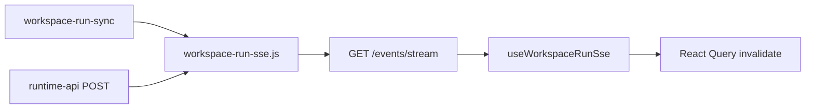

# Relatório: Workspace Fase I — SSE `workspace_run.*`

**Data:** 2026-05-17  
**Tipo:** implementação incremental (append-only)

---

## Resumo

Eventos SSE dedicados para mudanças de WorkspaceRun no stream existente `GET /events/stream`, com hook React Query no Mission Control e indicador discreto de ligação live.

---

## Arquitetura SSE



- **Transporte:** SSE sobre HTTP (mesmo endpoint que `runtime_event` / heartbeat)
- **Filtro:** `workspaceId` opcional na query string
- **Persistência:** nenhuma (memória apenas)

---

## Eventos implementados

| Evento | Origem |
|--------|--------|
| `workspace_run.updated` | Sync advance, start, resume, git, skip/retry |
| `workspace_run.started` | POST `/start` |
| `workspace_run.advanced` | Sync advance / resume com child |
| `workspace_run.waiting_user_action` | Sync em waiting |
| `workspace_run.failed` | Sync child failed |
| `workspace_run.completed` | Sync completed |
| `workspace_run.git_updated` | prepare-git / retry-prepare-git |
| `workspace_run.error` | Advance/tick error |

---

## Arquivos criados

| Ficheiro |
|----------|
| `scripts/daemon/lib/workspace-run-sse.js` |
| `scripts/daemon/lib/workspace-run-sse.test.js` |
| `scripts/smoke/workspace-sse-phaseI-smoke.js` |
| `frontend/lib/workspace/sse/workspace-run-sse-types.ts` |
| `frontend/lib/workspace/sse/workspace-run-sse-events.ts` |
| `frontend/lib/workspace/sse/workspace-run-sse-client.ts` |
| `frontend/lib/workspace/sse/workspace-run-sse-invalidation.ts` |
| `frontend/lib/workspace/sse/workspace-run-sse-invalidation.test.ts` |
| `frontend/hooks/use-workspace-run-sse.ts` |
| `frontend/stores/workspace-run-sse-store.ts` |
| `docs/workspace-sse-phaseI.md` |
| `docs/reports/2026-05-17-workspace-phaseI-sse.md` |

---

## Arquivos alterados

| Ficheiro | Alteração |
|----------|-----------|
| `scripts/daemon/runtime-api.js` | Listener SSE + emissão em operações manuais |
| `scripts/daemon/lib/workspace-run-sync.js` | Emissão SSE nos outcomes de sync |
| `frontend/components/features/MissionRuntimeRoot.tsx` | `useWorkspaceRunSse` |
| `frontend/components/features/workspace/WorkspaceRunViewShell.tsx` | Badge live connected/disconnected |
| `package.json` | `smoke:workspace-sse-phaseI` + test unitário |

---

## Validações

| Cenário | Resultado |
|---------|-----------|
| Conexão SSE + evento `workspace_run.updated` | smoke |
| `workspace_run.git_updated` em prepare-git | smoke |
| `workspace_run.started` em start | smoke |
| `workspace_run.advanced` em sync advance | smoke |
| Pub/sub unitário backend | `workspace-run-sse.test.js` |
| Invalidação React Query | `workspace-run-sse-invalidation.test.ts` |
| Hook sem runtime (reachable=false) | desliga stream, sem throw |
| Botão Atualizar manual | preservado |

```bash
npm run smoke:workspace-sse-phaseI
node --test scripts/daemon/lib/workspace-run-sse.test.js
```

---

## Limitações

- Sem replay: cliente que reconecta perde eventos intermédios
- Sem auth no stream (localhost only, como runtime SSE existente)
- Throttle 400ms na invalidação pode atrasar burst de eventos
- `workspace_run.updated` duplicado em alguns fluxos (advanced + updated) — intencional para lista genérica
- Dois streams possíveis se project SSE e workspace SSE activos (aceitável na Fase I)

---

## Riscos

| Risco | Mitigação |
|-------|-----------|
| Storm de invalidações | Throttle por `workspaceRunId` |
| Race SSE vs POST response | React Query refetch idempotente |
| Filtro `workspaceId` incorrecto | Cliente envia `selectedWorkspaceId` do shell |

---

## Readiness operacional

**~95%** para Mission Control local multi-projeto com UI auto-atualizada.

- Refetch manual continua como fallback
- Auto-sync (Fase H) + SSE (Fase I) cobrem o ciclo running → advance → completed

---

## Próximos passos

1. `SETUP_BOSS_WORKSPACE_SYNC_CAP` e backoff (Fase J)
2. Unificar indicador SSE project + workspace num único chip
3. Auto-resume pós-HITL (flag explícita, off por defeito)
4. Métricas: contagem de eventos SSE / reconnects no `/status`
