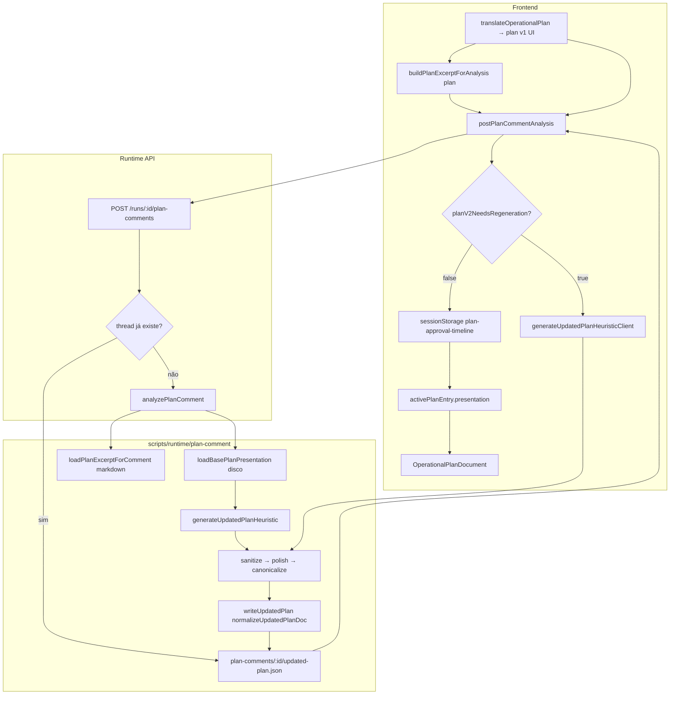

# Discovery E2E — Plano v2 regressa no browser após Fases A/B/C

**Data:** 2026-05-18  
**Contexto:** Fases A (complexidade), B (preservação semântica) e C (cap visualOnly) passam nos testes core, mas o browser ainda mostra regressão após comentário de plano.  
**Modo:** Somente investigação — sem implementação.

---

## 1. Resumo executivo

O **core está correto** quando `generateFullUpdatedPlanPresentation` corre com base estruturada e polish ativo: tema, fora do escopo, complexidade **média** e critérios completos foram reproduzidos em script local com o cenário obrigatório.

A regressão no browser **não é** “a heurística antiga ainda no core” como caminho principal. É um **problema de integração e de estado**:

| # | Causa raiz | Impacto no browser |
|---|------------|-------------------|
| 1 | **Dois planos v1 diferentes** (UI vs servidor) | Merge no servidor usa markdown/artefatos; UI mostra `translateOperationalPlan` |
| 2 | **`planV2NeedsRegeneration` demasiado fraco** | Cliente aceita v2 incompleto se ainda existir linha de chat no `whatWillBeDone` |
| 3 | **Idempotência em disco** (`updated-plan.json` + POST idempotente) | Plano antigo (pré A/B/C) é reutilizado sem regenerar |
| 4 | **localStorage bloqueia refresh remoto** | `mergeRemoteThread` não substitui `updatedPlan` local já gravado |
| 5 | **`mapUpdatedPlan` sem re-polish** | Payload da API é usado tal como vem; depende 100% do servidor ter normalizado bem na escrita/leitura |
| 6 | **Re-polish não inventa tema** | Se o JSON persistido já perdeu sinais de tema, `normalizeUpdatedPlanDoc` corrige complexidade/OOS mas **não** recupera tema/critérios |

**Conclusão:** As Fases A/B/C estão no caminho de geração **quando ele corre de novo**; o fluxo real frequentemente **não regenera** ou **grava/consome um v2 antigo ou parcial**, e o cliente **não corrige** porque `planV2NeedsRegeneration` devolve `false`.

---

## 2. Fluxograma real do dado



**Dois ramos de v1 (crítico):**

- **UI:** `ApprovalPhasePanel` → `translateOperationalPlan(clarification, strategy)` → polish → plano rico (tema, OOS, média).
- **Servidor:** `loadBasePlanPresentation(outputDir)` → `task-plan-refined.md` + `clarification-answers.json` → pode **não** ter as mesmas linhas que a UI.

O POST **não envia** `basePlan` nem `planExcerpt` da UI — só `commentId`, `text`, `createdAt`.

---

## 3. Tabela por etapa do pipeline (cenário obrigatório)

Legenda: ✅ ok | ⚠️ parcial | ❌ falha | — não aplicável

| Etapa | theme (done/crit) | outOfScope | complexity | Onde |
|-------|-------------------|------------|------------|------|
| v1 UI (`translateOperationalPlan`) | ✅ | ✅ | ✅ média | Browser plano inicial |
| v1 servidor (`loadBasePlanPresentation` markdown típico) | ⚠️ só no objetivo | ⚠️ 2 itens | — | `parsed.whatWillBeDone` sem linha tema |
| Após `generateFullUpdatedPlanPresentation` (base UI) | ✅ | ✅ | ✅ média + reason qualificado | Core — testes |
| Após `generateFullUpdatedPlanPresentation` (base servidor) | ✅ | ✅ | ✅ média | Script `diag` local |
| Após `polish` em memória | ✅ | ✅ | ✅ | `sanitizeUpdatedPlanPresentation` |
| `writeUpdatedPlan` / ficheiro JSON | ✅* | ✅* | ✅* | *se geração fresca pós B/C |
| `readUpdatedPlan` / GET threads | ⚠️ | ✅ corrige vazio | ✅ corrige alta | Re-polish; tema não recupera se ausente no JSON |
| `planV2NeedsRegeneration` (v2 antigo vs UI) | — | — | — | **false** (falso negativo) |
| `sessionStorage` updatedPlan | ❌ se gravado antes | ❌ | ❌ alta | Persiste se não regenerar |
| UI `activePresentation` | ❌ | ❌ | ❌ | Usa thread.updatedPlan local ou API sem regen |

---

## 4. Onde cada campo se perde ou é sobrescrito

### 4.1 Tema claro/escuro

| Ponto | O que acontece |
|-------|----------------|
| Markdown servidor | Linha dedicada de tema pode faltar em `## Passos`; tema só em `## Objetivo` → merge base pobre |
| Geração fresca | Fase B extrai tema do objetivo → **OK** em core |
| JSON antigo em disco | v2 sem linhas/sinais de tema |
| Re-leitura `normalizeUpdatedPlanDoc` | Polish não recria `flags.theme` sem corpus |
| `planV2NeedsRegeneration` | Não verifica tema → cliente **não** chama `generateUpdatedPlanHeuristicClient` |
| localStorage | Plano antigo mantido |

### 4.2 Fora do escopo

| Ponto | O que acontece |
|-------|----------------|
| v2 antigo | `outOfScope: []` comum |
| Re-polish na leitura | Fase B preenche defaults se `visualOnly` — **corrige na API GET** |
| Cliente sem regen | Se localStorage tem `[]` e remoto não substitui, UI continua vazio |
| `planV2NeedsRegeneration` | Não verifica `outOfScope` |

### 4.3 Complexidade alta

| Ponto | O que acontece |
|-------|----------------|
| v2 gerado antes Fase C | `level: high` persistido |
| Re-polish na leitura | Fase C recalcula → **medium** no servidor |
| Cliente | `mapUpdatedPlan` não re-polish; mostra `high` do storage/API sem regen |
| UI `PlanComplexitySentence` | Fase A OK se `reason` puro; problema é `level` errado no objeto |

### 4.4 Critérios sem tema

| Ponto | O que acontece |
|-------|----------------|
| `renderCompletionCriteria` | Depende de `flags.theme` |
| v2 sem flags.theme | Critérios sem linha de tema |
| Re-polish | Não adiciona critério de tema sem flag |

---

## 5. Respostas às perguntas obrigatórias

### 1. O backend gera o plano certo?

**Sim, na geração fresca** (`generateUpdatedPlanHeuristic` → `generateFullUpdatedPlanPresentation` → `sanitizeUpdatedPlanPresentation`).

**Não garantido no fluxo real** por idempotência: `generateUpdatedPlanForComment` devolve `existing` se `updated-plan.json` já existe; `submitPlanCommentForRun` devolve thread completa se análise já existir.

### 2. O polish é chamado no fluxo real?

**Sim** em:

- `generateFullUpdatedPlanPresentation` → `sanitizeUpdatedPlanPresentation` (final da geração);
- `writeUpdatedPlan` / `readUpdatedPlan` → `normalizeUpdatedPlanDoc` → `sanitizeUpdatedPlanPresentation`.

**Não** em:

- `mapUpdatedPlan` no frontend (spread cru);
- `isValidUpdatedPlan` / sessionStorage (aceita qualquer presentation).

### 3. As Fases B/C estão no caminho certo?

**Sim no código de geração** (`parseLineToAtoms`, `extractOutOfScope`, `inferCanonicalComplexity`).

**Não garantido na execução** se o fluxo não regenera ou consome artefato antigo.

### 4. O objeto correto é salvo?

| Camada | Normaliza na escrita? | Re-polish na leitura? |
|--------|----------------------|------------------------|
| `writeUpdatedPlan` | Sim (`normalizeUpdatedPlanDoc`) | — |
| `readUpdatedPlan` / GET | — | Sim |
| Resposta POST imediata | Objeto já normalizado na escrita | — |
| sessionStorage cliente | **Não** | **Não** |

### 5. O frontend renderiza o campo correto?

**Sim:** `activePresentation = activePlanEntry?.presentation ?? plan` (`ApprovalPhasePanel.tsx`).

- Plano ativo = último `thread.updatedPlan.presentation` ou fallback v1 UI.
- **Não** usa outro snapshot; o problema é **qual** `presentation` está na thread (stale).

### 6. Cache / state stale?

**Sim — dois níveis:**

1. **`sessionStorage`** (`plan-approval-timeline:v2:{runKey}`) — `mergeRemoteThread` só preenche `updatedPlan` se `!local.updatedPlan`.
2. **Disco** `plan-comments/{id}/updated-plan.json` — idempotência impede regeneração.

Não há React Query para plano; é storage manual + fetch pontual.

### 7. Diferença testes vs browser

| Testes core | Browser |
|-------------|---------|
| `basePresentation` estruturado (V1_BASE) | v1 UI rico via `translateOperationalPlan` |
| Geração sempre fresca | Idempotência + storage |
| Sem `planV2NeedsRegeneration` falso negativo | Falso negativo com v2 parcial |
| Sem sessionStorage | localStorage persiste v2 |

### 8. Dois pipelines?

| Pipeline | Uso |
|----------|-----|
| **A** `translateOperationalPlan` + polish | Plano v1 na UI |
| **B** `loadBasePlanPresentation` + generate + polish | Plano v2 no servidor |
| **C** Cliente `generateUpdatedPlanHeuristicClient` | Só se `planV2NeedsRegeneration` |

Não há renderizador legado alternativo no documento; `OperationalPlanDocument` é único.

### 9. Substituição do plano correto?

- Timeline usa última versão por `planVersion` — correto.
- Conteúdo da versão pode ser **stale** (gerado antes das fases ou parcial).
- v1 UI continua bom; v2 ativo é que regride.

### 10. Complexidade alta — origem

| Função | Quando |
|--------|--------|
| `inferCanonicalComplexity` (Fase C) | Geração + polish — **medium** para visualOnly |
| `inferComplexityLevel` em `generate-full` | Pré-polish; **sobrescrito** pelo polish |
| JSON antigo | `level: high` antes da Fase C |
| Cliente sem regen | Mostra `high` do storage |

`visualOnly` na Fase C **funciona** se `inferCanonicalComplexity` correr; não corre na UI se o objeto não passar por polish de novo.

**Prova:** `planV2NeedsRegeneration(staleV2, uiV1) === false` com v2 tendo chat+botão mas sem tema, `outOfScope: []`, `level: high`.

---

## 6. Arquivos e funções responsáveis

| Área | Ficheiro | Função / trecho |
|------|----------|-----------------|
| Geração servidor | `scripts/runtime/plan-comment/generate-updated-plan.js` | `generateUpdatedPlanForComment` (idempotente) |
| Análise | `scripts/runtime/plan-comment/analyze-plan-comment.js` | `analyzePlanComment` |
| API | `scripts/daemon/lib/run-plan-comments.js` | `submitPlanCommentForRun` (idempotente por commentId) |
| Persistência | `scripts/runtime/plan-comment/plan-comment-store.js` | `writeUpdatedPlan`, `readUpdatedPlan` |
| Normalização disco | `scripts/runtime/plan-comment/plan-comment-analysis-schema.js` | `normalizeUpdatedPlanDoc` |
| Base servidor | `core/load-base-plan-presentation.js` | `loadBasePlanPresentation` |
| Core merge | `core/generate-full-updated-plan-presentation.js` | `generateFullUpdatedPlanPresentation`, `planV2NeedsRegeneration` |
| Polish | `core/polish-operational-plan-presentation.js` | `polishOperationalPlanPresentation` |
| Complexidade | `core/infer-operational-plan-complexity.js` | `inferCanonicalComplexity` |
| Cliente API | `frontend/lib/runtime/operational/plan-comment-actions.ts` | `postPlanCommentAnalysis`, `regenerateUpdatedPlanIfNeeded`, `mapUpdatedPlan` |
| Storage | `frontend/lib/runtime/operational/plan-approval-timeline-storage.ts` | `readPlanApprovalTimeline`, `writePlanApprovalTimeline` |
| Merge remoto | `frontend/hooks/use-plan-approval-timeline.ts` | `mergeRemoteThread` |
| UI plano | `frontend/components/features/planning/ApprovalPhasePanel.tsx` | `plan`, `activePresentation` |
| Render | `frontend/components/features/planning/OperationalPlanDocument.tsx` | `plan` prop |
| Complexidade UI | `frontend/components/features/planning/PlanExecutionProfileBlock.tsx` | `PlanComplexitySentence` |

---

## 7. Proposta de correção (fases pequenas)

### Fase D — Wiring e fonte única de v1

1. Enviar `basePresentation` (ou hash) no POST `/plan-comments` **ou** persistir apresentação v1 UI em artefato no `outputDir` na aprovação.
2. `loadBasePlanPresentation` preferir snapshot UI se existir; fallback markdown.
3. Usar o mesmo excerpt da UI em `analyzePlanComment` (`planExcerpt` no body).

### Fase E — Regeneração obrigatória no cliente

1. Expandir `planV2NeedsRegeneration` para detectar:
   - perda de tema (base tem `/tema/i`, v2 não);
   - `outOfScope` vazio quando base tinha itens;
   - `complexity.level === 'high'` com sinais visualOnly;
   - ausência de `complexity.reason` qualificado (sem “sem backend”).
2. **Sempre** `generateUpdatedPlanHeuristicClient` após POST quando `requiresNewPlan`, opcionalmente ignorar payload servidor para presentation (usar só metadata).
3. Aplicar `normalizeUpdatedPlanDoc` ou `polishOperationalPlanPresentation` no cliente antes de gravar storage.

### Fase F — Invalidação de artefatos

1. Versionar `updated-plan.json` (`planSchemaVersion: 3`) e regenerar se versão antiga.
2. Query param `?forceRegenerate=1` ou apagar `updated-plan.json` ao detectar schema antigo.
3. `mergeRemoteThread`: substituir `updatedPlan` local se remoto tiver `planVersion` maior ou schema mais novo.

### Fase G — Testes de integração E2E

1. `scripts/runtime/plan-comment/plan-comment-e2e.test.js`: markdown mínimo + comentário → assert tema/OOS/medium.
2. Teste `planV2NeedsRegeneration` com v2 stale → deve pedir regen.
3. Teste storage: simular localStorage com v2 ruim + fetch remoto bom → UI deve convergir.

---

## 8. Testes adicionais necessários

| Teste | Objetivo |
|-------|----------|
| E2E servidor: POST comentário + ler JSON | Igual ao browser |
| `planV2NeedsRegeneration` regressão tema/OOS/alta | Fechar falso negativo |
| Cliente: `mapUpdatedPlan` + polish | Paridade com disco |
| Idempotência: segunda POST não devolve pré-B/C sem regen | Forçar bump versão |
| Base UI vs base markdown mesmo comentário | Divergência documentada |

Comando útil (repro local):

```bash
node -e "
const { generateFullUpdatedPlanPresentation, planV2NeedsRegeneration } = require('./core/generate-full-updated-plan-presentation');
// ... base UI vs comentário ...
"
```

---

## 9. Riscos de regressão

- Forçar regen sempre pode aumentar custo/latência no comentário.
- Substituir storage local pode apagar trabalho em rascunho de perguntas adicionais na mesma thread.
- Unificar v1 UI com disco pode mudar plano mostrado antes do comentário se markdown divergir.
- Bump de schema invalida todos os `updated-plan.json` existentes (comportamento desejado).

---

## 10. Recomendação final

1. **Implementar Fase E primeiro** (critério de regen + cliente sempre polish/regen) — maior impacto imediato no browser sem mudar API.
2. **Fase D em seguida** — alinha servidor com o v1 que o utilizador vê.
3. **Fase F** — evita ficar preso a JSON antigo.
4. **Fase G** — evita nova divergência testes/browser.

**Workaround manual para validar agora:** apagar `plan-comments/<commentId>/updated-plan.json` e `sessionStorage` da run (`setup-boss:plan-approval-timeline:v2:*`), comentar de novo — espera-se v2 correto se o código B/C estiver no bundle servido.

---

## Anexo — Evidência experimental

Script local (`scripts/diag-plan-comment-pipeline.js` — removido após discovery) mostrou:

- `v2-ui` e `v2-server`: `level: medium`, tema em done/crit, `outOfScope: 5`.
- `planV2NeedsRegeneration(v2-server, uiV1): false` mesmo com v2 correto (overlap de itens).
- Plano **stale** simulado (chat+botão, sem tema, OOS vazio, alta): `planV2NeedsRegeneration === false` → explica o browser.

`normalizeUpdatedPlanDoc` em plano stale:

- Corrige `high` → `medium` e preenche `outOfScope`.
- **Não** recupera tema nos critérios (flags.theme ausentes no corpus persistido).
