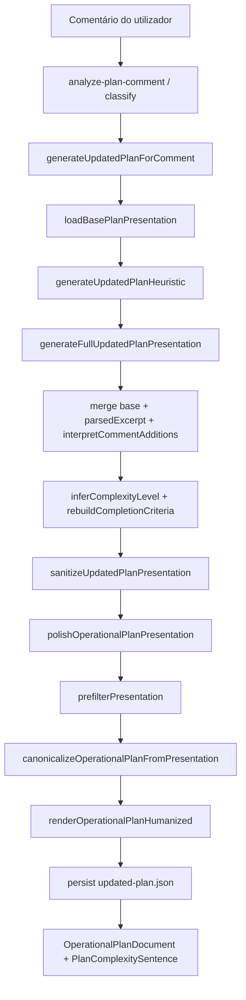

# Discovery — Bugs restantes no plano v2 após comentário

**Data:** 2026-05-18  
**Escopo:** Atualização do plano operacional após comentário na aprovação (merge → canonicalização → renderização)  
**Modo:** Somente investigação — sem alterações de código

---

## Resumo executivo

A pipeline atual **preserva e expande** bem o escopo quando o v1 chega estruturado (itens explícitos em `whatWillBeDone` e `outOfScope` com sinais de exclusão). Os cinco sintomas reportados têm causas raiz distintas, mas convergem em três pontos frágeis:

1. **Dupla camada de redação de complexidade** — backend grava frase completa; UI acrescenta o mesmo prefixo outra vez.
2. **Canonicalização por átomo único por linha** — requisitos embutidos no objetivo ou em linhas compostas somem; `outOfScope` vazio desliga defaults visuais.
3. **Score de complexidade na canonicalização** — tarefa visual simples com chat + botão + responsividade + tema pontua ≥ 5 e vira **alta** sistematicamente.

---

## 1. Fluxo real do dado (comentário → UI)



| Etapa | Ficheiro | Função |
|-------|----------|--------|
| Entrada servidor | `scripts/runtime/plan-comment/generate-updated-plan.js` | `generateUpdatedPlanForComment` |
| Heurística | `scripts/runtime/plan-comment/generate-updated-plan-heuristic.js` | delega ao core |
| Merge v1 + comentário | `core/generate-full-updated-plan-presentation.js` | `generateFullUpdatedPlanPresentation` |
| Base v1 | `core/load-base-plan-presentation.js` | `loadBasePlanPresentation` |
| Polish | `core/polish-operational-plan-presentation.js` | `polishOperationalPlanPresentation` |
| Átomos | `core/normalize-operational-plan-structure.js` | `parseLineToAtom`, `mergeAtomsByKind` |
| Canónico | `core/canonicalize-operational-plan.js` | `canonicalizeOperationalPlanFromPresentation` |
| Texto final | `core/render-operational-plan-humanized.js` | `renderOperationalPlanHumanized` |
| UI complexidade | `frontend/.../PlanExecutionProfileBlock.tsx` | `PlanComplexitySentence` |
| Regeneração cliente | `frontend/lib/runtime/operational/plan-comment-actions.ts` | `regenerateUpdatedPlanIfNeeded` |

**Nota:** O resultado de `inferComplexityLevel` e `rebuildCompletionCriteria` em `generate-full-updated-plan-presentation.js` é **descartado** na saída final — `polishOperationalPlanPresentation` recalcula complexidade, critérios, `whatWillBeDone` e `outOfScope` a partir dos átomos canónicos.

---

## 2. Causa raiz por problema

### 2.1 Duplicação da frase de complexidade

**Sintoma:**  
`A tarefa foi avaliada como alta porque a tarefa foi avaliada como alta porque...`

**Causa raiz (confirmada por reprodução):**

| Camada | O que faz |
|--------|-----------|
| `renderComplexityExplanation` (`render-operational-plan-humanized.js:130-136`) | Persiste **frase completa**: `A tarefa foi avaliada como {nível} porque envolve {fatores}.` |
| `PlanComplexitySentence` (`PlanExecutionProfileBlock.tsx:263-271`) | Renderiza **de novo**: `A tarefa foi avaliada como {levelWord} porque {because}.` onde `because` = `complexity.explanation` integral (só baixa a primeira letra). |

Qualquer plano v2 pós-polish produz duplicação na UI, mesmo com dados limpos:

```
stored:  A tarefa foi avaliada como alta porque envolve criação de componentes...
UI:      A tarefa foi avaliada como alta porque a tarefa foi avaliada como alta porque envolve...
```

**Respostas às perguntas do discovery:**

| Pergunta | Resposta |
|----------|----------|
| O texto já chega com prefixo pronto? | Sim — após `renderOperationalPlanHumanized`. |
| O renderizador UI adiciona outro prefixo? | **Sim** — sempre em `PlanComplexitySentence`. |
| O `reason` está como frase completa? | O campo `complexity.explanation` guarda frase completa, não motivo puro. |
| Fallback concatena duas vezes? | Não é fallback — é **contrato implícito duplo** (backend frase + UI template). |

**Mitigação secundária existente:** `isMetalanguageLine` em `normalize-operational-plan-structure.js:24` rejeita linhas já duplicadas na **entrada** da canonicalização, mas não impede a duplicação UI sobre saída já correta.

---

### 2.2 Perda parcial de requisitos (ex.: tema claro/escuro)

**Sintoma:** Responsividade mantida; tema claro/escuro desaparece após comentário.

**Causa raiz:** `parseLineToAtom` devolve **no máximo um átomo por linha** (`normalize-operational-plan-structure.js:67-196`). Ordem de match favorece `deliverable:chat_visual` quando a linha contém `chat` + `criar`, **antes** do match de `task:validate_theme`.

**Reprodução:**

- Base com tema só em `mainObjective` (`"… responsivo, tema claro/escuro …"`) e `whatWillBeDone` sem linha dedicada de tema.
- Após polish: `flags.theme === false`, sem linha de tema em `whatWillBeDone`, sem critério de tema.

| Cenário | `flags.theme` | Tema em critérios |
|---------|---------------|-------------------|
| Linha dedicada `"Garantir compatibilidade com tema claro e escuro"` | true | sim |
| Tema só no objetivo / linha composta com chat | false | não |

**Merge de arrays:** `generateFullUpdatedPlanPresentation` faz **união** (`pushUnique` / `mergeScopeLists`), não substitui arrays — a perda **não** ocorre no merge, ocorre na **re-materialização** pelo polish.

**Deduplicação agressiva:** `mergeAtomsByKind` colapsa por `kind` (um átomo por tipo); não remove tema por engano se existir `task:validate_theme`. O problema é **não criar** o átomo.

---

### 2.3 Bloco «Fora do escopo» desaparece

**Sintoma:** Secção vazia ou ausente no plano atualizado.

**Causa raiz:** `extractOutOfScope` (`canonicalize-operational-plan.js:153-176`) **não copia** `presentation.outOfScope` diretamente. Só inclui:

1. Átomos `scope_out:*` obtidos por `parseLineToAtom` sobre linhas recolhidas.
2. Lista default (5 itens) **somente se** `visualOnly === true`.

`visualOnly` (`detectVisualOnlyScope` em `normalize-operational-plan-language.js:78-89`) exige:

```text
visual em whatWillBeDone  AND  padrões de exclusão em outOfScope  AND  sem backend no escopo
```

**Reprodução:** `outOfScope: []` no v1 → `visualOnly: false` → `outOfScope` final **vazio** (0 itens), mesmo com chat visual no escopo.

| Etapa | Perde fora do escopo? |
|-------|----------------------|
| Parse markdown | Pode — se secção `## Fora do escopo` ausente ou título não reconhecido |
| Merge generate-full | Não — preserva se existir no base |
| Canonicalização | **Sim** — se não virar átomo e `visualOnly` for false |
| Render | Não — repassa `canonical.outOfScope` |
| UI | Oculta secção se `plan.outOfScope.length === 0` (`OperationalPlanDocument.tsx:159`) |

**Diferença v1 vs v2:** v1 pode ter `outOfScope` populado na apresentação inicial; v2 pós-polish depende de átomos + gate `visualOnly`, não do array original.

---

### 2.4 Critérios de conclusão incompletos

**Sintoma:** Melhoraram, mas não validam tema claro/escuro.

**Causa raiz:** Duas gerações em sequência:

1. `rebuildCompletionCriteria` (`generate-full-updated-plan-presentation.js:280-320`) — frases agregadas; considera `quality` com `/tema/i` nos itens de `whatWillBeDone`.
2. **Substituída** por `renderCompletionCriteria` (`render-operational-plan-humanized.js:103-124`) — bullets por flag (`flags.theme`, `flags.responsive`, etc.).

Se `flags.theme === false` (secção 2.2), **não há** critério de tema, independentemente do v1.

Critérios free-text do v1 (ex.: `"componente reutilizavel, responsivo e tema claro/escuro"`) são **descartados** — `canonical.completionCriteria` fica `[]` e o render ignora o blob antigo.

---

### 2.5 Complexidade inflada para alta

**Sintoma:** Tarefa visual simples (UI, sem backend) classificada como **alta** após adicionar botão.

**Causa raiz:** `inferComplexity` em `canonicalize-operational-plan.js:182-205` soma score:

```text
score = deliverableCount + (integrate ? 1 : 0) + (responsive ? 1 : 0) + (theme ? 1 : 0)
high se score >= 5 OU deliverableCount >= 4
```

**Caso chat + botão (reproduzido):**

| Fator | Contribuição |
|-------|----------------|
| deliverables: chat, button, integrate (auto se chat+button) | 3 |
| integrate flag | +1 |
| responsive | +1 |
| theme | +1 |
| **Total** | **6 → high** |

`inferComplexityLevel` em `generate-full-updated-plan-presentation.js:210-228` (limiar `itemCount >= 6`) é **sobrescrito** pelo polish — não governa o valor mostrado.

Adicionar botão aumenta `deliverableCount` e força `integrate`, empurrando o score — não por backend/WebSocket no escopo.

**Não existe** regra explícita «UI visual simples = média»; o default canónico é `medium` só se `score <= 1` sem integração.

---

## 3. Ficheiros e funções a alterar (proposta, sem implementar)

| # | Problema | Ficheiro | Função / zona |
|---|----------|----------|----------------|
| 1 | Duplicação complexidade | `core/render-operational-plan-humanized.js` | `renderComplexityExplanation` — persistir só **fatores** (sem prefixo) |
| 1b | Duplicação complexidade | `frontend/.../PlanExecutionProfileBlock.tsx` | `complexityBecauseText` / `PlanComplexitySentence` — detectar prefixo existente ou assumir explanation = motivo puro |
| 2 | Perda de tema/requisitos | `core/normalize-operational-plan-structure.js` | `parseLineToAtom` — extrair **múltiplos átomos** por linha ou passo de decomposição pós-parse |
| 2b | Flags incompletas | `core/canonicalize-operational-plan.js` | `buildFlags` — varrer **todas** as linhas fonte por regex de tema/responsivo/reutilizável, não só átomos |
| 3 | Fora do escopo vazio | `core/canonicalize-operational-plan.js` | `extractOutOfScope` — fazer merge com `presentation.outOfScope` normalizado antes de descartar |
| 3b | visualOnly gate | `core/normalize-operational-plan-language.js` | `detectVisualOnlyScope` — tratar exclusões implícitas (chat visual sem backend no escopo) |
| 4 | Critérios | `core/render-operational-plan-humanized.js` | `renderCompletionCriteria` — alinhado às flags corrigidas |
| 5 | Complexidade alta indevida | `core/canonicalize-operational-plan.js` | `inferComplexity` — cap **medium** para `visualOnly` com score ≤ N; pesos separados para validação vs entrega |
| 5b | (opcional) | `core/generate-full-updated-plan-presentation.js` | `inferComplexityLevel` — alinhar limiares se polish deixar de recalcular |

---

## 4. Proposta de correção (plano incremental)

### Fase A — Correção rápida de sintoma (baixo risco)

1. **Complexidade UI:** Em `complexityBecauseText`, se `explanation` já casar `/^a tarefa foi avaliada como/i`, usar só a parte após `porque` (ou mostrar `explanation` sem reenvolver).
2. **Alternativa backend:** `complexity.explanation` = `factors.join(", ")` sem prefixo; UI mantém template (preferível para contrato estável do campo como «motivo»).

### Fase B — Preservação de escopo

3. **`parseLineToAtom` multi-match:** Para linhas com chat + tema + responsivo, emitir vários átomos (ou função `parseLineToAtoms`).
4. **`extractOutOfScope`:** Union de `presentation.outOfScope` filtrado + átomos + defaults se `visualOnly`.
5. **`buildFlags` fallback:** Scan em `collectSourceLines` completo para `tema|claro|escuro`, `responsiv`, `reutiliz`.

### Fase C — Complexidade calibrada

6. Regras em `inferComplexity`:
   - `visualOnly && !backendInScope` → máximo **medium**.
   - Score: peso 1 por deliverable visual, 0.5 por validação (tema/responsivo), integração conta uma vez.
   - **high** reservado para backend, persistência, WebSocket no escopo ou `deliverableCount >= 5` não-visual.

### Fase D — Critérios

7. Garantir `flags.theme` → critério bullet (já implementado, depende de B).
8. Teste de regressão: critérios free-text do v1 não são requisito se flags cobrirem — documentar comportamento.

---

## 5. Testes a criar ou ajustar

| Teste | Ficheiro | Assertiva nova |
|-------|----------|----------------|
| UI não duplica prefixo | `PlanExecutionProfileBlock.test.tsx` (criar) ou teste de integração | explanation com prefixo → texto renderizado sem «porque a tarefa foi avaliada» duas vezes |
| Tema só no objetivo | `canonicalize-operational-plan.test.js` | `flags.theme === true` após polish |
| outOfScope vazio no v1 | `polish-operational-plan-presentation.test.js` | chat visual → `outOfScope.length >= 3` defaults |
| Complexidade visual chat+botão | `canonicalize-operational-plan.test.js` | `level === 'medium'` para flags chat+button+responsive+theme, visualOnly |
| Cenário obrigatório utilizador | `generate-full-updated-plan-presentation.test.js` | comentário botão + v1 com tema no objetivo apenas |
| E2E heurística | `generate-updated-plan-heuristic.test.js` | `complexity.explanation` sem prefixo duplicável OU documentar consumo UI |

Comandos atuais relevantes:

```bash
node --test core/generate-full-updated-plan-presentation.test.js core/canonicalize-operational-plan.test.js core/polish-operational-plan-presentation.test.js scripts/runtime/plan-comment/generate-updated-plan-heuristic.test.js
```

---

## 6. Exemplo esperado após correção

**Entrada**

- v1: componente de chat reutilizável, responsivo, tema claro/escuro.
- Comentário: «também criar componente de botão que abre/fecha o chat».

**Saída esperada** (alinhada ao pedido do utilizador)

> **Entendimento da atividade:** Será criado um componente visual de chat na tela de Integrações. O componente deve ser reutilizável, responsivo e compatível com tema claro/escuro. Também será criado um botão para abrir e fechar o chat visualmente.
>
> **Objetivo:** Criar uma interface visual de chat reutilizável na tela de Integrações.
>
> **O que será feito:** (chat, botão, integração, validar responsividade, validar tema)
>
> **Fora do escopo:** envio real, backend, persistência, WebSocket, IA/API
>
> **Complexidade:** Média — uma única frase na UI, sem duplicação de prefixo.
>
> **Critério de conclusão:** inclui layout responsivo **e** tema claro/escuro.

**Estado atual (v1 estruturado completo — reproduzido localmente):** tema e critérios OK; fora do escopo OK **se** v1 tinha exclusões; complexidade **alta** (não média); UI duplica prefixo de complexidade.

---

## 7. Matriz de diagnóstico rápido

| Sintoma observado | Verificar primeiro |
|-------------------|-------------------|
| Frase de complexidade duplicada | `PlanComplexitySentence` + valor de `complexity.explanation` |
| Tema sumiu | Tema está em linha própria em `whatWillBeDone` ou só no objetivo? |
| Fora do escopo vazio | `outOfScope` no v1 / markdown; `detectVisualOnlyScope` |
| Critério sem tema | `flags.theme` após `canonicalizeOperationalPlanFromPresentation` |
| Complexidade alta | `canonical.complexity.level` (não `inferComplexityLevel` do generate-full) |

---

## 8. Conclusão

A canonicalização melhorou a qualidade textual, mas introduziu **perda de informação** ao reescrever o plano só a partir de átomos de linha única e ao condicionar exclusões a `visualOnly`. A duplicação de complexidade é **100% reproduzível** e situa-se na fronteira **backend frase completa × template UI**. A inflação para **alta** é **determinística** no score atual quando o escopo inclui chat, botão, integração e validações.

Nenhuma alteração de código foi feita neste discovery. Próximo passo recomendado: **Fase A + Fase B** em PR pequeno, com testes da secção 5.
