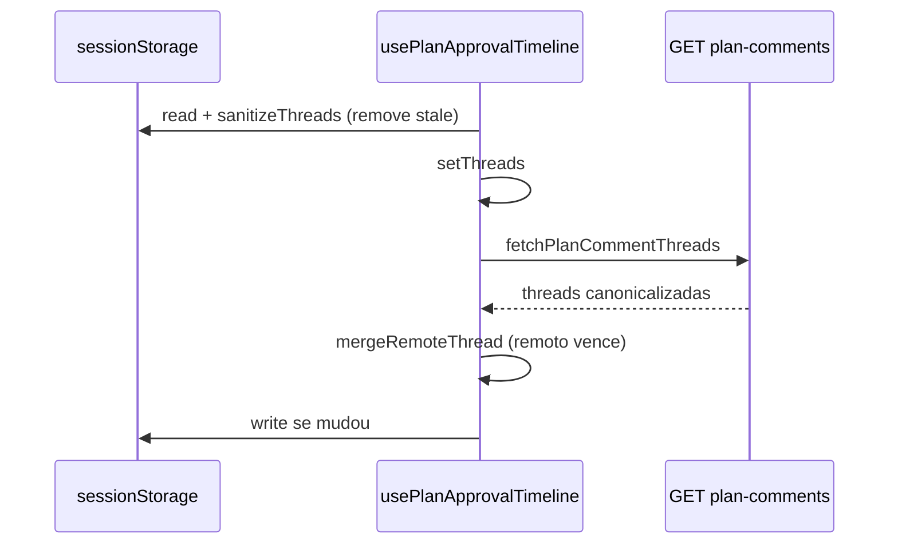

# Fase F — Invalidação sessionStorage + sincronização browser

**Data:** 2026-05-18  
**Base:** [discovery browser](./2026-05-18-discovery-plano-v2-browser-regressao-pos-fases-abc.md), [Fase E](./2026-05-18-fase-e-regen-defensivo-planos-stale.md)

---

## 1. Resumo executivo

O backend (Fases D/E) já devolvia planos canonicalizados; o browser ainda podia exibir v2 stale porque **`mergeRemoteThread` só preenchia `updatedPlan` local quando este estava vazio** (`!local.updatedPlan`). Planos ruins gravados em `sessionStorage` prevaleciam sobre o payload remoto.

A Fase F corrige a sincronização no cliente: **remoto canonicalizado sempre vence local stale**, sessionStorage é sanitizado na hidratação, e planos inválidos não são re-persistidos.

---

## 2. Causa raiz

```
Hidratação:
  sessionStorage (stale) → UI imediata
  fetch GET /plan-comments (correto)
  mergeRemoteThread: if (remote.updatedPlan && !local.updatedPlan) ← bug
  → remoto ignorado; stale permanece
```

---

## 3. Estratégia de invalidação

### 3.1 Módulo `plan-updated-plan-sync.ts`

| Função | Papel |
|--------|--------|
| `shouldRemoteUpdatedPlanReplaceLocal` | Compara schemaVersion, canonicalized, planVersion, generatedAt; local stale perde sempre |
| `isLocalUpdatedPlanStale` | Delega a `planV2NeedsRegeneration` (Fase E) |
| `sanitizeThreadsUpdatedPlansFromStorage` | Na leitura: remove/null stale antes do fetch |
| `mergeRemoteThread` | Substitui local por remoto quando mais fresco/correto |
| `prepareUpdatedPlanForPersistence` | Bloqueia gravar stale no sessionStorage |
| `normalizeClientUpdatedPlan` | Polish + meta schema 2 |

### 3.2 Ordem de precedência (updatedPlan)

1. Local stale (Fase E) → **perde para remoto**
2. `schemaVersion` maior
3. `canonicalized: true` vs false
4. `planVersion` maior
5. `generatedAt` mais recente
6. Empate → **remoto** (autoritativo pós-repair servidor)

### 3.3 Fluxo novo



---

## 4. Arquivos alterados

| Ficheiro | Alteração |
|----------|-----------|
| `frontend/lib/runtime/operational/plan-updated-plan-sync.ts` | **Novo** — lógica de sync |
| `frontend/lib/runtime/operational/plan-updated-plan-sync.test.ts` | **Novo** — 7 testes |
| `frontend/hooks/use-plan-approval-timeline.ts` | Sanitize na hidratação; merge com basePlan; persistência segura |
| `frontend/lib/runtime/operational/plan-comment-actions.ts` | `normalizeClientUpdatedPlan`; schema em regen cliente |

---

## 5. Comportamentos garantidos

| Cenário | Resultado |
|---------|-----------|
| Local stale + remoto OK | Remoto substitui |
| schemaVersion remoto maior | Remoto prevalece |
| Reload / reopen run | Sanitize SS → fetch → merge |
| POST comentário | Só persiste plano não-stale |
| Local high sem tema | Removido do SS; preenchido pelo remoto |
| Comentário novo | `prepareUpdatedPlanForPersistence` na gravação |

---

## 6. Testes

```bash
node --test frontend/lib/runtime/operational/plan-updated-plan-sync.test.ts
```

**7/7 pass** — cobre detecção stale, merge remoto, sessionStorage sanitize, persistência canonicalizada.

Regressão core Fase E: **8/8 pass**.

---

## 7. Fora de escopo (inalterado)

- Heurística A/B/C
- Canonicalização core
- `mergeRemoteThread` para analysis/questions (só `updatedPlan` com regra nova)
- E2E browser automatizado

---

## 8. Validação manual sugerida

1. Run com `updated-plan.json` antigo no servidor + sessionStorage stale na run.
2. Abrir fase de aprovação → plano deve convergir para medium/tema/OOS (fetch em background).
3. Hard refresh (F5) → mesmo resultado.
4. Novo comentário botão → v2 correto imediato.

Se ainda aparecer stale: DevTools → Application → `setup-boss:plan-approval-timeline:v2:{runId}` → confirmar `schemaVersion: 2` e `canonicalized: true` após ~1s do load.

---

## 9. Resultado esperado (cenário final)

| Campo | Valor |
|-------|--------|
| complexity | medium |
| theme | preservado |
| outOfScope | preservado |
| critérios | com tema |
| botão | presente |
| após refresh/reopen | consistente |
