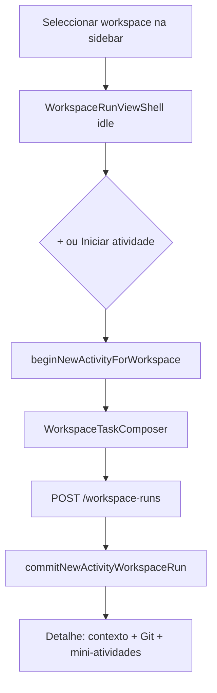

# Fase 2 — TaskComposer no contexto do Workspace (multi-projeto)

**Data:** 2026-05-18  
**Escopo:** Nascer atividades como `WorkspaceRun` quando há `selectedWorkspaceId`, sem novo runtime paralelo.

---

## Resumo

Com um workspace seleccionado, o Mission Control passa a criar atividades via `POST /workspace-runs` em vez de `POST /runs`. O painel central usa `WorkspaceRunViewShell`; a sidebar lista atividades dentro do workspace; o contexto multi-projeto fica visível no composer e no detalhe da run.

Runs por projeto e `TaskComposer` original mantêm-se quando **não** há workspace activo.

---

## Mudanças principais

### API e modelo

| Ficheiro | Função |
|----------|--------|
| `frontend/lib/api/workspace-runtime-api.ts` | `postWorkspaceRun`, `patchWorkspaceRun`, tipos de payload |
| `frontend/lib/workspace/workspace-global-spec.ts` | `WorkspaceGlobalSpecV1` com `task` + `projectIds` |
| `frontend/hooks/use-create-workspace-run.ts` | Mutação: `globalSpec` + `miniActivities` por projeto |

Payload de criação (resumo):

```json
{
  "workspaceId": "...",
  "title": "…",
  "status": "draft",
  "globalSpec": {
    "schemaVersion": 1,
    "task": "…",
    "projectIds": ["front", "api"],
    "source": "mission_control"
  },
  "miniActivities": [
    { "order": 0, "title": "…", "targetProjectId": "…", "description": "…" }
  ]
}
```

### Store (`mission-shell-store`)

- `beginNewActivityForWorkspace(workspaceId)` — limpa run/projeto, activa `newActivityFlow`
- `commitNewActivityWorkspaceRun(workspaceId, workspaceRunId)` — selecciona workspace run
- `setSelectedWorkspace` / `setSelectedWorkspaceRun` — limpam `selectedProjectId` e `selectedRunId` para evitar conflito de painel

### Painel central

| Ficheiro | Função |
|----------|--------|
| `frontend/lib/runtime/shell/central-shell-view.ts` | `selectedWorkspaceId` ou `selectedWorkspaceRunId` → vista `workspace-run` |
| `frontend/components/regions/AppShell.tsx` | Renderiza `WorkspaceRunViewShell` quando vista = workspace |
| `frontend/components/features/workspace/WorkspaceRunViewShell.tsx` | Idle / nova atividade / detalhe (Git, minis, contexto) |
| `frontend/components/features/workspace/WorkspaceTaskComposer.tsx` | Composer multi-projeto (sem “projeto principal”) |
| `frontend/components/features/workspace/WorkspaceContextCard.tsx` | Workspace + lista de projetos envolvidos |

### Sidebar

| Ficheiro | Função |
|----------|--------|
| `frontend/components/features/workspace/WorkspaceSidebarSection.tsx` | Projetos → secção **Atividades**; botão **+** → `beginNewActivityForWorkspace` |

### i18n

Chaves `workspaceRun.*` e `taskIntake.taskMinLength` em `pt-BR.ts` e `en.ts`.

### Testes

- `frontend/lib/runtime/shell/central-shell-view.test.ts` — prioridade project-run vs workspace; `selectedWorkspaceId` sozinho

---

## Fluxo novo



1. Utilizador expande workspace e clica no nome ou no **+**.
2. Painel central mostra contexto (workspace + projetos) e campo de tarefa.
3. Submit cria **uma** `WorkspaceRun` (não N runs em `/runs`).
4. Sidebar actualiza lista **Atividades** no workspace.
5. Clique numa atividade → `setSelectedWorkspaceRun` → detalhe com minis e orquestração existente.

---

## Compatibilidade

| Cenário | Comportamento |
|---------|----------------|
| Projeto sem workspace | `TaskComposer` + `POST /runs` inalterados |
| Run antiga por projeto | Continua em `RunViewShell` e na sidebar de projetos |
| `selectedRunId` presente | `resolveCentralShellView` prioriza `project-run` |
| Workspace seleccionado | `selectedProjectId` / `selectedRunId` limpos ao seleccionar workspace ou workspace run |

---

## Limitações (fora de escopo desta fase)

- **Intake/clarify/plano global** numa única conversa: a tarefa vive em `globalSpec`; clarificação e plano por repo continuam nas **mini-atividades** após Git prepare + Start (orquestrador existente).
- **Timeline lateral direita** oculta enquanto o painel central é workspace-run (`AppShell` não monta `RightTimelinePanel`).
- Sem branch multi-repo sincronizada, DAG, execução paralela ou merge automático.
- `primaryProjectId` no DTO backend não é pedido na UI.

---

## Validação manual sugerida

1. Criar workspace com front + api.
2. Seleccionar workspace → **+** → descrever “Adicionar upload de anexos no chat”.
3. Confirmar:
   - Network: `POST /workspace-runs` (não `POST /runs`).
   - `globalSpec.projectIds` com ambos os projetos.
   - Atividade na sidebar sob o workspace, não sob “Projetos”.
   - Detalhe com `WorkspaceContextCard` e mini-atividades.
4. Abrir run antiga de um projeto → fluxo project-run normal.

---

## Próximos passos

- Timeline unificada para `WorkspaceRun`.
- Intake/clarify/plano ao nível do workspace (antes de fan-out para minis).
- Branch sincronizada multi-repo e miniTasks com execução real por projeto.
- Testes E2E do composer + criação via API mock/runtime de teste.

---

## Ficheiros tocados (referência)

```
frontend/lib/workspace/workspace-global-spec.ts
frontend/lib/api/workspace-runtime-api.ts
frontend/hooks/use-create-workspace-run.ts
frontend/components/features/workspace/WorkspaceContextCard.tsx
frontend/components/features/workspace/WorkspaceTaskComposer.tsx
frontend/components/features/workspace/WorkspaceRunViewShell.tsx
frontend/components/features/workspace/WorkspaceSidebarSection.tsx
frontend/stores/mission-shell-store.ts
frontend/lib/runtime/shell/central-shell-view.ts
frontend/lib/runtime/shell/central-shell-view.test.ts
frontend/components/regions/AppShell.tsx
frontend/locales/pt-BR.ts
frontend/locales/en.ts
```
