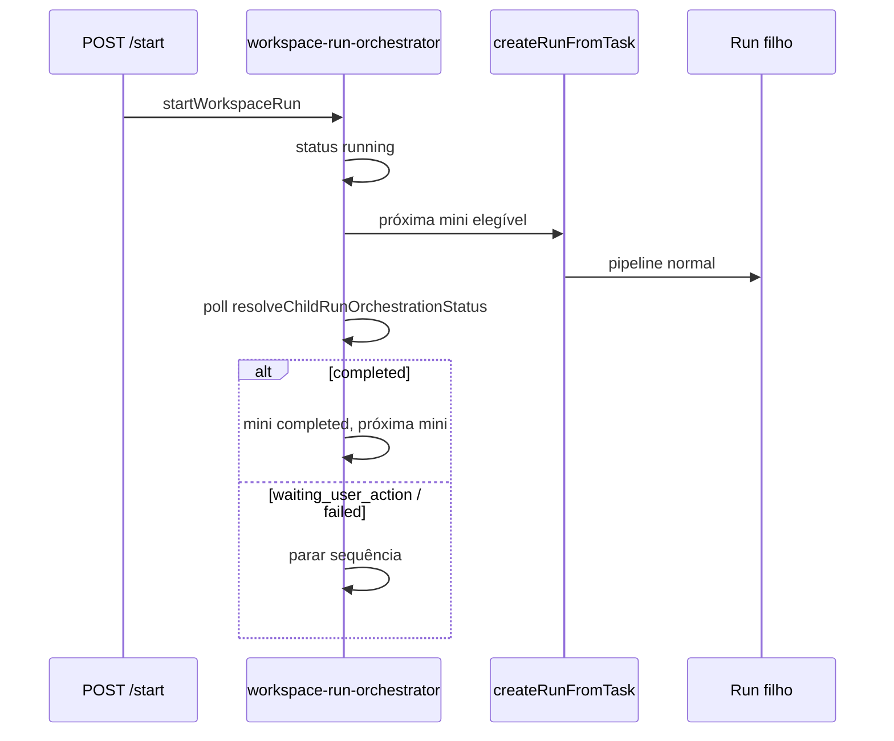

# Orquestrador sequencial WorkspaceRun — Fase D (MVP)

**Data:** 2026-05-16  
**Pré-requisitos:** Fases A–C (`SetupWorkspace`, `WorkspaceRun`, `miniActivities`)

## Objetivo

Executar **sequencialmente** cada `miniActivity` como **run padrão** no `targetProjectId`, reutilizando intake/clarify/strategy/execute existentes, sem Git global nem UI.

## Fluxo



## Regras de elegibilidade

- Mini em `pending` ou `ready`, sem `runId`
- Todas as `dependsOnMiniActivityIds` em `completed` ou `skipped`
- Menor `order` primeiro (sequencial)

## Mapeamento de status (run filho → miniActivity)

| Fase filho (`resolveChildRunOrchestrationStatus`) | miniActivity | WorkspaceRun |
|---------------------------------------------------|--------------|--------------|
| `running` | `running` | `running` |
| `waiting_user_action` | `waiting_user_action` | `waiting_user_action` (para) |
| `failed` | `failed` | `failed` (para) |
| `completed` | `completed` | avança próxima ou `completed` |

Fontes: `collectExecutionForRun`, clarificação (`runtimePhase`), job `uiState`, `orchestration-state.json`.

## Criação do run filho

- `createRunFromTask` com task derivada do título/descrição da mini + contexto do WorkspaceRun
- `metadata.source = workspace_orchestrator`, `skipLlm: true` por defeito do intake API
- Após create: `patchRunIndexWorkspaceLink` → `workspace_run_id`, `mini_activity_id`
- `childRunIds` sincronizado via validação Fase C

## API

| Método | Rota | Descrição |
|--------|------|-----------|
| POST | `/workspace-runs/:id/start` | Inicia (`draft`/`planned` → `running`) |
| POST | `/workspace-runs/:id/resume` | Retoma (`waiting_user_action`, `failed`, `running`) |
| POST | `/workspace-runs/:id/retry-mini-activity/:miniActivityId` | `failed`/`waiting` → `ready`, limpa `runId`, avança |
| POST | `/workspace-runs/:id/skip-mini-activity/:miniActivityId` | `skipped`, avança |

Resposta: `{ ok, data: WorkspaceRun, meta?: { stopped, completed, childRunId, ... } }`

## Validações

- Sem `miniActivities` → `workspace_run_no_mini_activities`
- Já `running` no start → `workspace_run_already_running`
- Mini com `runId` existente não gera novo run no resume
- `targetProjectId` deve existir no registry

## Limitações MVP

- **Sem worker em background** — avanço só em `start`/`resume`/retry/skip (não poll automático)
- Sem Git/branch global entre projectos
- Sem decomposição IA de minis
- Poll de estado pode exigir `resume` após HITL no run filho
- `createRunFromTask` síncrono (intake+clarify) — pode ser lento

## Validação local

```bash
npm run smoke:workspace-orchestrator-phaseD
node --test scripts/daemon/lib/workspace-run-orchestrator.test.js
```

## Próximos passos

1. Job daemon `workspace_run_sync` (poll periódico enquanto `running`)
2. Propagar `activityBranch` global (Fase Git multi-projeto)
3. UI Mission Control: botões Start/Resume + progresso por mini
4. Eventos SSE `workspace_run.*`
